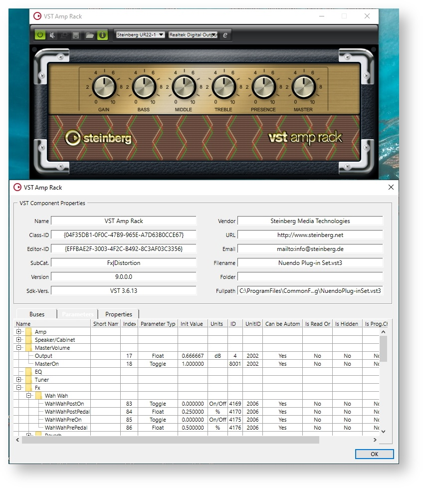
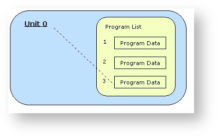
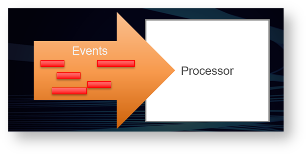

[TOC]


# 技术文档

> 版本更新历史不在翻译范围内：[版本更新历史链接]([Change History - VST - Steinberg Developer Help](https://developer.steinberg.help/display/VST/Change+History))


## API文档

**VST 3 API** 是为实时音频处理组件设计的接口集。例如音频效果或音频乐器。
**VST 3** 基于一种称为 [VST 模块架构](https://developer.steinberg.help/display/VST/VST+Module+Architecture) (**VST-MA**) 的技术。请参考[VST-MA 文档](https://developer.steinberg.help/display/VST/VST+Module+Architecture)了解更多关于插件系统常规工作的细节信息。
API 文档文件**VST 3**位于文件夹“*pluginterfaces/vst*”。


### 基础概念

一个**VST 3**音效或乐器基本上由两部分组成：处理部分和编辑控制器部分。
对应的接口有：

- Processor : [Steinberg::Vst::IAudioProcessor](https://steinbergmedia.github.io/vst3_doc/vstinterfaces/classSteinberg_1_1Vst_1_1IAudioProcessor.html) + [Steinberg::Vst::IComponent](https://steinbergmedia.github.io/vst3_doc/vstinterfaces/classSteinberg_1_1Vst_1_1IComponent.html)
- Controller : [Steinberg::Vst::IEditController](https://steinbergmedia.github.io/vst3_doc/vstinterfaces/classSteinberg_1_1Vst_1_1IEditController.html)


**VST 3**插件开发可以通过实现两个组件来完全解耦处理器和编辑控制器。分开成这两部分需要一些额外的开发工作。
但是，这种分离使主机能够在不同的上下文与计算机中更好地运行每个组件。另一个好处是，在自动化方面，参数更改可以分离。虽然进行这些更改需要以精确样本传输为代价，但 GUI 可以以很低的频率进行更新，并且可以根据任何延迟补偿或其他的量进行移动。


支持这种分离的插件必须在处理器组件的类中设置 [Steinberg::Vst::kDistributable](https://steinbergmedia.github.io/vst3_doc/vstinterfaces/namespaceSteinberg_1_1Vst.html#a626a070dcd2e025250f41b9c3f9817cda3185111648c1599241528f1a7f523396) 标志（[Steinberg::PClassInfo2::classFlags](https://steinbergmedia.github.io/vst3_doc/base/structSteinberg_1_1PClassInfo2.html#ab5ab9135185421caad5ad8ae1d758409)）。当然不是每个插件都能做到这一点，例如，如果它非常依赖某一台特定计算机的资源。因此，当未设置此标志时，宿主不得以任何方式分离组件。
虽然不推荐，但可以在一个组件类中同时实现处理部分和控制器部分。宿主在创建 [Steinberg::Vst::IAudioProcessor](https://steinbergmedia.github.io/vst3_doc/vstinterfaces/classSteinberg_1_1Vst_1_1IAudioProcessor.html) 后尝试查询 [Steinberg::Vst::IEditController](https://steinbergmedia.github.io/vst3_doc/vstinterfaces/classSteinberg_1_1Vst_1_1IEditController.html) 接口，并在成功时将其用作控制器。


> 宿主不需要实例化插件的控制器部分来处理它。
>
> 插件应准备好被处理，而无需实例化控制器部分。


#### 初始化

[Steinberg::Vst::IComponent](https://steinbergmedia.github.io/vst3_doc/vstinterfaces/classSteinberg_1_1Vst_1_1IComponent.html) 和 [Steinberg::Vst::IEditController](https://steinbergmedia.github.io/vst3_doc/vstinterfaces/classSteinberg_1_1Vst_1_1IEditController.html) 都派生自 [Steinberg::IPluginBase](https://steinbergmedia.github.io/vst3_doc/base/classSteinberg_1_1IPluginBase.html)。这个基本接口的目的是初始化组件并在它被销毁之前终止它。


传递给 [Steinberg::IPluginBase::initialize](https://steinbergmedia.github.io/vst3_doc/base/classSteinberg_1_1IPluginBase.html#a3c81be4ff2e7bbb541d3527264f26eed) 的上下文参数应该实现接口 [Steinberg::Vst::IHostApplication](https://steinbergmedia.github.io/vst3_doc/vstinterfaces/classSteinberg_1_1Vst_1_1IHostApplication.html)。主机不应在调用初始化之前调用其他函数，[Steinberg::Vst::IComponent::setIoMode](https://steinbergmedia.github.io/vst3_doc/vstinterfaces/classSteinberg_1_1Vst_1_1IComponent.html#a4618e7358890d549f990010bea4a4137) 必须在初始化之前调用。[Steinberg::Vst::IComponent::getControllerClassId](https://steinbergmedia.github.io/vst3_doc/vstinterfaces/classSteinberg_1_1Vst_1_1IComponent.html#a8aa65685068ad033af57b1497926b689)也可以在初始化之前调用（参见[VST3工作流程图](https://developer.steinberg.help/display/VST/VST+3+Workflow+Diagrams)）。

**插件如何访问IHostApplication？**

```c++
tresult PLUGIN_API MyPluginProcessor::initialize (FUnknown* context)
{
    FUnknownPtr<IHostApplication> hostApp (hostContext);
    if (hostApp)
    {
        String128 name;
        if (hostApp->getName (name) == kResultTrue)
        {
            //...
        }
    }
    //..
}
```


#### 从宿主的角度创建和初始化

下面是一个宿主实现示例，它使用给定的 classID 创建组件及其关联的控制器：

```c++
Vst::IComponent* processorComponent;
Vst::IEditController* editController;
IPluginFactory* factory;
// ...
// factory already initialized (after the library is loaded, see validator for example)
// ...
// create its component part
tresult result = factory->createInstance (classID, Vst::IComponent::iid, (void**)&processorComponent);
if (processorComponent && (result == kResultOk))
{
    // initialize the component with our host context (note: initialize called just after creatInstance)
    res = (processorComponent->initialize (gStandardPluginContext) == kResultOk);
 
    // try to create the controller part from the component
    // for Plug-ins which did not succeed to separate component from controller :-(
    if (processorComponent->queryInterface (Vst::IEditController::iid, (void**)&editController) != kResultTrue)
    {
        // editController is now created, we have the ownership, which means that we have
        // to release it when not used anymore FUID controllerCID;
 
        // ask for the associated controller class ID (could be called before processorComponent->initialize ())
        if (processorComponent->getControllerClassId (controllerCID) == kResultTrue && controllerCID.isValid ())
        {
            // create its controller part created from the factory
            result = factory->createInstance (controllerCID, Vst::IEditController::iid, (void**)&editController);
             if (editController && (result == kResultOk))
            {
                // initialize the component with our context
                res = (editController->initialize (gStandardPluginContext) == kResultOk);
 
                // now processorComponent and editController are initialized... :-)
            }
        }
    }
}
```


#### 扩展

这些基本接口组件的功能可以被一些可选接口进行扩展，只有在需要此扩展时才需要实现这些可选接口。

- Processor Extensions:
   - [Steinberg::Vst::IConnectionPoint](https://steinbergmedia.github.io/vst3_doc/vstinterfaces/classSteinberg_1_1Vst_1_1IConnectionPoint.html)
   - [Steinberg::Vst::IUnitData](https://steinbergmedia.github.io/vst3_doc/vstinterfaces/classSteinberg_1_1Vst_1_1IUnitData.html)
   - [Steinberg::Vst::IProgramListData](https://steinbergmedia.github.io/vst3_doc/vstinterfaces/classSteinberg_1_1Vst_1_1IProgramListData.html)

- Edit Controller Extensions:
   - [Steinberg::Vst::IConnectionPoint](https://steinbergmedia.github.io/vst3_doc/vstinterfaces/classSteinberg_1_1Vst_1_1IConnectionPoint.html)
   - [Steinberg::Vst::IMidiMapping](https://steinbergmedia.github.io/vst3_doc/vstinterfaces/classSteinberg_1_1Vst_1_1IMidiMapping.html)
   - [Steinberg::Vst::IUnitInfo](https://steinbergmedia.github.io/vst3_doc/vstinterfaces/classSteinberg_1_1Vst_1_1IUnitInfo.html)


#### 持久化

宿主在项目文件和预设文件中存储和恢复处理器和控制器的完整状态：

- [Steinberg::Vst::IComponent::getState](https://steinbergmedia.github.io/vst3_doc/vstinterfaces/classSteinberg_1_1Vst_1_1IComponent.html#a10db03106be8ba89d23859fa6be5d9f6) + [Steinberg::Vst::IComponent::setState](https://steinbergmedia.github.io/vst3_doc/vstinterfaces/classSteinberg_1_1Vst_1_1IComponent.html#a77ac39bcc5c4b15818b1a87de2573805)
   store and restore the DSP model.
- [Steinberg::Vst::IEditController::getState](https://steinbergmedia.github.io/vst3_doc/vstinterfaces/classSteinberg_1_1Vst_1_1IEditController.html#a10db03106be8ba89d23859fa6be5d9f6) + [Steinberg::Vst::IEditController::setState](https://steinbergmedia.github.io/vst3_doc/vstinterfaces/classSteinberg_1_1Vst_1_1IEditController.html#a77ac39bcc5c4b15818b1a87de2573805)
   store and restore any GUI settings that are not related to the processor (like scroll positions etc).
- **Restore:** When the states are restored, the host passes the processor state to both the processor and the controller ([Steinberg::Vst::IEditController::setComponentState](https://steinbergmedia.github.io/vst3_doc/vstinterfaces/classSteinberg_1_1Vst_1_1IEditController.html#a4c2e1cafd88143fda2767a9c7ba5d48f)). 宿主必须始终先将该状态传递给处理器。然后控制器必须将其参数同步到此状态（但不得执行任何 [IComponentHandler](https://steinbergmedia.github.io/vst3_doc/vstinterfaces/classSteinberg_1_1Vst_1_1IComponentHandler.html)的回调）。
   恢复状态后，宿主重新扫描参数（通过询问控制器）以更新其内部表示。


请参考

- [Steinberg::IBStream](https://steinbergmedia.github.io/vst3_doc/base/classSteinberg_1_1IBStream.html)
- [VST 3 Interfaces to be implemented by the Plug-in](https://steinbergmedia.github.io/vst3_doc/vstinterfaces/group__vstIPlug.html)
- [VST 3 Interfaces to be implemented by the Host](https://steinbergmedia.github.io/vst3_doc/vstinterfaces/group__vstIHost.html)


### 处理部分


处理部分由两个相关接口组成：[Steinberg::Vst::IComponent](https://steinbergmedia.github.io/vst3_doc/vstinterfaces/classSteinberg_1_1Vst_1_1IComponent.html)和[Steinberg::Vst::IAudioProcessor](https://steinbergmedia.github.io/vst3_doc/vstinterfaces/classSteinberg_1_1Vst_1_1IAudioProcessor.html)。The reason for splitting the two is to use the basic interfaces [Steinberg::Vst::IComponent](https://steinbergmedia.github.io/vst3_doc/vstinterfaces/classSteinberg_1_1Vst_1_1IComponent.html) not only for audio plug-ins but also for other kinds of media (e.g. video processing in the future). Hence the [Steinberg::Vst::IAudioProcessor](https://steinbergmedia.github.io/vst3_doc/vstinterfaces/classSteinberg_1_1Vst_1_1IAudioProcessor.html) interface represents the audio-specific part of a processing component. Let's have a closer look at the concepts.


### IComponent

The [Steinberg::Vst::IComponent](https://steinbergmedia.github.io/vst3_doc/vstinterfaces/classSteinberg_1_1Vst_1_1IComponent.html) interface allows the host to get information about the plug-in:

1. **Edit controller association**: In order to enable the host to create the associated edit controller part, the processing component has to provide the matching class-ID. The host uses the module's class factory to create the controller component. See [Steinberg::Vst::IComponent::getControllerClassId](https://steinbergmedia.github.io/vst3_doc/vstinterfaces/classSteinberg_1_1Vst_1_1IComponent.html#a8aa65685068ad033af57b1497926b689)


2. The host can ask for bus configurations ([Steinberg::Vst::BusInfo](https://steinbergmedia.github.io/vst3_doc/vstinterfaces/structSteinberg_1_1Vst_1_1BusInfo.html)). See [Steinberg::Vst::IComponent::getBusInfo](https://steinbergmedia.github.io/vst3_doc/vstinterfaces/classSteinberg_1_1Vst_1_1IComponent.html#a41b0e971a0ff153a4eb34274750b0c91)


3. The host can ask for routing information ([Steinberg::Vst::RoutingInfo](https://steinbergmedia.github.io/vst3_doc/vstinterfaces/structSteinberg_1_1Vst_1_1RoutingInfo.html)).


4. The host can activate or deactivate a specific bus like [side-chain](https://developer.steinberg.help/display/VST/Frequently+Asked+Questions#FrequentlyAskedQuestions-WhatisaSide-chain). A deactivated bus should be not processed by the plug-in. See [Steinberg::Vst::IComponent::activateBus](https://steinbergmedia.github.io/vst3_doc/vstinterfaces/classSteinberg_1_1Vst_1_1IComponent.html#a3ab7d06aaefe03da1fcd1819f1261050)


5. The host can activate or deactivate the plug-in (On/Off button). See [Steinberg::Vst::IComponent::setActive](https://steinbergmedia.github.io/vst3_doc/vstinterfaces/classSteinberg_1_1Vst_1_1IComponent.html#a0a840e8077eb74ec429b8007c7b83517)


6. The host can store and restore the state of the plug-in (preset and project persistence). See [Steinberg::Vst::IComponent::getState](https://steinbergmedia.github.io/vst3_doc/vstinterfaces/classSteinberg_1_1Vst_1_1IComponent.html#a10db03106be8ba89d23859fa6be5d9f6),  Steinberg::Vst::IComponent::setState


### IAudioProcessor

The [Steinberg::Vst::IAudioProcessor](https://steinbergmedia.github.io/vst3_doc/vstinterfaces/classSteinberg_1_1Vst_1_1IAudioProcessor.html) interface extends [Steinberg::Vst::IComponent](https://steinbergmedia.github.io/vst3_doc/vstinterfaces/classSteinberg_1_1Vst_1_1IComponent.html) by providing a state machine for processing and the process method:

1. Setup:


   The processor must be configured before processing can start. Configurations are only allowed when the processor is inactive (

   Steinberg::Vst::IComponent::setActive).

   - **Process setup**: The processor is informed about the parameters that cannot be changed while processing is active. ([Steinberg::Vst::ProcessSetup](https://steinbergmedia.github.io/vst3_doc/vstinterfaces/structSteinberg_1_1Vst_1_1ProcessSetup.html)).


   - **Dynamic Speaker Arrangements**: The host can try to change the number of channels of an audio bus. By default the speaker arrangement is defined by the plug-in. In order to adjust the plug-in to a context where a different speaker arrangement is used, the host can try to change it using [Steinberg::Vst::IAudioProcessor::setBusArrangements](https://steinbergmedia.github.io/vst3_doc/vstinterfaces/classSteinberg_1_1Vst_1_1IAudioProcessor.html#ad3bc7bac3fd3b194122669be2a1ecc42)

2. When the processor is configured, it has to be activated ([Steinberg::Vst::IComponent::setActive](https://steinbergmedia.github.io/vst3_doc/vstinterfaces/classSteinberg_1_1Vst_1_1IComponent.html#a0a840e8077eb74ec429b8007c7b83517)). The activation call signals that all configurations have been finished.

3. In addition to that, the processor has a 'processing state'. Before a host begins to perform processing calls, it has to signal this by calling [IAudioProcessor::setProcessing](https://steinbergmedia.github.io/vst3_doc/vstinterfaces/classSteinberg_1_1Vst_1_1IAudioProcessor.html#af252fd721b195b793f3a5dfffc069401)(true). When the host stops processing, it must call [IAudioProcessor::setProcessing](https://steinbergmedia.github.io/vst3_doc/vstinterfaces/classSteinberg_1_1Vst_1_1IAudioProcessor.html#af252fd721b195b793f3a5dfffc069401)(false) after the last processing call. Please see also: [VST 3 Workflow Diagrams](https://developer.steinberg.help/display/VST/VST+3+Workflow+Diagrams)

4. Process:Steinberg::Vst::IAudioProcessor::process is the method that implements the actual processing. Any data needed for processing is passed to it as a parameter Steinberg::Vst::ProcessData. This is necessary because processing is often performed in a separate thread and this is a simple way to avoid thread synchronization problems.

   - **Block Size**: Processing is done in blocks. The maximum number of samples to be processed in one block is set in [Steinberg::Vst::IAudioProcessor::setupProcessing](https://steinbergmedia.github.io/vst3_doc/vstinterfaces/classSteinberg_1_1Vst_1_1IAudioProcessor.html#aefb5731b94dbc899a4a7e9cd1c96e6a2). The actual number of samples in a processing block is transmitted in the process call and can be different from call to call, but it must be a value between 1 and [maxSamplesPerBlock](https://steinbergmedia.github.io/vst3_doc/vstinterfaces/structSteinberg_1_1Vst_1_1ProcessSetup.html#a41cd06a0c942a1b3f283092b893d0de3).


   - **Audio Buffers**: For any audio bus defined by the plug-in, the host must provide buffer data - even for inactive busses. Busses are addressed by index, so leaving out inactive busses will mix up these indices. The actual data buffer can be null though (see[Steinberg::Vst::AudioBusBuffers](https://steinbergmedia.github.io/vst3_doc/vstinterfaces/structSteinberg_1_1Vst_1_1AudioBusBuffers.html)).

      **Note:** The [channelBuffers32](https://steinbergmedia.github.io/vst3_doc/vstinterfaces/structSteinberg_1_1Vst_1_1AudioBusBuffers.html#abac2239417d88a091cad5b4f917dc49a)(or [channelBuffers64](https://steinbergmedia.github.io/vst3_doc/vstinterfaces/structSteinberg_1_1Vst_1_1AudioBusBuffers.html#a0bbcd9a3e75d01b547097c91f9f659cf)) buffer pointers can be the same or different for input and output: this has to be taken into account in the process function (for example not resetting the output before processing if input and output buffers are the same!). It can be the same for multiple inputs or multiple outputs (in the case of instrument plug-ins) all outputs (or inputs) can share the same buffer!

      **Important**: The host can call [Steinberg::Vst::IAudioProcessor::process](https://steinbergmedia.github.io/vst3_doc/vstinterfaces/classSteinberg_1_1Vst_1_1IAudioProcessor.html#a6b98eb31cf38ba96a28b303c13c64e13) without buffers ([numInputs](https://steinbergmedia.github.io/vst3_doc/vstinterfaces/structSteinberg_1_1Vst_1_1ProcessData.html#a852a74fc4e461ef086bac048313d2de9)and [numOutputs](https://steinbergmedia.github.io/vst3_doc/vstinterfaces/structSteinberg_1_1Vst_1_1ProcessData.html#a1338255f88bad5cf4fb714c71f92b61a)of [Steinberg::Vst::AudioBusBuffers](https://steinbergmedia.github.io/vst3_doc/vstinterfaces/structSteinberg_1_1Vst_1_1AudioBusBuffers.html) are zeroed, [numSamples](https://steinbergmedia.github.io/vst3_doc/vstinterfaces/structSteinberg_1_1Vst_1_1ProcessData.html#aeb42971a4bd34d7baa27cff8d7e3cf26)too), in order to flush parameters (from host to plug-in). Parameters can only be flushed when the host needs to send parameter changes and no processing is called.


   - **Parameters & Automation**: Any parameter changes are transmitted in the process call through the interfaces [Steinberg::Vst::IParameterChanges](https://steinbergmedia.github.io/vst3_doc/vstinterfaces/classSteinberg_1_1Vst_1_1IParameterChanges.html) and [Steinberg::Vst::IParamValueQueue](https://steinbergmedia.github.io/vst3_doc/vstinterfaces/classSteinberg_1_1Vst_1_1IParamValueQueue.html). Simple parameter changes as a result of GUI interaction are transmitted exactly in the same way as automation. (see [Parameters and Automation](https://developer.steinberg.help/vst3Automation.html)).


   - **Context:** For each processing block the host should provide information about its state. See [Steinberg::Vst::ProcessContext](https://steinbergmedia.github.io/vst3_doc/vstinterfaces/structSteinberg_1_1Vst_1_1ProcessContext.html)


   - **Events:** [Steinberg::Vst::IEventList](https://steinbergmedia.github.io/vst3_doc/vstinterfaces/classSteinberg_1_1Vst_1_1IEventList.html)


### The Editing Part


The edit controller is responsible for the GUI aspects of the plug-in. Its standard interface is[Steinberg::Vst::IEditController](https://steinbergmedia.github.io/vst3_doc/vstinterfaces/classSteinberg_1_1Vst_1_1IEditController.html). The host has to provide a callback interface for the edit controller named [Steinberg::Vst::IComponentHandler](https://steinbergmedia.github.io/vst3_doc/vstinterfaces/classSteinberg_1_1Vst_1_1IComponentHandler.html). The handler is essential for the communication with both the host and the processor.

- **GUI:** Optionally, the controller can define an editor view. The method [Steinberg::Vst::IEditController::createView](https://steinbergmedia.github.io/vst3_doc/vstinterfaces/classSteinberg_1_1Vst_1_1IEditController.html#a1fa4ed10cc0979e5559045104c998b1a) allows the host to specify the type of the view by passing an id-string. Currently the only type defined is "editor" ([Steinberg::Vst::ViewType::kEditor](https://steinbergmedia.github.io/vst3_doc/vstinterfaces/namespaceSteinberg_1_1Vst_1_1ViewType.html#aaa62c4c32f0270a908eb20c7c7124dfc)), but there might be variations in future versions (e.g. "setup").
   See also[Steinberg::IPlugView](https://steinbergmedia.github.io/vst3_doc/base/classSteinberg_1_1IPlugView.html).


- **Parameters:** The controller is responsible for the management of parameters. Any change to a parameter that is caused by user interaction in the plug-in GUI must be properly reported to the [Steinberg::Vst::IComponentHandler](https://steinbergmedia.github.io/vst3_doc/vstinterfaces/classSteinberg_1_1Vst_1_1IComponentHandler.html). The host is responsible for transmitting the change to the processor. In order to make recording of automation work, it is necessary to call [beginEdit](https://steinbergmedia.github.io/vst3_doc/vstinterfaces/classSteinberg_1_1Vst_1_1IComponentHandler.html#a8456ad739430267a12dda11a53fe9223), [performEdit](https://steinbergmedia.github.io/vst3_doc/vstinterfaces/classSteinberg_1_1Vst_1_1IComponentHandler.html#a135d4e76355ef0ba0a4162a0546d5f93)and [endEdit](https://steinbergmedia.github.io/vst3_doc/vstinterfaces/classSteinberg_1_1Vst_1_1IComponentHandler.html#ae380206486b11f000cad7c0d9b6e877c)in the expected order! And from the **UI-Thread**!
   With the new interface [IComponentHandler2](https://developer.steinberg.help/classSteinberg_1_1Vst_1_1IComponentHandler2.html) (since VST 3.1), the plug-in (from UI) can group parameters which should use the same time-stamp in host when writing automation, by wrapping a set of [beginEdit](https://steinbergmedia.github.io/vst3_doc/vstinterfaces/classSteinberg_1_1Vst_1_1IComponentHandler.html#a8456ad739430267a12dda11a53fe9223)/[performEdit](https://steinbergmedia.github.io/vst3_doc/vstinterfaces/classSteinberg_1_1Vst_1_1IComponentHandler.html#a135d4e76355ef0ba0a4162a0546d5f93)/[endEdit](https://steinbergmedia.github.io/vst3_doc/vstinterfaces/classSteinberg_1_1Vst_1_1IComponentHandler.html#ae380206486b11f000cad7c0d9b6e877c)functions (see [IComponentHandler](https://steinbergmedia.github.io/vst3_doc/vstinterfaces/classSteinberg_1_1Vst_1_1IComponentHandler.html)) with [startGroupEdit](https://steinbergmedia.github.io/vst3_doc/vstinterfaces/classSteinberg_1_1Vst_1_1IComponentHandler2.html#aba339113df404a6b3c557774d4aa9102)and [finishGroupEdit](https://steinbergmedia.github.io/vst3_doc/vstinterfaces/classSteinberg_1_1Vst_1_1IComponentHandler2.html#adbdc10ff7ecd96fa365ad4f98d57b55e).
   More details can be found on the page about [Parameters](https://developer.steinberg.help/display/VST/Parameters+and+Automation).


- **Plug-in structure:** If the plug-in is composed of discrete functional parts, the edit controller should publish this structure and the parameters belonging to each part by implementing the [Steinberg::Vst::IUnitInfo](https://steinbergmedia.github.io/vst3_doc/vstinterfaces/classSteinberg_1_1Vst_1_1IUnitInfo.html) interface. More details can be found on the page about [VST 3 Units](https://developer.steinberg.help/vst3Units.html).


### VST 3 threading model

The threading model used by **VST 3** is quite simple and requires that:

- all initialisation/de-initialisation are done in the UI Thread
- all function exported by the plugin-in are called by the host in the UI Thread with the exception of:
   - IAudioProcessor→process: which could be called in a Audio Thread (realtime thread), avoid any memory allocation!
   - IAudioProcessor→setProcessing: which could be called in a Audio Thread (realtime thread), avoid any memory allocation!
- all function exported by the host are called by the plug-in in the UI Thread

Check the [Audio Processor Call Sequence](https://developer.steinberg.help/display/VST/Audio+Processor+Call+Sequence) and the [Edit Controller Call Sequence](https://developer.steinberg.help/display/VST/Edit+Controller+Call+Sequence)


### Communication between the components

The two **VST 3** components (processor and controller) need a way to communicate. It is the task of the host to handle this.

#### Standard communication

All standard data (like parameter changes) are transmitted between processor and controller using the basic interfaces listed above.

- After creation of processor and controller, the host sets the controller component state from the processors state. This is a change from the previous SDK, where it was assumed that after creation the controller and the processor are in sync.

- When the host sets a new processor state ([Steinberg::Vst::IComponent::setState](https://steinbergmedia.github.io/vst3_doc/vstinterfaces/classSteinberg_1_1Vst_1_1IComponent.html#a77ac39bcc5c4b15818b1a87de2573805)), this state is always transmitted to the controller as well ([Steinberg::Vst::IEditController::setComponentState](https://steinbergmedia.github.io/vst3_doc/vstinterfaces/classSteinberg_1_1Vst_1_1IEditController.html#a4c2e1cafd88143fda2767a9c7ba5d48f)). The controller then has to synchronize to this state and adjust its parameters.

- When the controller transmits a parameter change to the host, the host synchronizes the processor by passing the new values as [Steinberg::Vst::IParameterChanges](https://steinbergmedia.github.io/vst3_doc/vstinterfaces/classSteinberg_1_1Vst_1_1IParameterChanges.html) to the process call.

- The processor can transmit outgoing parameter changes to the host as well. ([Steinberg::Vst::ProcessData::outputParameterChanges](https://steinbergmedia.github.io/vst3_doc/vstinterfaces/structSteinberg_1_1Vst_1_1ProcessData.html#af08c4f7dfd9e456cc98ba0eb325993ae)). These are transmitted to the edit controller by the call of [Steinberg::Vst::IEditController::setParamNormalized](https://steinbergmedia.github.io/vst3_doc/vstinterfaces/classSteinberg_1_1Vst_1_1IEditController.html#aded549c5b0f342a23dee18cc41ece6b8).


#### Private communication

Data that is unknown to the host can be transmitted by means of messages. The communication interfaces are

- [Steinberg::Vst::IConnectionPoint](https://steinbergmedia.github.io/vst3_doc/vstinterfaces/classSteinberg_1_1Vst_1_1IConnectionPoint.html): The host establishes a connection between processor and controller.
- [Steinberg::Vst::IMessage](https://steinbergmedia.github.io/vst3_doc/vstinterfaces/classSteinberg_1_1Vst_1_1IMessage.html): Represents a message to send to the counterpart.
- [Steinberg::Vst::IAttributeList](https://steinbergmedia.github.io/vst3_doc/vstinterfaces/classSteinberg_1_1Vst_1_1IAttributeList.html): A list of attributes belonging to a message.


Please note that messages from the processor to the controller must not be sent during the process call, as this would not be fast enough and would break the real time processing. Such tasks should be handled in a separate timer thread.


#### Initialization of communication from Host point of view

Here an example of host implementation where the component and controller parts are connected and synchronized:

```c++
//------------------------------------------------------------------------
// the component and the controller parts are previously be created and initialized (see above)
// ...
if (editController)
{
    // set the host handler
    // the host set its handler to the controller
    editController->setComponentHandler (myHostComponentHandler);
 
    // connect the 2 components
    Vst::IConnectionPoint* iConnectionPointComponent = nullPtr;
    Vst::IConnectionPoint* iConnectionPointController = nullPtr;
 
    processorComponent->queryInterface (Vst::IConnectionPoint::iid, (void**)&iConnectionPointComponent);
    editController->queryInterface (Vst::IConnectionPoint::iid, (void**)&iConnectionPointController);
 
    if (iConnectionPointComponent && iConnectionPointController)
    {
        iConnectionPointComponent->connect (iConnectionPointController);
        iConnectionPointController->connect (iConnectionPointComponent);
    }
 
    // synchronize controller to component by using setComponentState
    MemoryStream stream; // defined in "public.sdk/source/common/memorystream.h"
    stream.setByteOrder (kLittleEndian);
    if (processorComponent->getState (&stream) == kResultTrue)
    {
        stream.rewind ();
        editController->setComponentState (&stream);
    }
 
    // now processorComponent and editController parts are connected and synchronized...:-)
}
```

> 处理组件和编辑控制器之间是直接连接的，你不能依赖于连接中的实施细节


## VST模块体系

### How the host will load a VST-MA based Plug-in

Check the included cpp files showing how to load such Component/plug-in:

- *public.sdk/source/vst/hosting/module.h* and
- *for each platform public.sdk/source/vst/hosting/module_win32.cpp,.....*

Here below you could found a basic implementation on Windows showing how to load the library and get pointer to the wanted exported functions:

```c++
HMODULE hModule = LoadLibrary ("SomePlugin.dll");
if (hModule)
{
    InitModuleProc initProc = (InitModuleProc)GetProcAddress (hModule, "InitDll");
    if (initProc) // this entry function is optional on Windows, not on MacOS and Linux!
    {
        if (initProc () == false)
        {
            FreeLibrary (module);
            return false;
        }
    }
 
    GetFactoryProc proc = (GetFactoryProc)GetProcAddress (hModule, "GetPluginFactory");
 
    IPluginFactory* factory = proc ?proc () : 0;
    if (factory)
    {
        for (int32 i = 0; i < factory->countClasses (); i++)
        {
            PClassInfo ci;
            factory->getClassInfo (i, &ci);
 
            FUnknown* obj;
            factory->createInstance (ci.cid, FUnknown::iid, (void**)&obj);
            ...
            obj->release ();
        }
 
        factory->release ();
    }
 
    ExitModuleProc exitProc = (ExitModuleProc)GetProcAddress (hModule, "ExitDll");
    if (exitProc)  // This exit function is optional on Windows, not on MacOS and Linux!
         exitProc ();
 
    FreeLibrary (hModule);
}
```


### How to derive a class from an interface

```c++
class CMyClass: public FUnknown
{
public:
    CMyClass ();
    virtual ~CMyClass ();
 
    DECLARE_FUNKNOWN_METHODS  // declares queryInterface, addRef and release
};
 
CMyClass::CMyClass ()
{
    FUNKNOWN_CTOR // init reference counter, increment global object counter
}
 
CMyClass::~CMyClass ()
{
    FUNKNOWN_DTOR // decrement global object counter
}
 
IMPLEMENT_REFCOUNT (CMyClass) // implements reference counting
 
tresult CMyClass::queryInterface (const char* iid, void** obj)
{
    QUERY_INTERFACE (iid, obj, ::FUnknown::iid, CMyClass)
    return kNoInterface;
}
```

Developing a class with more than one interface is done by multiple inheritance. Additionally you have to provide an appropriate cast for each interface in the queryInterface method.

```c++
class CMyMultiClass : public Steinberg::IPluginBase,
                      public Steinberg::IPlugController,
                      public Steinberg::IEditorFactory
{
public:
    DECLARE_FUNKNOWN_METHODS
 
    // declare the methods of all inherited interfaces here...
};
 
IMPLEMENT_REFCOUNT (CMyMultiClass) // implements reference counting
 
tresult CMyMultiClass::queryInterface (const char* iid, void** obj)
{
    QUERY_INTERFACE (iid, obj, Steinberg::FUnknown::iid, IPluginBase)
    QUERY_INTERFACE (iid, obj, Steinberg::IPluginBase::iid, IPluginBase)
    QUERY_INTERFACE (iid, obj, Steinberg::IPlugController::iid, IPlugController)
    QUERY_INTERFACE (iid, obj, Steinberg::IEditorFactory::iid, IEditorFactory)
     *obj = 0;
    return kNoInterface;
}
```


### Interface Versions and Inheritance

Unlike C++ classes, **VST-MA** interfaces do not use inheritance to express specializations of objects. Usually all interfaces are derived from FUnknown. This is because interfaces must **never** change after they have been released. The VST Module Architecture Interfaces use inheritance only for versioning! All specializations will be modeled as separate interfaces!


For example the C++ classes:

```c++
class Shape
{
public:
    void setPosition (long x, long y);
protected:
    long x;
    long y;
};
class Rect : public Shape
{
public:
    void setDimension (long width, long height);
protected:
    long width;
    long height;
};
```

expressed in **VST-MA**, define an interface for each inheritance level:

```c++
class IShape : public FUnknown
{
public:
    virtual void setPosition (long x, long y) = 0;
};
class IRect : public FUnknown
{
public:
    virtual void setDimension (long width, long height) = 0;
};
```

In the next program version there need to be changes to the `Shape` class that look like this:

```c++
class Shape
{
public:
    void setPosition (long x, long y);
    void setColor (Color color);
protected:
    long x;
    long y;
    Color color;
};
```

The **VST-MA** representation now reflect the changes to Shape by adding a new interface that inherits from *IShape* and looks like the following code, while the former interface definitions remain the same:

```c++
class IShape2 : public IShape
{
public:
    virtual void setColor (Color color) = 0;
};
```


## Parameters and Automation

Description of how parameters are defined and used in **VST 3**

Parameters

A plug-in requires parameters in order to control its DSP algorithm, for example, a Frequency parameter for a filter. The plug-in can export these parameters in order to make them visible to the host and allow the host to control/change/automate/remote/visualize them. Some parameters can be defined for private use only (not visible to the user) or as read-only, such as parameters associated to VU Meters.

[Steinberg::Vst::IEditController::getParameterCount](https://steinbergmedia.github.io/vst3_doc/vstinterfaces/classSteinberg_1_1Vst_1_1IEditController.html#ab6ffbb8e3bf6f4829ab1c9c23fe935a1) allows the host to to identify the number of parameters that are exported by the plug-in.
The plug-in must assign a unique 32-bit identifier (ID) to each exported parameter.

> Up to 2^31 parameters can be exported with ID range **[0, 2147483648]** (the range [2147483649, 429496729] is reserved for host application).

Please note that it is not allowed to change this assignment at any time. In particular, a plug-in must not perform any reconfigurations that lead to a different set of automatable parameters. The only allowed variation is the adding or removing of parameters in a future plug-in version. However, keep in mind that automation data can get lost when parameters are removed.

Usually, the host is unaware of a parameter's semantics. However, there are a few important exceptions that the controller must announce using the [Steinberg::Vst::ParameterInfo::flags](https://steinbergmedia.github.io/vst3_doc/vstinterfaces/structSteinberg_1_1Vst_1_1ParameterInfo.html#a8ffba1d4311e48ae488bc118f20d7edb):

- **kCanAutomate:** This means that this parameter can be automated by the host using its automation track. [**SDK 3.0.0**]
- **kIsBypass:** If the plug-in performs bypass processing itself, it must export the corresponding parameter and flag it with kIsBypass. It is highly recommended that this bypass parameter is provided by the effect plug-in. If the plug-in does not export a bypass parameter, the host can perform bypass processing and the plug-in process call will be discontinued. Only one bypass parameter is allowed. The plug-in should save the state of this bypass parameter like other parameters (when getState and setState are used). If the plug-in does not need a bypass (like Instrument) this flag should be not used. Check this [FAQ](https://developer.steinberg.help/display/VST/Frequently+Asked+Questions#FrequentlyAskedQuestions-HowdoesAudioProcessingBypasswork?)in order to understand how bypass processing works. [**SDK 3.0.0**]
- **kIsReadOnly:** This means that this parameter cannot be changed from outside the plug-in, this requires that kCanAutomate is NOT set. [**SDK 3.0.0**]
- **kIsWrapAround:** When a UI control created by the host for this parameter attempts to set its value out of the limits, this UI control will make a wrap around (useful for parameters like 360 degree rotation). [**SDK 3.0.2**]
- **kIsList:** This means that the host will display this parameter as list in a generic editor or automation editing. [**SDK 3.1.0**]
- **kIsHidden:** This means that this parameter will NOT be displayed and cannot be changed from outside the plug-in. This requires that kCanAutomate is NOT set and kIsReadOnly is set. [**SDK 3.7.0**]
- **kIsProgramChange:** If the plug-in supports program lists (see [VST 3 Units](https://developer.steinberg.help/display/VST/VST+3+Units), [Program Lists](https://developer.steinberg.help/pages/viewpage.action?pageId=9798267)), each 'unit' of the plug-in needs to export a program selector parameter. Such a parameter is not allowed to be automated when the affected parameters are flagged as automatable as well. A host can display program parameters at dedicated locations of its GUI. [**SDK 3.0.0**]

The controller must support the conversion to a string for any exported parameter. The conversion method [Steinberg::Vst::IEditController::getParamStringByValue](https://steinbergmedia.github.io/vst3_doc/vstinterfaces/classSteinberg_1_1Vst_1_1IEditController.html#aab2f0b853e75361d331b667e7893962e)must provide a result for any possible normalized parameter value.

> Parameter values are always transmitted in a normalized floating point (64bit double) representation **[0.0, 1.0]**.

**Representation of parameter values**

A plug-in parameter usually has more than one representation. The GUI of a plug-in can display something that appears to be a single parameter, but might control multiple processing parameters at the same time. Or the GUI representation displays a scale-transformed representation of a DSP-Parameter.

Somewhere on the way from the GUI to the DSP algorithm, this transformation has to be performed. The host does not need information about DSP parameters, but it is responsible for reporting parameter changes to the processor. According to this, the processor is the only place where a transformation can happen and all parameters always have to match the GUI representation.

Does this fit into the idea of separating GUI and processing? No problem so far

- it is a separation of duties, nothing more. The processor component and the controller component have to work on the same internal plug-in model. The controller knows how this model has to be presented in the GUI. The processor knows how the model has to be translated into DSP parameters.
   The **VST 3** interfaces suggest a normalized value representation for a part of this model (the part that is exported as parameters). This means every value has to be inside the range from 0.0 to 1.0.

### Parameter styles / 'Step Count'

Although values are transmitted in a normalized format, the host needs to know some details of the parameter's displayed GUI representation. When editing automation data, for example, the host must know the nature of a parameter expressed in its 'step count' (see [Steinberg::Vst::ParameterInfo::stepCount](https://steinbergmedia.github.io/vst3_doc/vstinterfaces/structSteinberg_1_1Vst_1_1ParameterInfo.html#ac1efeff62e4ba9aea101c3327e0b5c4d)).

**Step count semantics** :

- **0** : A *continuous* parameter. Any normalized value has an exact mapping (0 = there are no steps between the values)
- **1** : A *discrete* parameter with 2 states like [on/off] [yes/no] etc. (1 = there is one step between these states)
- **2** : A *discrete* parameter with 3 states [0,1,2] or [3,5,7] (2 = there are two steps between these states)
- **3** : etc...

**Conversion of normalized values**

The controller and the processor have to work with normalized parameter values.

- Step count 0 : Continuous parameters simply need to be mapped accordingly

- Step count n : Discrete parameters need a little bit more care

   - **Discrete Value => Normalize**


   - **Normalize => Discrete Value (Denormalize)**


**Example:** Step Count 3


### Automation

A host that supports parameter automation is dependent on a proper cooperation of the component owning these parameters. One intention in the design of the **VST 3** interfaces was to reduce the amount of possible mistakes for an implementation. The separation of processor and controller enforces that all parameter changes have to be handled by the host in a defined way. Additionally, this allows the host to store the changes as automation data. Nevertheless, there are some more things to consider:

No automated parameter must influence another automated parameter!

The prime example for this is the automation of preset changes. A preset change can lead to the change of all 'normal' parameters. So if automation data already has been recorded for these parameters and the preset change is recorded as well: who wins? This question cannot be answered and the problem can only be resolved by avoiding it. This is why automation of preset changes is not allowed by default.


**Problems**

A fix value range from 0.0 to 1.0 simplifies the handling of parameters in some ways, but there are problems:

- **Non-linear scaling**
   If the DSP representation of a value does not scale in a linear way to the exported normalized representation (which can happen when a decibel scale is used, for example), the edit controller must provide a conversion to a plain representation. This allows the host to move automation data (being in GUI representation) and keep the original value relations intact. ([Steinberg::Vst::IEditController::normalizedParamToPlain](https://steinbergmedia.github.io/vst3_doc/vstinterfaces/classSteinberg_1_1Vst_1_1IEditController.html#a849747dc98909312b4cdbdeea82dbae0) / [Steinberg::Vst::IEditController::plainParamToNormalized](https://steinbergmedia.github.io/vst3_doc/vstinterfaces/classSteinberg_1_1Vst_1_1IEditController.html#ae9706616ae6d938bbf102954f8f2f110)).
- **Changes in future plug-in versions**
   Take a discrete parameter, for example, that controls an option of three choices. If the host stores normalized values as automation data and a new version of a plug-in invented a fourth choice, the automation data will be invalid now. So either the host has to store denormalized values as automation or it must recalculate the automation data accordingly.


**Automation Recording**

Automation recording is performed by the host. In doing so, it is essential for the host to know the start and the end of a manipulation. Therefore, the plug-in must operate the [Steinberg::Vst::IComponentHandler](https://steinbergmedia.github.io/vst3_doc/vstinterfaces/classSteinberg_1_1Vst_1_1IComponentHandler.html) interface in the following way and in the **UI Thread**!:

- The begin of a manipulation must be signaled via [Steinberg::Vst::IComponentHandler::beginEdit](https://steinbergmedia.github.io/vst3_doc/vstinterfaces/classSteinberg_1_1Vst_1_1IComponentHandler.html#a8456ad739430267a12dda11a53fe9223)
- Changes of parameters are reported via [Steinberg::Vst::IComponentHandler::performEdit](https://steinbergmedia.github.io/vst3_doc/vstinterfaces/classSteinberg_1_1Vst_1_1IComponentHandler.html#a135d4e76355ef0ba0a4162a0546d5f93)
- The end of a manipulation must be signaled via [Steinberg::Vst::IComponentHandler::endEdit](https://steinbergmedia.github.io/vst3_doc/vstinterfaces/classSteinberg_1_1Vst_1_1IComponentHandler.html#ae380206486b11f000cad7c0d9b6e877c)

The plug-in must stick to the order of these callbacks. Otherwise, automation recording cannot work correctly. However, the implementation can bring up difficulties. Each type of GUI control and the way it is operated along with the nature of the controlled parameter requires specific considerations.
To address the most common cases:


### Sliders & Knobs

These kind of controls usually control continuous parameters and they are usually operated with the mouse. This common case is the most simple to handle: On mouse-click-down call beginEdit (followed by performEdit when the control allows a jump), on mouse-drag call performEdit and on mouse-click-up call endEdit.

Trouble starts with the **mouse wheel**: There simply is nothing like a defined start or end when the wheel is operated - each wheel event arrives 'out of the blue'. The only way to enable proper automation recording in this case is the usage of a timer.

- A plug-in implementation should call beginEdit when the first wheel event is handled and start a timer (followed by the first call to performEdit). Further wheel events that arrive inside of the timeout interval are reported with performEdit and the timer is restarted. When the timeout period has passed without further events, endEdit should be called and the timer can be removed.


- But since it is the host's task to record automation data, one could argue that it should be the host's task to take care of the timer in this case. This is the reason for the following exception to the rule:

   - Mouse wheel events can be reported without beginEdit and endEdit to the host. The host must be prepared to receive a performEdit without a previous call of beginEdit for a parameter and handle the timeout itself.
   - 

### Buttons / Radio Groups / Pop-up Menus

These kind of controls usually control discrete parameters and simply switch the state of something. A proper handling is to call beginEdit, performEdit and endEdit in a row. The affected parameter has to be exported to the host with the correct step count because discrete parameters are handled differently than continuous parameters in regard to automation.

Mouse wheel handling usually is not supported for buttons, but sometimes for pop-up menus. Discrete parameters do not require the usage of a timer in order to be recorded correctly.

So the plug-in should call the 3 functions in a row for each wheel event - again, the other option is to omit beginEdit and endEdit, but in this case, be sure to report the discrete nature of the parameter to the host correctly.


### Text Input

For reporting the results of a text input value change for a continuous or a discrete parameter, always call beginEdit, performEdit and endEdit in a row.


**Automation Playback**

In **VST 3**, automation playback is the task of the plug-in and it is the host's task to provide the automation data. The only way for a parameter change to arrive in the processor is the processing call. Receiving parameter changes from the edit controller and playing back automation data is one and the same thing.

The need to perform all transformations, from the normalized GUI representation to the DSP representation, produces some overhead. Performing sample accurate automation requires even more overhead, because the DSP value must be calculated for each single sample. While this cannot be avoided entirely, it is the choice of the plug-in implementation how much processing time to spend on automation accuracy. The host always transmits value changes in a way that allows a sample accurate reconstruction of the underlying automation curve. The plug-in is responsible for the realization.


The processor gets the automation data in the processing call by using queue of parameter changes for each parameter having automation data:

a [IParameterChanges](https://steinbergmedia.github.io/vst3_doc/vstinterfaces/classSteinberg_1_1Vst_1_1IParameterChanges.html) has some [IParamValueQueue](https://steinbergmedia.github.io/vst3_doc/vstinterfaces/classSteinberg_1_1Vst_1_1IParamValueQueue.html)s (for a specific parameter ID) which has some Automation Points.

> - A parameter (ID) is present only one time in the [IParameterChanges](https://steinbergmedia.github.io/vst3_doc/vstinterfaces/classSteinberg_1_1Vst_1_1IParameterChanges.html) list!
> - Automation Points inside a [IParamValueQueue](https://steinbergmedia.github.io/vst3_doc/vstinterfaces/classSteinberg_1_1Vst_1_1IParamValueQueue.html)s are sorted per offset (position inside the audio block)!


**GUI playback**

The host is responsible for updating the plug-in GUI when automation data is transmitted to the processor. This is realized by frequent calls of [Steinberg::Vst::IEditController::setParamNormalized](https://steinbergmedia.github.io/vst3_doc/vstinterfaces/classSteinberg_1_1Vst_1_1IEditController.html#aded549c5b0f342a23dee18cc41ece6b8) in the **UI Thread**.

See also [Steinberg::Vst::IParameterChanges](https://steinbergmedia.github.io/vst3_doc/vstinterfaces/classSteinberg_1_1Vst_1_1IParameterChanges.html), [Steinberg::Vst::IParamValueQueue](https://steinbergmedia.github.io/vst3_doc/vstinterfaces/classSteinberg_1_1Vst_1_1IParamValueQueue.html)


### Informing the host about changes

**Parameter titles, default values or flags have changed**

If something happens, user interaction for example, which change the parameter styles ([ParameterFlags](https://steinbergmedia.github.io/vst3_doc/vstinterfaces/structSteinberg_1_1Vst_1_1ParameterInfo.html#ae3a5143ca8d0e271dbc259645a4ae645)) or title or default value of one or multiple parameters, the plug-in must call

```
`IComponentHandler::restartComponent (kParamTitlesChanged);`
```

to inform the host about this change (in the **UI Thread)**. The host rescans the [ParameterInfo](https://steinbergmedia.github.io/vst3_doc/vstinterfaces/structSteinberg_1_1Vst_1_1ParameterInfo.html)s with [getParameterInfo](https://steinbergmedia.github.io/vst3_doc/vstinterfaces/classSteinberg_1_1Vst_1_1IEditController.html#a0ba78602ecf2f5e8d747d8b01d4cfb6c).

**Multiple parameter values have changed**

As result of a program change for example, the plug-in must call

```
`IComponentHandler::restartComponent (kParamValuesChanged);`
```

to inform the host about this change (in the **UI Thread)**. The host invalidates all caches of parameter values and asks the edit controller for the current values.

If only some values have changed (less than 10)  the plug-in should use the [Steinberg::Vst::IComponentHandler::performEdit](https://steinbergmedia.github.io/vst3_doc/vstinterfaces/classSteinberg_1_1Vst_1_1IComponentHandler.html#a135d4e76355ef0ba0a4162a0546d5f93) interface (Show the right use when automation are used: [Automation Recording](https://developer.steinberg.help/display/VST/Parameters+and+Automation#ParametersandAutomation-AutomationRecording))

> If the plug-in needs to inform the host about changes containing parameter title, default or flags and values (of multiple parameters), it could combine the restartComponent flags:

```
`IComponentHandler::restartComponent (kParamValuesChanged|kParamTitlesChanged);`
```


## VST3单元

### 介绍

For example, an EQ section can be a unit.
The purposes of units are:

- Reveal the internal logical structure of the plug-in
- Organize parameters by associating them with units
- Support program lists
- Support handling of Complex Plug-in Structures / Multi-timbral Instruments
   - Multiple program lists (associated with a unit)
   - Access to program list data
   - Associations of MIDI tracks and units
   - Synchronization of plug-in GUI and host GUI


### 单元细节

- The plug-in can define any number and any kind of units. The semantics of a unit is not important.


- Units are organized in a hierarchical way. Each unit can contain sub-units.


- The root unit of this hierarchy is always present (explicit or implicit) and has ID '**0**'. A plug-in that does not define any further units simply consist of unit '0'.


- The plug-in has to assign a unique ID to each further unit it defines and must provide a suitable name for it to be shown in the GUI ([Steinberg::Vst::UnitInfo](https://steinbergmedia.github.io/vst3_doc/vstinterfaces/classSteinberg_1_1Vst_1_1IUnitInfo.html)).


- Each unit can 'contain' parameters. All parameters of the plug-in are managed and published by the [Steinberg::Vst::IEditController](https://steinbergmedia.github.io/vst3_doc/vstinterfaces/classSteinberg_1_1Vst_1_1IEditController.html), but each parameter can be associated with a unit. ([Steinberg::Vst::ParameterInfo::unitId](https://steinbergmedia.github.io/vst3_doc/vstinterfaces/structSteinberg_1_1Vst_1_1ParameterInfo.html#a4d2e0574df0f6d36f26fae1ad759a14f)). A host can organize the list of parameters in a tree view reflecting the unit hierarchy as nodes.


- Each unit can be associated with a program list. (See [Complex Plug-in Structures / Multi-timbral Instruments](https://developer.steinberg.help/pages/viewpage.action?pageId=9798271))


- A unit can be associated with specific busses. There can be any kind of combination, but the VST 3 interfaces only define queries for special situations. (See [Units and Tracks](file:///C:/Users/YGrabit/Desktop/SDKs/VST3_SDKs/3.7/VST_SDK/VST3_SDK/vst3_doc/vstinterfaces/vst3Multitimbral.html#vst3UnitsTracks))


Most things of interest in regard to units are GUI related, so the access interface [Steinberg::Vst::IUnitInfo](https://steinbergmedia.github.io/vst3_doc/vstinterfaces/classSteinberg_1_1Vst_1_1IUnitInfo.html) needs to be implemented as extension of the edit controller.

See also [Steinberg::Vst::IUnitInfo](https://steinbergmedia.github.io/vst3_doc/vstinterfaces/classSteinberg_1_1Vst_1_1IUnitInfo.html), [Presets & Program Lists](https://developer.steinberg.help/pages/viewpage.action?pageId=9798267)


### Examples

- Example of a plug-in (MultibandCompressor from **Cubase** pluginset) with structured parameters list that can be used by the host, here in **Cubase** for selecting a parameter to automate:

   

- Example of a plug-in (VST Amp Rack from **Cubase** pluginset) with structured parameters list visualized in the Parameters tab of the [**PluginTestHost**](https://developer.steinberg.help/display/VST/VST+3+Plug-in+Test+Host)application:

   

- Example of using the unit structure of **HALion Sonic SE** inside **Cakewalk** for automation selection:
   


## 预设和程序列表

### 简单插件


For a simple plug-in, the data of a preset is nothing more than its state. In this case:


- It is the job of the host to manage the preset handling for the plug-in.


- The plug-in itself does not need to provide any means in its GUI for loading presets at all and it does not need to define any program lists.


- Factory presets must be installed as files at the required location (See [Preset Locations](https://developer.steinberg.help/pages/viewpage.action?pageId=9798275#VST3Locations/Format-PresetLocations)).


The host has to provide the GUI for loading and saving preset files. These files contain data that the plug-in has filled into the stream in [Steinberg::Vst::IComponent::getState](https://steinbergmedia.github.io/vst3_doc/vstinterfaces/classSteinberg_1_1Vst_1_1IComponent.html#a10db03106be8ba89d23859fa6be5d9f6). **VST 3** defines dedicated locations in the OS file system (see [Preset Locations](https://developer.steinberg.help/pages/viewpage.action?pageId=9798275#VST3Locations/Format-PresetLocations)), so the host does not need to display a file selector dialog. It knows where to search for preset files of a specific plug-in and where to create them. So it can create a pop-up list for selecting a preset or any other GUI of its choice. After loading a preset, the host is responsible to rescan the parameters values (from the controller part). Therefore, the controller must be sure that it gets the correct parameter states when loading a preset (which is done with [Steinberg::Vst::IEditController::setComponentState](https://steinbergmedia.github.io/vst3_doc/vstinterfaces/classSteinberg_1_1Vst_1_1IEditController.html#a4c2e1cafd88143fda2767a9c7ba5d48f)).

See also [Communication between the components](https://developer.steinberg.help/display/VST/VST+3+API+Documentation#VST3APIDocumentation-Communicationbetweenthecomponents) and [Persistence](https://developer.steinberg.help/display/VST/VST+3+API+Documentation#VST3APIDocumentation-Persistence).


### Program Lists

If a plug-in uses a large pool of programs that require some kind of caching or that need to be preloaded, using preset files may not be a sufficient choice. In this case, the plug-in can define a program list. For this purpose, the edit controller has to be extended by the interface [Steinberg::Vst::IUnitInfo](https://steinbergmedia.github.io/vst3_doc/vstinterfaces/classSteinberg_1_1Vst_1_1IUnitInfo.html).

- If the plug-in defines a program list to be used as pool of factory presets, it must not allow the user to change these presets by the means of parameter editing. Instead, it should load the corresponding data into a kind of working memory and store possible modifications as component state. In addition, the user can be allowed to store the modifications as preset file.


- If the plug-in defines a program list to be used as a pool of user presets that are initially in an 'empty' state, modifications can be applied to the list items directly. This way of using program lists should only be chosen if programs do require a lot of resources that need to be cached in order to achieve fast program changes (good examples for this are sample-based plug-ins).



- The plug-in can provide GUI for the selection of programs, but it must enable the host to display the list and the selected program as well. The index of the selected program in the list must be exported as program selection parameter. ([Steinberg::Vst::ParameterInfo::kIsProgramChange](https://steinbergmedia.github.io/vst3_doc/vstinterfaces/structSteinberg_1_1Vst_1_1ParameterInfo.html#ae3a5143ca8d0e271dbc259645a4ae645a517665185bca1f4f3d77ce0a6468b8e3))


- The plug-in can allow the host to read and write the program data of a list item. To support this, the plug-in must implement the [Steinberg::Vst::IProgramListData](https://steinbergmedia.github.io/vst3_doc/vstinterfaces/classSteinberg_1_1Vst_1_1IProgramListData.html) interface as an extension of the component part.


**Structure of Program Lists**

All programs are always transmitted as a flat list to the host. But the plug-in can assign a number of attributes to each program of the list. This enables the host to organize and filter them in a very flexible way. Attribute values are queried via [Steinberg::Vst::IUnitInfo::getProgramInfo](https://steinbergmedia.github.io/vst3_doc/vstinterfaces/classSteinberg_1_1Vst_1_1IUnitInfo.html#ac40c799f1f52837c311ac153d7a8ead7). The possible attribute identifiers are defined in namespace Steinberg::Vst::PresetAttributes. The attribute identifier specifying a program category, for example, is [Steinberg::Vst::PresetAttributes::kInstrument](https://steinbergmedia.github.io/vst3_doc/vstinterfaces/group__presetAttributes.html#ga93cb7a7100ac96cfafceb6216770c42d). Although the name suggests that it should be used for instruments only, it can be used for any kind of audio plug-in. The value for an instrument category of a program is "Piano" for example. But it is possible to specify a subcategory like "Acoustic Piano" as well. In this case, the strings need to be chained like this:
"Piano|Acoustic Piano". This allows the host to organize presets in a category tree view, for example.


**Pitch Names**

Pitch names are intended to be used with drum kit programs where the different drum sounds are addressed by note pitches. In order to display the name of the drum instrument assigned to a pitch in a drum editor, for example, the host calls [Steinberg::Vst::IUnitInfo::hasProgramPitchNames](https://steinbergmedia.github.io/vst3_doc/vstinterfaces/classSteinberg_1_1Vst_1_1IUnitInfo.html#a63c02601259d4e8690f26eefaad53195) to determine if pitch names are supported and[Steinberg::Vst::IUnitInfo::getProgramPitchName](https://steinbergmedia.github.io/vst3_doc/vstinterfaces/classSteinberg_1_1Vst_1_1IUnitInfo.html#a6126c4506f7981b5e800c6b4daa1e66b) to query the pitch name of a single note.

See also [VST 3 Units Multi-timbral Program Lists](https://developer.steinberg.help/pages/viewpage.action?pageId=9798271) and check out the [pitchnames VST 3 Plug-in example](https://developer.steinberg.help/display/VST/VST+3+Plug-ins+Examples)


## 复杂插件/多音带乐器

### 问题

A simple VST effect plug-in usually does not cause the host too many problems. It has only one audio input and output bus and a defined set of parameters that control aspects of its sound. But a VST plug-in can be a lot more complex than this. When the plug-in implements a multi-timbral musical instrument, the host is confronted with a range of problems regarding the integration of this plug-in in its GUI. To mention a few of them:

- The plug-in can define multiple event input and multiple audio outputs. How can the host know on which output a sound will emerge when a note-event is transmitted to the plug-in?
   -> This may be of interest for the host in order to link a MIDI track to the corresponding audio channel.


- The plug-in can define a list of programs that the user can load from the plug-in GUI. In a multi-timbral instrument, a program only affects a certain part of the plug-in (we call this part a 'unit'). How can the host know about these parts and about the plug-in defined programs that can be loaded?
   -> This may be of interest for a host in order to provide shortcuts for this functionality in its own GUI.

Since a VST plug-in unlike a hardware MIDI instrument is more than only a black box, a complex plug-in should help its host to provide a more convenient GUI integration than it is possible with hardware instruments. **VST 3** uses the concept of units to describe the internal structure of the plug-in (see [VST 3 Units](https://developer.steinberg.help/display/VST/VST+3+Units)) and a multi-timbral instrument is supposed to support the respective interfaces. But the preferred solution in **VST 3** is a reduction of this complexity with the 'simple mode'.


### The Simple Mode

The 'VST 3 simple mode' has the (selfish) background to support the so-called 'simple instrument tracks' of Cubase. These tracks combine a MIDI track and VST audio channel (without the need to make any further assignments such as the choice of a MIDI output port or a MIDI channel). This mode is defined as 'only one input and only one output'. In 'simple mode', only MIDI channel 0 is used. Therefore, an instrument has to be mono-timbral.

The host will now work with multiple instances of the plug-in rather than using the same instance in a way that it contains multiple internal sections of the same kind. The **VST-MA** component model supports shared resources between multiple instances of a plug-in because usually the same module instance (dll/bundle) is used for each plug-in instance.

Yet, a plug-in has the option to support both the simple and the advanced mode with the same implementation. The host tests the general ability to support the 'simple mode' by checking the processor's class flags ([Steinberg::PClassInfo2::classFlags](https://steinbergmedia.github.io/vst3_doc/base/structSteinberg_1_1PClassInfo2.html#ab5ab9135185421caad5ad8ae1d758409)) for the [Steinberg::Vst::kSimpleModeSupported](https://steinbergmedia.github.io/vst3_doc/vstinterfaces/namespaceSteinberg_1_1Vst.html#a626a070dcd2e025250f41b9c3f9817cdabc2edc9bb281cebe9cc6dc00a7cac0ea) flag. If the plug-in is to be used in an instrument track (or whenever a host regards it more suitable) the [Steinberg::Vst::IComponent::setIoMode](https://steinbergmedia.github.io/vst3_doc/vstinterfaces/classSteinberg_1_1Vst_1_1IComponent.html#a4618e7358890d549f990010bea4a4137) method is called (before any other call!) to configure the plug-in. A mono-timbral plug-in should set this flag as well and does not need to take into account the [setIoMode](https://steinbergmedia.github.io/vst3_doc/vstinterfaces/classSteinberg_1_1Vst_1_1IComponent.html#a4618e7358890d549f990010bea4a4137)call.


### Multi-timbral Program Lists

For a multi-timbral instrument plug-in, preset handling can be a lot more complex. In this case:

- The plug-in can define any number of program lists.
- Each unit can reference one program list - this reference must not change.
- Each unit that uses a program list references one list item.
- For each unit referencing a program list, a program selection parameter has to be exported ([Steinberg::Vst::ParameterInfo::kIsProgramChange](https://steinbergmedia.github.io/vst3_doc/vstinterfaces/structSteinberg_1_1Vst_1_1ParameterInfo.html#ae3a5143ca8d0e271dbc259645a4ae645a517665185bca1f4f3d77ce0a6468b8e3)).
- The plug-in can provide GUI for the selection of programs, but it must synchronize the corresponding program selection parameter.
- A host may want to show the program list of the active unit in the same way as it shows the presets of a simple plug-in (usually in a separate control area at the top or the bottom of the window). The host must be able to display the correct list and the correct program name for the unit that has got the focus in the plug-in GUI.


To make this all work correctly, the plug-in must supply a valid implementation of [Steinberg::Vst::IUnitInfo](https://steinbergmedia.github.io/vst3_doc/vstinterfaces/classSteinberg_1_1Vst_1_1IUnitInfo.html) and it must operate the callback interface [Steinberg::Vst::IUnitHandler](https://steinbergmedia.github.io/vst3_doc/vstinterfaces/classSteinberg_1_1Vst_1_1IUnitHandler.html) accordingly.

Similar to the simple case, the host may want to save and load preset files. The component state of the plug-in is not useful here. A preset of a complex plug-in can be:

- The state of a plug-in unit
   -> To support this, the plug-in must implement the [Steinberg::Vst::IUnitData](https://steinbergmedia.github.io/vst3_doc/vstinterfaces/classSteinberg_1_1Vst_1_1IUnitData.html) interface in its component part.
- The contents of an item in the program list
   -> To support this, the plug-in must implement the[Steinberg::Vst::IProgramListData](https://steinbergmedia.github.io/vst3_doc/vstinterfaces/classSteinberg_1_1Vst_1_1IUnitData.html) interface in its component part.


A plug-in can support unit presets and program list presets.


See also [Presets & Program Lists](https://developer.steinberg.help/pages/viewpage.action?pageId=9798267), [Steinberg::Vst::IProgramListData](https://steinbergmedia.github.io/vst3_doc/vstinterfaces/classSteinberg_1_1Vst_1_1IUnitData.html), [Steinberg::Vst::IUnitData](https://steinbergmedia.github.io/vst3_doc/vstinterfaces/classSteinberg_1_1Vst_1_1IUnitData.html)


### Units and Tracks

A unit can be associated with busses (or channels of busses). In particular, a unit can have a fixed and unique connection to an input MIDI channel. For a host, it might be useful to know about this connection and which unit can be associated with a specific MIDI track as a result of this. Often, the GUI of a multi-timbral plug-in does not show the settings of all similar units at the same time. Instead, there is some kind of unit selection. The idea is to be able to synchronize the selection of units in a plug-in to the selection of tracks in the host (in both ways).

When a plug-in GUI is organized in the described way, it should support the described behavior by implementing

- [Steinberg::Vst::IUnitInfo::getUnitByBus](https://steinbergmedia.github.io/vst3_doc/vstinterfaces/classSteinberg_1_1Vst_1_1IUnitInfo.html#a718fa905d04d7d559bc89c7ca761413b) : find out the track - unit relations
- [Steinberg::Vst::IUnitInfo::getSelectedUnit](https://steinbergmedia.github.io/vst3_doc/vstinterfaces/classSteinberg_1_1Vst_1_1IUnitInfo.html#a6f1b43425ba894764f35b7d492e81c53) : let the host know which track to select
- [Steinberg::Vst::IUnitInfo::selectUnit](https://steinbergmedia.github.io/vst3_doc/vstinterfaces/classSteinberg_1_1Vst_1_1IUnitInfo.html#a2504c2bb3c57742102577f34cb58e257) : cause the plug-in to select its unit

and by calling

- [Steinberg::Vst::IUnitHandler::notifyUnitSelection](https://steinbergmedia.github.io/vst3_doc/vstinterfaces/classSteinberg_1_1Vst_1_1IUnitHandler.html#ab05a9a8dcca888caeabdb8ed74766bc6) : trigger the host to synchronize its GUI


### Routing

For a host, it may be interesting to know which VSTi channel in the mixer is the output of a specific MIDI track if the plug-in defines multiple audio output busses (represented as VSTi mixer channels in the host).
In general, the host needs to know about any input to output routing of the plug-in. So if an unambiguous relation exists between a plug-in input and an output, the following method should be implemented:

- [Steinberg::Vst::IComponent::getRoutingInfo](https://steinbergmedia.github.io/vst3_doc/vstinterfaces/classSteinberg_1_1Vst_1_1IComponent.html#aa0ffeccad3c44364a199ce56365a4c12) : find out the output of a given input


## VST3工作流程图

> 本章较多非图片文件，请到相应链接上看

### Audio Processor Call Sequence

https://developer.steinberg.help/display/VST/Audio+Processor+Call+Sequence


### Edit Controller Call Sequence

https://developer.steinberg.help/display/VST/Edit+Controller+Call+Sequence


### Get Latency Call Sequences

https://developer.steinberg.help/display/VST/Get+Latency+Call+Sequences


### Resize View Call Sequences

https://developer.steinberg.help/display/VST/Resize+View+Call+Sequences


### Bus Arrangement Setting Sequences

https://developer.steinberg.help/display/VST/Bus+Arrangement+Setting+Sequences


## VST 3 Locations / Format

### 插件的格式结构

#### For the macOS platform

On the macOS platform, **VST 3 Plug-in** is a standard macOS bundle, its file extension is "**.vst3**" and has the following folder structure:

| Folder | Description |
| :-------------------------------- | :----------------------------------------------------------- |
| MyPlugin.vst3/Contents/Resources/ | folder contains all additional resource files useful for the plug-in |
| MyPlugin.vst3/Contents/MacOS/ | folder contains the plug-in’s macOS universal binary (Mach-O) |
| MyPlugin.vst3/Contents/Info.plist | the plug-in’s property list |
| MyPlugin.vst3/Contents/PkgInfo | specifies the type and creator codes of the bundle (optional) |

#### For the Windows platform

On the Windows platform, a **VST 3 Plug-in** is organized as a bundle like package format (simple folder), its file extension is "**.vst3**" and has the following folder structure:

| Folder | Description |
| :---------------------------------------------- | :----------------------------------------------------------- |
| MyPlugin.vst3/Contents/Resources/ | folder contains all additional resource files useful for the plug-in |
| MyPlugin.vst3/Contents/x86-win/MyPlugin.vst3 | folder contains the plug-in binary (32 bit dll for the i386 architecture) |
| MyPlugin.vst3/Contents/x86_64-win/MyPlugin.vst3 | folder contains the plug-in binary (64 bit dll for the x86_64 architecture) |
| MyPlugin.vst3/Contents/arm-win/MyPlugin.vst3 | Proposal: folder contains the plug-in binary (32 bit dll for the arm architecture) |
| MyPlugin.vst3/Contents/arm_64-win/MyPlugin.vst3 | Proposal: folder contains the plug-in binary (64 bit dll for the arm64 architecture) |
| MyPlugin.vst3/desktop.ini | used to set custom icon in Windows Explorer |
| MyPlugin.vst3/Plugin.ico | customized plug-in icon |


In previous SDKs, the **VST 3 Plug-in** was defined as a single dll file with the **.vst3** extension. This is deprecated since VST 3.6.10.

The file **desktop.ini** should contain:

**desktop.ini**

```
`[.ShellClassInfo]``IconResource=Plugin.ico,``0`
```

and you should then change their attributes with this command line (**s** for system to make sure that Windows will use it for the folder/bundle, **r** for read-only and **h** for hidden (optional)):

```
`attrib +s +``r` `+``h` `desktop.ini``attrib +``r` `+``h` `Plugin.ico`
```

#### For the Linux platform

On Linux, a **VST 3 Plug-in** is organized as a bundle like package format, its file extension is "**.vst3**", it follows this folder structure:

| Folder | Description |
| :---------------------------------- | :----------------------------------------------------------- |
| MyPlugin.vst3/Contents/Resources/ | folder contains all additional resource files useful for the plug-in |
| MyPlugin.vst3/Contents/i386-linux | folder contains the plug-in binary (32 bit shared library .so for Kernel Architecture i386) |
| MyPlugin.vst3/Contents/x86_64-linux | folder contains the plug-in binary (64 bit shared library .so for Kernel Architecture x86_64) |
| yPlugin.vst3/Contents/XXX-linux | with XXX the architecture name based on the output of command-line "uname -m" (machine hardware) + "-linux"for example:armv3l-linuxarmv4b-linuxarmv4l-linuxarmv5tel-linuxarmv5tejl-linuxarmv6l-linuxarmv7l-linuxarmv8l-linux |

#### Merged Bundle

Note that all the bundles can be merged to one, which allows to have a cross-platform bundle/folder.

For example:

```
MyPlugin.vst3/
    |_ Contents/
    |   |__ Resources/
    |   |   |__ Snapshots/
    |   |   |   |__ 84E8DE5F92554F5396FAE4133C935A18_snapshot.png
    |   |   |   |__ 84E8DE5F92554F5396FAE4133C935A18_snapshot_2.0x.png
    |   |   |__ Documentation/
    |   |   |   |__ Manual.pdf
    |   |   |   |__ WhatsNew.pdf
    |   |   |__ Help/
    |   |       |__ helpdoc.xml
    |   |   |__ MyPlugin.srf
    |   |
    |   |__ armv7l-linux/
    |   |   |__ MyPlugin.so
    |   |
    |   |__ i686-linux/
    |   |   |__ MyPlugin.so
    |   |
    |   |__ i386-linux/
    |   |   |__ MyPlugin.so
    |   |
    |   |__ x86_64-linux/
    |   |   |__ MyPlugin.so
    |   |
    |   |__ MacOS/
    |   |   |__ MyPlugin
    |   |
    |   |__ x86-win/
    |   |   |__ MyPlugin.vst3
    |   |
    |   |__ x86_64-win/
    |   |   |__ MyPlugin.vst3
    |   |
    |   |__ Info.plist  (macOS Only)
    |   |__ PkgInfo     (macOS Only)
    |
    |____desktop.ini    (Windows only)
    |___ Plugin.ico     (Windows only)
```


## 插件位置

### 介绍

A **VST 3** Plug-in should be installed at specific folder location, the following tables specify these predefined locations for different operating system.

> **VST 3** doesn't require a Plug-in registration like it is used with **DirectX**.

> Links, Symbolic links or Shortcuts could be used from these predefined folders.

3 levels of folder location are defined:

- **User**: available only for the current logged user
- **Global**: available for all users of the system
- **Application**: available only inside an specific Audio Application (local Plug-ins)

> The host should scan at first higher level of priority, first found Plug-in (for a given Processor UID) has to be used.

#### On macOS platform

On the macOS platform, the host application expects **VST 3 Plug-ins** to be located in:

| Priority | Location | Path | Comment |
| :------- | :---------- | :-------------------------------------------- | :------ |
| 1 | User | /Users/$USERNAME/Library/Audio/Plug-ins/VST3/ |         |
| 2 | Global | /Library/Audio/Plug-ins/VST3/ |         |
| 3 | Global | /Network/Library/Audio/Plug-ins/VST3/ |         |
| 4 | Application | $APPFOLDER/Contents/VST3/ |         |

> **Note:** The host recursively scans these folders at startup in this order (User/Global/Application).

#### On Windows platform

On the Windows platform, the host application expects **VST 3 Plug-ins** to be located in:

| Priority | Location | Path | Comment |
| :------- | :---------- | :-------------------------------------- | :----------------------------------------------------------- |
| 1 | Global | /Program Files/Common Files/VST3/ | FOLDERID_ProgramFilesCommonnative bitdepth:32bit Plug-in on 32bit OS,64bit on 64bit OS |
| 1 | Global | /Program Files (x86)/Common Files/VST3/ | 32bit Plug-ins on 64bit Windows |
| 2 | Application | $APPFOLDER/VST3/ |                                                              |

> **Note:** The host recursively scans these folders at startup in this order (Global/Application).

#### On Linux platform

On the Linux platform, the host application expects **VST 3 Plug-ins** to be located in:

| Priority | Location | Path | Comment |
| :------- | :---------- | :------------------- | :------ |
| 1 | User | $HOME/.vst3/ |         |
| 2 | Global | /usr/lib/vst3/ |         |
| 3 | Global | /usr/local/lib/vst3/ |         |
| 4 | Application | $APPFOLDER/vst3/ |         |

> **Note:** The host recursively scans these folders at startup in this order (User/Global/Application).


## 预设格式

The file extension has to be **".vstpreset"**, for example: *myBestDefault.vstpreset*

Specification of a **VST 3** Preset file :


Check the[Steinberg::Vst::PresetFile](https://steinbergmedia.github.io/vst3_doc/vstsdk/classSteinberg_1_1Vst_1_1PresetFile.html#a9db1b48345e92320b0dffc446d5e3483) source code which allows to read and write such presets.


## 预设位置

### 介绍

**VST 3** presets are located at predefined locations on the computer, depending on the operating system.

- 3 levels of preset scope are defined:
   - **User**: available only for the current logged user
   - **Public**: available for all users of the system
   - **Apps**: available only inside a specific audio application
- 4 types of preset are defined:
   - **User**: presets created by the user
   - **User_Factory**: like **User** type, but more hidden
   - **Shared_Factory**: factory presets installed by the plug-in installer
   - **App_Factory**: presets installed by an audio application installer, only visible for this specific audio application

> **$COMPANY** and **$PLUGIN-NAME** folder names contain only allowed characters for file naming (replace characters "**\\*?/:<>|\**" by "**_**").

> **Note:** Each path defined below should be scanned in the given priority, presets extracted and added to the preset list.

#### For Mac platform

| Prio | Type | Scope | Writable | Path | Comment |
| :--- | :------------- | :----- | :------- | :----------------------------------------------------------- | :----------------------------- |
| 1 | User | User | X | Users/$USERNAME/Library/Audio/Presets/$COMPANY/$PLUGIN-NAME/ |                                |
| 2 | Shared_Factory | Public | - | Library/Audio/Presets/$COMPANY/$PLUGIN-NAME/ | Computer shared FactoryROM |
| 3 | Shared_Factory | Public | - | Network/Library/Audio/Presets/$COMPANY/$PLUGIN-NAME/ | Network shared FactoryROM |
| 4 | App_Factory | Apps | - | [$APPFOLDER]/VST3 Presets/$COMPANY/$PLUGIN-NAME/ | Host Application (Cubase, ...) |

#### For Windows XP/2000 platform

| Prio | Type | Scope | Writable | Path | Comment |
| :--- | :------------- | :----- | :------- | :----------------------------------------------------------- | :----------------------------- |
| 1 | User | User | X | [my documents]/vst3 presets/$company/$plugin-name/ | csidl_personal |
| 2 | User_Factory | User | X | [documents and settings/$username/application data]/vst3 presets/$company/$plugin-name/ | csidl_appdata |
| 3 | Shared_Factory | Public | - | [documents and settings/$allusers/application data]/vst3 presets/$company/$plugin-name/ | csidl_common_appdata |
| 4 | App_Factory | Apps | - | [$APPFOLDER]/VST3 Presets/$COMPANY/$PLUGIN-NAME/ | Host Application (Cubase, ...) |

#### For Windows Vista/7/8/10 platform

| Prio | Type | Scope | Writable | Path | Comment |
| :--- | :------------- | :----- | :------- | :----------------------------------------------------------- | :----------------------------- |
| 1 | User | User | X | [Users/$USERNAME/Documents]/VST3 Presets/$COMPANY/$PLUGIN-NAME/ | FOLDERID_Documents |
| 2 | User_Factory | User | X | [Users/$USERNAME/AppData/Roaming]/VST3 Presets/$COMPANY/$PLUGIN-NAME/ | FOLDERID_RoamingAppData |
| 3 | Shared_Factory | Public | - | [ProgramData]/VST3 Presets/$COMPANY/$PLUGIN-NAME/ | FOLDERID_ProgramData |
| 4 | App_Factory | Apps | - | [$APPFOLDER]/VST3 Presets/$COMPANY/$PLUGIN-NAME/ | Host Application (Cubase, ...) |

#### For Linux platform

| Prio | Type | Scope | Writable | Path | Comment |
| :--- | :------------- | :----- | :------- | :--------------------------------------------------- | :--------------- |
| 1 | User | User | X | $HOME/.vst3/presets/$COMPANY/$PLUGIN-NAME/ |                  |
| 2 | Shared_Factory | Public | - | /usr/share/vst3/presets/$COMPANY/$PLUGIN-NAME/ |                  |
| 3 | Shared_Factory | Public | - | /usr/local/share/vst3/presets/$COMPANY/$PLUGIN-NAME/ |                  |
| 4 | App_Factory | Apps | - | [$APPFOLDER]/vst3/presets/$COMPANY/$PLUGIN-NAME/ | Host Application |


## 快照

### 介绍

Since VST 3.6.10, a **VST 3** bundle can contain pre-rendered snapshot images for a **VST 3** host as a visual representation of the plug-in UI.
This snapshot must have a predefined format and file name so that a host can recognize it.

- The image format must be PNG
- The image needs to be located inside the bundle directory in the folder **Resources/Snapshots/**
- The file name must start with the unique ID of the audio processor printed in the form 84E8DE5F92554F5396FAE4133C935A18 followed by the string _snapshot and optionally followed by the HiDPI scale factor _2.0x and ending with the file extension .png.
   - For example, again's snapshot must be named:
      - **84E8DE5F92554F5396FAE4133C935A18_snapshot.png**
      - **84E8DE5F92554F5396FAE4133C935A18_snapshot_2.0x.png** for the 2x scaled HiDPI variant.
   - If the HiDPI scale factor is omitted, a scale factor of 1 is used.


### Examples

#### Again

|  |
| ------------------------------------------------------------ |
| **84E8DE5F92554F5396FAE4133C935A18_snapshot.png** |
|  |
| **84E8DE5F92554F5396FAE4133C935A18_snapshot_2.0x.png** |

#### 音符音调合成器

|  |
| ------------------------------------------------------------ |
| **6EE65CD1B83A4AF480AA7929AEA6B8A0_snapshot.png** |
|  |
| **6EE65CD1B83A4AF480AA7929AEA6B8A0_snapshot_2.0x.png** |

#### How Cubase uses Snapshots


In the Right Zone under the Media Tab, the user can choose FXs and Instruments using the snapshots.


## VST3里的MIDI

Unlike in **VST 2**, **MIDI** is not included in **VST 3**.

But **VST 3** offers suitable concepts that can be translated to and from MIDI using [Event](https://steinbergmedia.github.io/vst3_doc/vstinterfaces/structSteinberg_1_1Vst_1_1Event.html):



### Related Concepts in MIDI and VST 3

Relationship of concepts in **MIDI 1.0** to **VST 3**

| MIDI 1.0 | VST 3 | Defined in |
| :------------------------------- | :----------------------------------------------------------- | :--------------------------------------- |
| Port | Bus of[Steinberg::Vst::MediaType](https://steinbergmedia.github.io/vst3_doc/vstinterfaces/group__vstBus.html#ga576e5da9bdc49812cf65f803bb303ad5), [Steinberg::Vst::MediaTypes::kEvent](https://steinbergmedia.github.io/vst3_doc/vstinterfaces/group__vstBus.html#gga576e5da9bdc49812cf65f803bb303ad5ae6a97de99980aeac9312e818af337d6f) | *ivstcomponent.h* |
| Channel | Channel of a Bus, [Unit by Bus](https://developer.steinberg.help/display/VST/VST+3+Units) and Channel | *ivstcomponent.h, ivstunits.h* |
| Note-On | [Steinberg::Vst::NoteOnEvent](https://steinbergmedia.github.io/vst3_doc/vstinterfaces/structSteinberg_1_1Vst_1_1NoteOnEvent.html) | *ivstevents.h* |
| Note-Off | [Steinberg::Vst::NoteOffEvent](https://steinbergmedia.github.io/vst3_doc/vstinterfaces/structSteinberg_1_1Vst_1_1NoteOffEvent.html) | *ivstevents.h* |
| Poly Key Pressure | [Steinberg::Vst::PolyPressureEvent](https://steinbergmedia.github.io/vst3_doc/vstinterfaces/structSteinberg_1_1Vst_1_1PolyPressureEvent.html) | *ivstevents.h* |
| Control Change | [Parameter](https://developer.steinberg.help/display/VST/Parameters+and+Automation), [IMidiMapping](https://developer.steinberg.help/display/VST/[3.0.1]+Parameter+MIDI+Mapping+Support) | *ivstcomponent.h, ivstmidicontrollers.h* |
| Channel Pressure | [Parameter](https://developer.steinberg.help/display/VST/Parameters+and+Automation), [IMidiMapping](https://developer.steinberg.help/display/VST/[3.0.1]+Parameter+MIDI+Mapping+Support) | *ivstcomponent.h, ivstmidicontrollers.h* |
| Pitch Bend | [Parameter](https://developer.steinberg.help/display/VST/Parameters+and+Automation), [IMidiMapping](https://developer.steinberg.help/display/VST/[3.0.1]+Parameter+MIDI+Mapping+Support) | *ivstcomponent.h, ivstmidicontrollers.h* |
| Program Change | [Parameter](https://developer.steinberg.help/display/VST/Parameters+and+Automation), [kIsProgramChange](https://steinbergmedia.github.io/vst3_doc/vstinterfaces/structSteinberg_1_1Vst_1_1ParameterInfo.html#ae3a5143ca8d0e271dbc259645a4ae645a517665185bca1f4f3d77ce0a6468b8e3), [Steinberg::Vst::ProgramListInfo](https://steinbergmedia.github.io/vst3_doc/vstinterfaces/structSteinberg_1_1Vst_1_1ProgramListInfo.html) | *ivstcomponent.h, ivstunits.h* |
| MPE (MIDI Polyphonic Expression) | [NoteExpression](https://developer.steinberg.help/display/VST/[3.5.0]+Note+Expression+Support), [PhysicalUI](https://developer.steinberg.help/display/VST/[3.6.11]+NoteExpression+Physical+UI+Mapping+Support) | *ivstnoteexpression.h, ivstphysicalui.h* |
| System Exclusive | [Steinberg::Vst::DataEvent](https://steinbergmedia.github.io/vst3_doc/vstinterfaces/structSteinberg_1_1Vst_1_1DataEvent.html)of Type [Steinberg::Vst::DataEvent::kMidiSysEx](https://steinbergmedia.github.io/vst3_doc/vstinterfaces/structSteinberg_1_1Vst_1_1DataEvent.html#afb6eb4f28419b652027fad41104a6d22ab06d86440be6a85eccce4df100ce8e79) | *ivstevents.h* |


Additional relationships of concepts introduced in MIDI 2.0 (<https://www.midi.org/>) to **VST 3**

| MIDI 2.0 | VST 3 | Defined in / Comments |
| :----------------------------- | :----------------------------------------------------------- | :----------------------------------------------------------- |
| Group (of Channels) | Bus of [Steinberg::Vst::MediaType](https://steinbergmedia.github.io/vst3_doc/vstinterfaces/group__vstBus.html#ga576e5da9bdc49812cf65f803bb303ad5), [Steinberg::Vst::MediaTypes::kEvent](https://steinbergmedia.github.io/vst3_doc/vstinterfaces/group__vstBus.html#gga576e5da9bdc49812cf65f803bb303ad5ae6a97de99980aeac9312e818af337d6f) | *ivstcomponent.h* |
| Registered Per-Note Controller | [NoteExpression](https://developer.steinberg.help/display/VST/[3.5.0]+Note+Expression+Support), [PhysicalUI](https://developer.steinberg.help/display/VST/[3.6.11]+NoteExpression+Physical+UI+Mapping+Support) | *ivstnoteexpression.h, ivstphysicalui.h* |
| Assignable Per-Note Controller | [NoteExpression](https://developer.steinberg.help/display/VST/[3.5.0]+Note+Expression+Support) | *ivstnoteexpression.h* |
| System Exclusive 8-Bit | indirect support | The host can translate to 7-Bit, [Steinberg::Vst::DataEvent](https://steinbergmedia.github.io/vst3_doc/vstinterfaces/structSteinberg_1_1Vst_1_1DataEvent.html)of Type [Steinberg::Vst::DataEvent::kMidiSysEx](https://steinbergmedia.github.io/vst3_doc/vstinterfaces/structSteinberg_1_1Vst_1_1DataEvent.html#afb6eb4f28419b652027fad41104a6d22ab06d86440be6a85eccce4df100ce8e79) |
| Registered Controller | not supported | The host can do detailed tuning via [NoteExpression](https://developer.steinberg.help/display/VST/[3.5.0]+Note+Expression+Support) |
| Assignable Controller | not supported | The host should offer mapping to parameters |
| Relative Registered Controller | not supported | The host is free to translate this to parameters |
| Relative Assignable Controller | not supported | The host is free to translate this to parameters |
| Per-Note Pitch Bend | not supported | The host can do detailed tuning via [NoteExpression](https://developer.steinberg.help/display/VST/[3.5.0]+Note+Expression+Support) |
| Mixed Data Set | not supported | not supported |

### MIDI 2.0 Per-Note Controllers

There are many subtle differences between **MIDI 2.0** Per-Note Controllers and [**VST 3** NoteExpression](https://developer.steinberg.help/display/VST/[3.5.0]+Note+Expression+Support). The good thing is that plug-in developers do not have to do anything about it. It is the host's duty to translate from MIDI 2.0 to **VST 3**.

### MIDI 2.0 Increased Resolution, compared to MIDI 1.0

**MIDI 2.0** achieved a significant increase in resolution of many important values, like Velocity, Pressure, and Controllers compared to **MIDI 1.0**. Nevertheless, **VST 3** still has superior resolution than **MIDI 2.0**. Plug-ins and hosts supporting **VST 3** should make use of these capabilities and should not stick to a 0-127 mindset.

See the following tables to compare the resolution of specific values in **MIDI 1.0**, **MIDI 2.0**, and **VST 3**.

| Value | MIDI 1.0 | MIDI 2.0 | VST 3 |
| :----------------------------------------------------------- | :--------------- | :----------------------- | :----------- |
| Velocity (On & Off) | 7 Bit integer | 16 Bit integer | 32 Bit float |
| Poly Pressure | 7 Bit integer | 32 Bit integer | 32 Bit float |
| Channel Pressure / Parameters | 7 Bit integer | 32 Bit integer | 64 Bit float |
| Controllers / Parameters | 7-14 Bit integer | 32 Bit integer | 64 Bit float |
| Pitch Bend / Parameters | 14 Bit integer | 32 Bit integer | 64 Bit float |
| Note Attribute Tuning | not available | 16 Bit fixed point (7.9) | 32 Bit float |
| Per-Note Controllers / [NoteExpression](https://developer.steinberg.help/display/VST/[3.5.0]+Note+Expression+Support) | not available | 32 Bit integer | 64 Bit float |