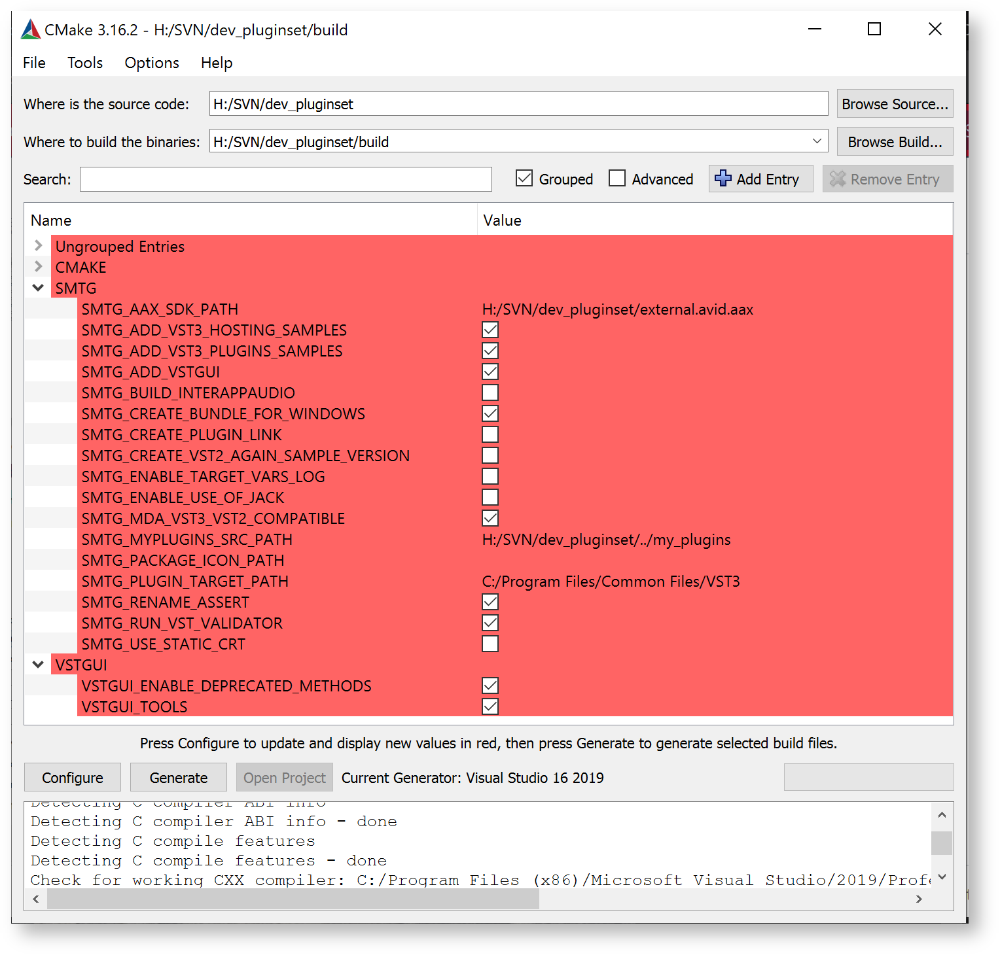
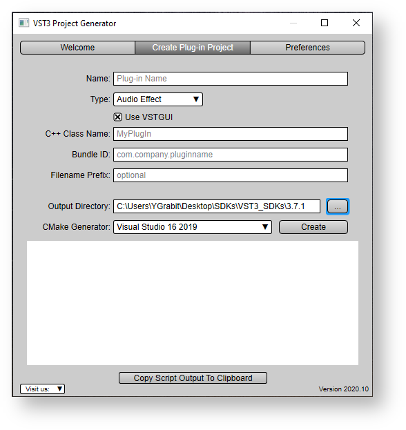

[TOC]


# 教程

## 构建SDK里面的示例项目

This tutorial explains how to set up your computer and create an environment for compiling the **VST 3** audio plug-in examples provided with the **VST 3 SDK**.These include plug-ins like simple DSP effects (Gain, compressor, delay,...), synths instruments and some plug-ins showing how to handle some specific **VST 3** features (Note Expression, Program Change, channel info context,...).

They can be loaded into **VST 3** hosts like Cubase, WaveLab, ...


### **Part 1: Getting and installing the VST3 SDK**

For downloading the SDK, see this section "[How to set up my system for VST 3](https://developer.steinberg.help/display/VST/How+to+set+up+my+system+for+VST+3)".

Download cmake from: <https://cmake.org/download/> or use a package manager for your OS.


### Part 2: Building the examples

**Building the examples on Windows**

- Create a folder for the build and move to this folder (using cd):

```
mkdir build
cd build
```

- Generate the solution/projects: specify the path to the project where CMakeLists.txt is located:

```
cmake.exe -G "Visual Studio 16 2019" -A x64 ../vst3sdk
  or without symbolic links
cmake.exe -G "Visual Studio 16 2019" -A x64 ../vst3sdk -SMTG_CREATE_PLUGIN_LINK=0
```

Note: you can find the string definition for different Visual Studio Generators in the cmake online documentation (<https://cmake.org/documentation/>)

- Build the plug-in (you can use Visual Studio too):

```
msbuild.exe vstsdk.sln
 (or alternatively for example for release)
 
cmake --build . --config Release
```

**Building the examples on macOS**

- Create a folder for the build and move to this folder (using cd):

```
mkdir build
cd build
```

- Generate the solution/projects: specify the path to the project where CMakeLists.txt is located:
  For XCode:

```
cmake -GXcode ../vst3sdk
```

Without XCode (here debug variant):

```
cmake -DCMAKE_BUILD_TYPE=Debug ../
```

- Build the plug-in (you can use XCode too):

```shell
xcodebuild
 (or alternatively for example for release)
 
cmake --build . --config Release
```

**Building the examples on Linux**

- Install the required packages: [Required packages](https://developer.steinberg.help/display/VST/How+to+set+up+my+system+for+VST+3#HowtosetupmysystemforVST3-setup_linux)
- Create a folder for the build and move to this folder (using cd):

```
mkdir build
cd build
```

- Generate the solution/projects: specify the path to the project where CMakeLists.txt is located:

```
cmake ../vst3sdk
```

- Build the plug-in:

```shell
make
(or alternatively for example for release)
 
cmake --build . --config Release
```


### Building using cmake-gui

- Start the cmake-gui application which is part of the cmake installation (<https://cmake.org/download/>)



- "**Browse Source...**": select the folder VST3_SDK
- "***Browse Build...***": select a folder where the outputs (projects/...) will be created. Typically a folder named "build"
- you can check the ***SMTG** Options*
- Press "***Configure***" and choose the generator in the window that opens: for example "**Visual Studio 16 2019**"


- Press "***Generate***" to create the project
- Open your targeted IDE, and compile the solution/project.


## 使用Cmake来构建VST3插件

### CMake for building VST 3 plug-ins

The SDK provides a set of cmake files allowing you to compile the included samples and to develop new plug-ins.

- Download cmake from: [https://cmake.org](https://cmake.org/) or use a package manager for your OS (See [How to set up my system for VST 3](https://developer.steinberg.help/display/VST/How+to+set+up+my+system+for+VST+3)).
- You can use the command line or the cmake editor ([cmake-gui](https://cmake.org/download/)).


### Command line for Windows

Example for building "**Microsoft Studio 16 2019**" solution:

```shell
// go in to the folder where you extracted the VST 3 SDK
mkdir build
cd build
cmake.exe -G "Visual Studio 16 2019" -A x64 "..\vst3sdk"
//  or without symbolic links
cmake.exe -G "Visual Studio 16 2019" -A x64 "..\vst3sdk" -SMTG_CREATE_PLUGIN_LINK=0
 
// note: you can find the string definition for different Visual Studio Generators in the cmake online documentation
```


### Command line for macOS

 Example for building **Xcode** project:

```
// go in to the folder where you extracted the VST 3 SDK
mkdir build
cd build
/Applications/CMake.app/Content/bin/cmake -G"Xcode" "../vst3sdk"
```


### On Linux with QtCreator

You can use **QtCreator** 2.3.1 (or higher)

```
start QtCreator 2.3.2
open the CMakeLists.txt located at the top of the VST 3 SDK folder
click on the menu Build->Run CMake
```


### Use of cmake-gui

```
start the CMake (cmake-gui) application
set "Where is the source code" to the location of the "VST3_SDK" folder
set "Where to build the binaries" to a build folder of your choice
click on "Configure"
click on "Generate" for creating project/solution
```


Example of cmakegui application on Windows

- Compile with cmake command line

```
cd build
cmake --build
```

- Choose a specific compiler with cmake (command line on Linux)

```
cmake -DCMAKE_C_COMPILER=/usr/bin/clang -DCMAKE_CXX_COMPILER=/usr/bin/clang++
or
cmake -DCMAKE_C_COMPILER=/usr/bin/gcc -DCMAKE_CXX_COMPILER=/usr/bin/g++
```


### Available SMTG cmake options

- **SMTG_AAX_SDK_PATH**: Here you can define where the AAX SDK is located (if needed)
- **SMTG_ADD_VST3_HOSTING_SAMPLES**: Add VST3 hosting samples to the solution (default ON)
- **SMTG_ADD_VST3_PLUGINS_SAMPLES**: Add VST3 plug-in samples to the project (default ON)
- **SMTG_ADD_VSTGUI**: Add VSTGUI support (default ON)
- **SMTG_BUILD_UNIVERSAL_BINARY**: Build universal binary (32 & 64 bit) (Mac only)
- **SMTG_COREAUDIO_SDK_PATH**: Here you can define where the COREAUDIO SDK is located (Mac only, if needed)
- **SMTG_CREATE_BUNDLE_FOR_WINDOWS**: Create bundle on Windows for the [VST3](file:///C:/Users/YGrabit/Desktop/SDKs/VST3_SDKs/3.7/VST_SDK/VST3_SDK/vst3_doc/vstsdk/namespaceVST3.html) plug-ins (new since 3.6.10! Windows only) (default ON)
- **SMTG_CREATE_PLUGIN_LINK**: Create symbolic link for each [VST3](file:///C:/Users/YGrabit/Desktop/SDKs/VST3_SDKs/3.7/VST_SDK/VST3_SDK/vst3_doc/vstsdk/namespaceVST3.html) plug-in in ${VST3_FOLDER_NAME} folder (you need to have Administrator rights on Windows or change the Local Group Policy to allow the creation of symbolic links) (default ON)
- **SMTG_CREATE_VST2_AGAIN_SAMPLE_VERSION**: Allows you to create the VST2 version of the Sample Plug-in AGain, be sure that you have copied the VST2 interfaces into the folder VST_SDK/VST3_SDK/pluginterfaces/vst2.x (default OFF)
- **SMTG_CUSTOM_BINARY_LOCATION**: Customize output location for binaries
- **SMTG_CXX_STANDARD**: C++ standard version used for plugins: 14, 17, 20
- **SMTG_ENABLE_ADDRESS_SANITIZER**: Enable Address Sanitizer
- **SMTG_ENABLE_TARGET_VARS_LOG**: Enables to log target variables for debugging (new since 3.6.11!) (default OFF)
- **SMTG_ENABLE_USE_OF_JACK**: Allows you to create the audiohost application using Jack (default OFF)
- **SMTG_MDA_VST3_VST2_COMPATIBLE**: Build the MDA examples as a replacement for their VST2 counterpart (default ON)
- **SMTG_IOS_DEVELOPMENT_TEAM**: Needed for building the InterAppAudio and AUv3 examples for iOS (Mac only)
- **SMTG_MYPLUGINS_SRC_PATH**: Here you can add your VST3 plug-ins folder
- **SMTG_PLUGIN_TARGET_PATH**: Here you can redefine the VST3 plug-ins folder
- **SMTG_RENAME_ASSERT**: Rename ASSERT to SMTG_ASSERT to avoid conflicts with 3rd party libraries (default ON)
- **SMTG_RUN_VST_VALIDATOR**: Run the VST validator on VST3 plug-ins each time they are built (default ON)
- **SMTG_USE_STATIC_CRT**: Use static CRuntime on Windows (option /MT) (default OFF) (Windows only)


**Preparation on Windows**

Generated VST3 Microsoft Visual Studio Projects using the [cmake](https://cmake.org/) included in the SDK will create by default symbolic links for each built plug-in in the [official VST3 folder](https://developer.steinberg.help/display/VST/Plug-in+Locations), in order to allow this on Windows you have to adapt the Group Policy of Windows. See [Here](https://developer.steinberg.help/display/VST/Preparation+on+Windows)!

If you do not want to create this link, call [cmake](https://cmake.org/) with this parameter:

```
-SMTG_CREATE_PLUGIN_LINK=0
```


### Using your IDE for compiling the examples

- solution/project (vstsdk.sln/vstsdk.xcodeproj) is generated in the "build" folder.
- the created plug-ins are located in the "build" folder, in sub-folders ***/VST3/Release*** or ***/VST3/Debug***.
- In order to allow a DAW to find these plug-ins you have to create links from the official [VST3 Locations](https://developer.steinberg.help/pages/viewpage.action?pageId=9798275) to them.


## 使用项目生成器生成一个新插件  

### Part 1: Getting and installing the VST 3 SDK

For downloading the SDK, see the section "[ How to set up my system for VST 3](https://developer.steinberg.help/display/VST/How+to+set+up+my+system+for+VST+3)".

You have the following possibilities to start a new project:

- You can use the [**helloworld** template](https://developer.steinberg.help/display/VST/Creating+a+plug-in+from+the+Helloworld+template) included in the **VST SDK** and duplicate the folder into a new folder. Adapt each file where the comment mentions it.
- Or, which is **easier** and **recommended**, you can use the **VST3 Project Generator** application included in the **VST SDK.** The following steps show how to use it.


------

### Part 2: Using the [VST 3 plug-in **Project Generator**](https://developer.steinberg.help/display/VST/VST+3+Project+Generator) application

The [**VST3 Project Generator**](https://developer.steinberg.help/display/VST/VST+3+Project+Generator) application included in the **VST SDK**  is available for Windows and for macOS.

Start the application located in the *VST3_Project_Generator* folder of the **VST SDK**.

Check that the **Preferences** tab has the required information: see [Setting the Preferences](https://developer.steinberg.help/display/VST/VST+3+Project+Generator#VST3ProjectGenerator-SettingthePreferences).

In the **Create Plug-in Project** tab you have to enter information about the plug-in that you want create:




Check the [Create Plug-in Project](https://developer.steinberg.help/display/VST/VST+3+Project+Generator#VST3ProjectGenerator-CreatePlug-inProject) tab of the [VST 3 Project Generator](https://developer.steinberg.help/display/VST/VST+3+Project+Generator) dialog for more detailed documentation.

Once you have entered all information, click **Create.** A script is started which creates a project with updated files in the Output directory. After this step, the IDE ([Visual Studio](https://visualstudio.microsoft.com/) or [XCode](https://developer.apple.com/xcode/)) is launched.

Compile the project and test your new plug-in. The plug-in is created in the *Output Directory*, in order to make it visible to a **VST 3** host you may have to copy or symbolic-link it to the official [VST 3 Locations / Format](https://developer.steinberg.help/pages/viewpage.action?pageId=9798275).

For example, if you chose **Audio Effect** as Type, a simple Stereo→Stereo plug-in is created.

A good way to understand how a **VST 3** plug-in works is to add breakpoints in each function in the processor and controller files:

```
tresult PLUGIN_API MyPluginController::initialize (FUnknown* context);
tresult PLUGIN_API MyPluginController::terminate ();
//...
tresult PLUGIN_API MyPluginProcessor::initialize (FUnknown* context);
//...
```

and start a **VST 3** host from the debugger.


### Part 3: Coding your Plug-in

Now you have an automatically generated frame for your plug-in. The following sections explain how to add a new parameter, its associated processing algorithm, and other specific features like saving/loading project or presets, creating a dedicated user interface, etc.

A **VST 3** plug-in contains two main classes: its *PlugProcessor* (performing the processing and persistence) and its *PlugController* (taking care of communication with the DAW, handling parameters and the UI).


#### Add a parameter: Gain

In this basic plug-in example, we will add a Gain parameter which modifies the volume of the audio going through the plug-in.

For this, each **VST 3** parameter requires a unique identifier (a number).

1. Open the file plugids.h and enter a new id *kParamGainId.* In this example, assign the unique number 102.

**plugids.h**

```c++
#include "pluginterfaces/vst/vsttypes.h"
 
enum GainParams : Steinberg::Vst::ParamID
{
    kParamGainId = 102, // should be an unique id...
};
```


2. Open the plugcontroller.cpp file, and add the gain parameter with the *parameters.addParameter*

**plugcontroller.cpp**

```c++
#include "myplugincids.h"
 
//-----------------------------------------------------------------------------
tresult PLUGIN_API PlugController::initialize (FUnknown* context)
{
    tresult result = EditController::initialize (context);
    if (result != kResultOk)
    {
        return result;
    }
 
    //---Create Parameters------------
    parameters.addParameter (STR16 ("Gain"), STR16 ("dB"), 0, .5, Vst::ParameterInfo::kCanAutomate, GainParams::kParamGainId, 0);
 
    return kResultTrue;
}
```


> Note
>
> - We add the flag [*kCanAutomate* ](https://steinbergmedia.github.io/vst3_doc/vstinterfaces/structSteinberg_1_1Vst_1_1ParameterInfo.html#ae3a5143ca8d0e271dbc259645a4ae645af38562ef6dde00a339d67f9be4ec3a31)which informs the DAW/host that this parameter can be automated.
> - A **VST 3** parameter is always normalized (its value is a floating point value between [0, 1]), here its default value is set to 0.5.


3. Now adapt the processor part for this new parameter. Open the file *plugprocessor.h* and add a gain value **Vst::ParamValue mGain**. This value is used for the processing to apply the gain.

**plugprocessor.h**

```c++
// ... 
static FUnknown* createInstance (void*)
{
    return (Steinberg::Vst::IAudioProcessor*)new PlugProcessor ();
}
protected:
    Steinberg::Vst::ParamValue mGain = 1.;
// ...
```


#### Add the process applying the gain

1. We need to set our internal **mGain** with its required value from the host. This is the first step of the process method. Parse the parameter change coming from the host in the structure *data.inputParameterChanges* for the current audio block to process. Be sure that you have added at top of the file plugprocessor.cpp **"#include "public.sdk/source/vst/vstaudioprocessoralgo.h"**! This includes some helpers to access audio buffer.

**plugprocessor.cpp**

```c++
#include "pluginterfaces/vst/ivstparameterchanges.h"
#include "public.sdk/source/vst/vstaudioprocessoralgo.h"
 
//-----------------------------------------------------------------------------
tresult PLUGIN_API PlugProcessor::process (Vst::ProcessData& data)
{
    //--- First : Read inputs parameter changes-----------
    if (data.inputParameterChanges)
    {
        // for each parameter defined by its ID
        int32 numParamsChanged = data.inputParameterChanges->getParameterCount ();
        for (int32 index = 0; index < numParamsChanged; index++)
        {
            // for this parameter we could iterate the list of value changes (could 1 per audio block or more!)
            // in this example we get only the last value (getPointCount - 1)
            Vst::IParamValueQueue* paramQueue = data.inputParameterChanges->getParameterData (index);
            if (paramQueue)
            {
                Vst::ParamValue value;
                int32 sampleOffset;
                int32 numPoints = paramQueue->getPointCount ();
                switch (paramQueue->getParameterId ())
                {
                    case GainParams::kParamGainId:
                        if (paramQueue->getPoint (numPoints - 1, sampleOffset, value) == kResultTrue)
                            mGain = value;
                        break;
                }
            }
        }
    }
    // ....
}
```

> **data.inputParameterChanges** can include more than **1** change for the same parameter inside a processing audio block. Here we take only the last change in the list and apply it our **mGain**.

2. The real processing part:

**plugprocessor.cpp**

```c++
// ...
 
//-- Flush case: we only need to update parameter, no processing possible
if (data.numInputs == 0 || data.numSamples == 0)
    return kResultOk;
 
//--- Here you have to implement your processing
int32 numChannels = data.inputs[0].numChannels;
 
//---get audio buffers using helper-functions (vstaudioprocessoralgo.h)-------------
uint32 sampleFramesSize = getSampleFramesSizeInBytes (processSetup, data.numSamples);
void** in = getChannelBuffersPointer (processSetup, data.inputs[0]);
void** out = getChannelBuffersPointer (processSetup, data.outputs[0]);
 
// Here could check the silent flags
// now we will produce the output
// mark our outputs has not silent
data.outputs[0].silenceFlags = 0;
 
float gain = mGain;
// for each channel (left and right)
for (int32 i = 0; i < numChannels; i++)
{
    int32 samples = data.numSamples;
    Vst::Sample32* ptrIn = (Vst::Sample32*)in[i];
    Vst::Sample32* ptrOut = (Vst::Sample32*)out[i];
    Vst::Sample32 tmp;
    // for each sample in this channel
    while (--samples >= 0)
    {
        // apply gain
        tmp = (*ptrIn++) * gain;
        (*ptrOut++) = tmp;
    }
}
//...
```

3. **VST 3** includes a way for the host to inform the plug-in that its inputs are silent (using the **VST 3** [silence flags](https://developer.steinberg.help/display/VST/Frequently+Asked+Questions)):

**plugprocessor.cpp**

```c++
    // Here could check the silent flags
    //---check if silence---------------
    // normally we have to check each channel (simplification)
    if (data.inputs[0].silenceFlags != 0)
    {
        // mark output silence too
        data.outputs[0].silenceFlags = data.inputs[0].silenceFlags;
 
        // the Plug-in has to be sure that if it sets the flags silence that the output buffer are clear
        for (int32 i = 0; i < numChannels; i++)
        {
           // do not need to be cleared if the buffers are the same (in this case input buffer are
            // already cleared by the host)
            if (in[i] != out[i])
            {
                memset (out[i], 0, sampleFramesSize);
            }
        }
        // nothing to do at this point
        return kResultOk;
    }
```


#### Add store/restore state

The *Processor* part represents the state of the plug-in, so it is its job to implement the **getState**/**setState** method used by the host to save/load projects and presets.

1. In the file *plugprocessor.cpp,* add the **mGain** value to the state stream given by the host in the **getState** method which will save it as a project or preset.

**plugprocessor.cpp**

```c++
//------------------------------------------------------------------------
tresult PLUGIN_API PlugProcessor::getState (IBStream* state)
{
    // here we need to save the model (preset or project)
    float toSaveParam1 = mGain;
    IBStreamer streamer (state, kLittleEndian);
    streamer.writeFloat (toSaveParam1);
    return kResultOk;
}
```

2. In the **setState** () method, the plug-in receives a new state (called after a project or preset is loaded) from the host.

**plugprocessor.cpp**

```c++
//------------------------------------------------------------------------
tresult PLUGIN_API PlugProcessor::setState (IBStream* state)
{
    if (!state)
        return kResultFalse;
    // called when we load a preset or project, the model has to be reloaded
    IBStreamer streamer (state, kLittleEndian);
    float savedParam1 = 0.f;
    if (streamer.readFloat (savedParam1) == false)
        return kResultFalse;
    mGain = savedParam1;
 
    return kResultOk;
}
```

------

#### Part 4: Advanced Steps

#### Add an Event Input

In our example we want to modify our current Gain factor with the velocity of a played "MIDI" event (noteOn).

1. If you need in your plug-in to receive not only audio but events (like MIDI), you have to add an Event input. For this you just have to add in , in order to do this call in the **initialize()** method of the processor [addEventInput](https://steinbergmedia.github.io/vst3_doc/vstsdk/classSteinberg_1_1Vst_1_1AudioEffect.html#a98a16757564b1a077d82e2b2decc2ad8):

**plugprocessor.cpp**

```c++
//------------------------------------------------------------------------
tresult PLUGIN_API PlugProcessor::initialize (FUnknown* context)
{
    //---always initialize the parent-------
    tresult result = AudioEffect::initialize (context);
    // if everything Ok, continue
    if (result != kResultOk)
    {
        return result;
    }
 
    //....
 
    //---create Event In/Out busses (1 bus with only 1 channel)------
    addEventInput (STR16 ("Event In"), 1);
 
    return kResultOk;
}
```


> In this example we add 1 input event bus, receiving only on 1 channel. If you need to receive differentiated events, for example, from different channels, just change it like this:

addEventInput (STR16 ("Event In"), 4); // here 4 channels

2. We create a new internal value mGainReduction (not exported to the host) which is changed by the velocity of a played noteOn, so that the harder you hit the note, the higher is the gain reduction (this is what we want here):

**plugprocessor.h**

```c++
// ... 
static FUnknown* createInstance (void*)
{
    return (Steinberg::Vst::IAudioProcessor*)new PlugProcessor ();
}
protected:
    Steinberg::Vst::ParamValue mGain= 1.;
    Steinberg::Vst::ParamValue mGainReduction = 0.;
 
// ...
```

3. Now we have to receive the event changes in the process method:

**plugprocessor.cpp**

```c++
//------------------------------------------------------------------------
tresult PLUGIN_API PlugProcessor::process (ProcessData& data)
{
    //--- First : Read inputs parameter changes-----------
    //...
 
    //---Second : Read input events-------------
    // get the list of all event changes
    Vst::IEventList* eventList = data.inputEvents;
    if (eventList)
    {
        int32 numEvent = eventList->getEventCount ();
        for (int32 i = 0; i < numEvent; i++)
        {
            Vst::Event event;
            if (eventList->getEvent (i, event) == kResultOk)
            {
                // here we do not take care of the channel info of the event
                switch (event.type)
                {
                    //----------------------
                    case Vst::Event::kNoteOnEvent:
                        // use the velocity as gain modifier: a velocity max (1) will lead to silent audio
                        mGainReduction = event.noteOn.velocity; // value between 0 and 1
                        break;
                     
                    //----------------------
                    case Vst::Event::kNoteOffEvent:
                        // noteOff reset the gain modifier
                        mGainReduction = 0.f;
                        break;
                }
            }
        }
    }
```

4. Make use of this mGainReduction in our real processing part:

**plugprocessor.cpp**

```c++
//-----------------------------------------------------------------------------
tresult PLUGIN_API PlugProcessor::process (Vst::ProcessData& data)
{
    //....
 
    float gain = mGain - mGainReduction;
    if (gain < 0.f)  // gain should always positive or zero
        gain = 0.f;
 
    // for each channel (left and right)
    for (int32 i = 0; i < numChannels; i++)
    {
        int32 samples = data.numSamples;
        Vst::Sample32* ptrIn = (Vst::Sample32*)in[i];
        Vst::Sample32* ptrOut = (Vst::Sample32*)out[i];
        Vst::Sample32 tmp;
        // for each sample in this channel
        while (--samples >= 0)
        {
            // apply gain
            tmp = (*ptrIn++) * gain;
            (*ptrOut++) = tmp;
        }
    }
    //...
}
```


#### Add a mono audio [Side-chain](https://developer.steinberg.help/display/VST/Frequently+Asked+Questions#FrequentlyAskedQuestions-WhatisaSide-chain)

In our example we want to modulate our main audio input with a [side-chain](https://developer.steinberg.help/display/VST/Frequently+Asked+Questions#FrequentlyAskedQuestions-WhatisaSide-chain) audio input.

1. First add a new side-chain audio input (busType: ***kAux***) in the initialize call of our processor:

**plugprocessor.cpp**

```c++
//------------------------------------------------------------------------
tresult PLUGIN_API PlugProcessor::initialize (FUnknown* context)
{
    //---always initialize the parent-------
    tresult result = AudioEffect::initialize (context);
    // if everything Ok, continue
    if (result != kResultOk)
    {
        return result;
    }
 
    //....
 
    //---create Event In/Out busses (1 bus with only 1 channel)------
    addEventInput (STR16 ("Event In"), 1);
 
    // create a Mono SideChain input bus
    addAudioInput (STR16 ("Mono Aux In"), Steinberg::Vst::SpeakerArr::kMono, Steinberg::Vst::kAux, 0);
 
    return kResultOk;
}
```

2. We want to be sure that our side-chain is handled as mono input. For this we need to overwrite the AudioEffect::setBusArrangements function:

**plugprocessor.h**

```c++
//------------------------------------------------------------------------
class PlugProcessor: public AudioEffect
{
public:
    PlugProcessor();
     
    //...
    // overwrite this function
    Steinberg::tresult PLUGIN_API setBusArrangements (Steinberg::Vst::SpeakerArrangement* inputs,
                                                      Steinberg::int32 numIns,
                                                      Steinberg::Vst::SpeakerArrangement* outputs,
                                                      Steinberg::int32 numOuts) SMTG_OVERRIDE;
    //...
};
```

**plugprocessor.cpp**

```c++

//------------------------------------------------------------------------
tresult PLUGIN_API PlugProcessor::setBusArrangements (Vst::SpeakerArrangement* inputs, int32 numIns,
                                                      Vst::SpeakerArrangement* outputs,
                                                      int32 numOuts)
{
    // the first input is the Main Input and the second is the SideChain Input
    // be sure that we have 2 inputs and 1 output
    if (numIns == 2 && numOuts == 1)
    {
        // we support only when Main input has the same number of channel than the output
        if (Vst::SpeakerArr::getChannelCount (inputs[0]) != Vst::SpeakerArr::getChannelCount (outputs[0]))
            return kResultFalse;
 
        // we are agree with all arrangement for Main Input and output
        // then apply them
        getAudioInput (0)->setArrangement (inputs[0]);
        getAudioOutput (0)->setArrangement (outputs[0]);
 
        // Now check if sidechain is mono (we support in our example only mono Side-chain)
        if (Vst::SpeakerArr::getChannelCount (inputs[1]) != 1)
            return kResultFalse;
 
        // OK the Side-chain is mono, we accept this by returning kResultTrue
        return kResultTrue;
    }
 
    // we do not accept what the host wants : return kResultFalse !
    return kResultFalse;
}
```


3. Adapt our process using the side-chain input as modulation:

```c++
//------------------------------------------------------------------------
tresult PLUGIN_API PlugProcessor::process (ProcessData& data)
{
    //--- First : Read inputs parameter changes-----------
    //...
 
    //---Second : Read input events-------------
    //...
 
    float gain = mGain - mGainReduction;
    if (gain < 0.f)  // gain should always positive or zero
        gain = 0.f;
 
    void** auxIn = nullptr;
     
    // Check if the Side-chain input is activated
    bool auxActive = false;
    if (getAudioInput (1)->isActive ())
    {
        auxIn = getChannelBuffersPointer (processSetup, data.inputs[1]);
        auxActive = true;
    }
    if (auxActive)
    {
        // for each channel (left and right)
        for (int32 i = 0; i < numChannels; i++)
        {
            int32 samples = data.numSamples;
            Vst::Sample32* ptrIn = (Vst::Sample32*)in[i];
            Vst::Sample32* ptrOut = (Vst::Sample32*)out[i];
            // Side-chain is mono, so take auxIn[0]: index 0
            Vst::Sample32* ptrAux = (Vst::Sample32*)auxIn[0];
            Vst::Sample32 tmp;
 
            // for each sample in this channel
            while (--samples >= 0)
            {
                // apply modulation and gain
                tmp = (*ptrIn++) * (*ptrAux++) * gain;
                (*ptrOut++) = tmp;
            }
        }
    }
    else
    {
        // for each channel (left and right)
        for (int32 i = 0; i < numChannels; i++)
        {
            int32 samples = data.numSamples;
            Vst::Sample32* ptrIn = (Vst::Sample32*)in[i];
            Vst::Sample32* ptrOut = (Vst::Sample32*)out[i];
            Vst::Sample32 tmp;
            // for each sample in this channel
            while (--samples >= 0)
            {
                // apply gain
                tmp = (*ptrIn++) * gain;
                (*ptrOut++) = tmp;
            }
        }
    }
```

这样就可以了


## 使用VSTGUI设计一套用户界面

### Part 1: Preparation

If you have created your project with the [VST 3 Project Generator](https://developer.steinberg.help/display/VST/VST+3+Project+Generator) and check the "**Use VSTGUI**" you can directly jump to Part 2 of this tutorial.

Before using the inline UI editor, you must make sure that you use the [Steinberg::Vst::EditController](https://steinbergmedia.github.io/vst3_doc/vstsdk/classSteinberg_1_1Vst_1_1EditController.html) class as a base of your own edit controller and that you have used the [Steinberg::Vst::Parameter](https://steinbergmedia.github.io/vst3_doc/vstsdk/classSteinberg_1_1Vst_1_1Parameter.html) class or any subclass of it for your parameters.
Otherwise the inline UI editor won't work properly.

Next you have to add vstgui to your project. For *cmake* users, you can just add the vstgui_support library to your target:

```
target_link_libraries(${target} PRIVATE vstgui_support)
```

If you are not using cmake, you have to manually include the following source files to your project:

- vstgui/vstgui_[ios/mac/linux/win32].[cpp/mm]
- vstgui/vstgui_uidescription.cpp
- vstgui/plugin-bindings/vst3editor.cpp

After that you have to alter your project settings to add a preprocessor definition to your debug build:

- **VSTGUI_LIVE_EDITING=1**

With *cmake,* this would look like this:

```
target_compile_definitions(${target} PUBLIC $<$<CONFIG:Debug>:VSTGUI_LIVE_EDITING=1>)
```

Finally, you have to modify your edit controller class to overwrite the createView() method:

```c++
#include "vstgui/plugin-bindings/vst3editor.h"
 
IPlugView* PLUGIN_API MyEditController::createView (FIDString name)
{
    if (strcmp (name, ViewType::kEditor) == 0)
    {
        return new VSTGUI::VST3Editor (this, "view", "myEditor.uidesc");
    }
    return 0;
}
```

Also make sure to include the vst3editor.h header.

Now you can build your plug-in and start your preferred **VST 3** host to start designing your user interface.


### Part 2: Open the VSTGUI/WYSWYG editor

If you now open your plug-in editor, you will see a blank editor. To enter the UI editor, right-click on it and choose "**Open UIDescription Editor**".

After your first edits, you have to add the *uidesc* file you have saved to your project (already done if you have used [VST 3 Project Generator](https://developer.steinberg.help/display/VST/VST+3+Project+Generator)) . You also have to make sure to always build your project after changes to the *uidesc* file.


### Part 3: Parameter Binding

If you've used the Parameter class provided by the **VST 3 SDK**, you get automatic parameter bindings between the controls of your editor and the parameters in your VST Edit Controller.

The only thing you need to do is to declare the IDs of the parameters as tags in the Tags editor (or use the 'Sync Parameter Tags' command in the Edit menu of the toolbar) and set the tags of your controls to these IDs. Your VST Edit Controller now receives the beginEdit(..)/performEdit(..)/endEdit(..) calls when the user changes the controls. If the host automates the parameter, the control also reflects these changes.

Additionally, you can modify your VST Edit Controller to return specific parameter objects in the getParameterObject(int32 paramID) method for UI only needs, which are not parameters of your VST audio processor. This way you can store view settings (like the tab which is open when the user closes the editor so that it can be restored when the user opens the editor again). You can look at the sources of the included 'uidescription test' project for more information on how this works.


### Part 4: Creating Custom Views

If you need to create custom views, you can implement the VSTGUI::VST3EditorDelegate interface in your edit controller class. The createCustomView method is called if you set the 'custom-view-name' attribute in one of the views.

Another way to use your own views is to register them at runtime with the UIViewFactory. This method requires more work but has the advantage that the view is listed like the built-in views and changing attributes works on the fly. See VSTGUI::IViewCreator.


### Part 5: Showcase

Here's an example video recorded while creating the new user interface for the famous Grungelizer plug-in of Cubase after it was ported from **VST 2.4** to **VST 3**.


**Create the VST 3 Grungelizer UI in 15 minutes with the UIDescriptionEditor of VSTGUI**

https://youtu.be/0zFT6bo2Dig


## 高级

### Part 1: Sample accurate parameter handling

We will start by looking at this process function:

```c++
void MyEffect::process (ProcessData& data)
{
    handleParameterChanges (data.inputParameterChanges);
 
    // get the gain value for this block
    ParamValue gain = gainParameter.getValue ();
 
    // process audio
    AudioBusBuffers* inputs = data.inputs;
    AudioBusBuffers* outputs = data.outputs;
    for (auto channelIndex = 0; channelIndex < inputs[0].numChannels; ++channelIndex)
    {
        for (auto sampleIndex = 0; sampleIndex < data.numSamples; ++sampleIndex)
        {
            auto sample = inputs[0].channelBuffers32[channelIndex][sampleIndex];
            outputs[0].channelBuffers32[channelIndex][sampleIndex] = sample * gain;
        }
    }
}
```

This is straight simple, we handle the parameter changes in the function `handleParameterChanges`, which we will see in a moment. Then we get the last `gain` parameter value and iterate over the input buffers and copy the samples from there to the output buffers and apply the `gain` factor.

If we look at the handleParameterChanges function:

```c++
void MyEffect::handleParameterChanges (IParameterChanges* changes)
{
    if (!changes)
        return;
    int32 changeCount = changes->getParameterCount ();
    for (auto i = 0; i < changeCount; ++i)
    {
        if (auto queue = changes->getParameterData (i))
        {
            auto paramID = queue->getParameterId ();
            if (paramID == ParameterID::Gain)
            {
                int32 pointCount = queue->getPointCount ();
                if (pointCount > 0)
                {
                    int32 sampleOffset;
                    ParamValue value;
                    if (queue->getPoint (pointCount - 1, sampleOffset, value) == kResultTrue)
                        gainParameter.setValue (value);
                }
            }
        }
    }
}
```

We see that the `Gain` parameter only uses the last point for the gain value.

If we now want to use all points of the `Gain` parameter we can use two utility classes from the SDK.

The first one is the `ProcessDataSlicer` which slices the audio block into smaller peaces.

```c++
void MyEffect::process (ProcessData& data)
{
    handleParameterChanges (data.inputParameterChanges);
 
    ProcessDataSlicer slicer (8);
     
    auto doProcessing = [this] (ProcessData& data) {
        // get the gain value for this block
        ParamValue gain = gainParameter.getValue ();
 
        // process audio
        AudioBusBuffers* inputs = data.inputs;
        AudioBusBuffers* outputs = data.outputs;
        for (auto channelIndex = 0; channelIndex < inputs[0].numChannels; ++channelIndex)
        {
            for (auto sampleIndex = 0; sampleIndex < data.numSamples; ++sampleIndex)
            {
                auto sample = inputs[0].channelBuffers32[channelIndex][sampleIndex];
                outputs[0].channelBuffers32[channelIndex][sampleIndex] = sample * gain;
            }
        }
    }
     
    slicer.process<SymbolicSampleSizes::kSample32> (data, doProcessing);
}
```

As you see we have moved the algorithm part into a lambda `doProcessing` which is passed to `slicer.process`. This lambda is now called multiple times with a maximum of 8 samples per call until the whole buffer is processed. This doesn't give us yet a better parameter resolution, but we can now use the second utility class to handle this.

At first we now look at the type of the `gainParameter` variable as this is our next utility class:

```
SampleAccurate::Parameter gainParameter;
```

We have to change the `handleParameterChanges` function to:

```c++
void MyEffect::handleParameterChanges (IParameterChanges* inputParameterChanges)
{
    int32 changeCount = inputParameterChanges->getParameterCount ();
    for (auto i = 0; i < changeCount; ++i)
    {
        if (auto queue = changes->getParameterData (i))
        {
            auto paramID = queue->getParameterId ();
            if (paramID == ParameterID::Gain)
            {
                gainParameter.beginChanges (queue);
            }
        }
    }
     
}
```

to delegate the handling of the parameter changes to the `gainParameter` object.

Now we just need another small change in the process lambda to use the nearly sample accurate `gain` value. We have to call the `gainParameter` object to `advance` the parameter value:

```c++
auto doProcessing = [this] (ProcessData& data) {
    // get the gain value for this block
    ParamValue gain = gainParameter.advance (data.numSamples);
 
    // process audio
    AudioBusBuffers* inputs = data.inputs;
    AudioBusBuffers* outputs = data.outputs;
    for (auto channelIndex = 0; channelIndex < inputs[0].numChannels; ++channelIndex)
    {
        for (auto sampleIndex = 0; sampleIndex < data.numSamples; ++sampleIndex)
        {
            auto sample = inputs[0].channelBuffers32[channelIndex][sampleIndex];
            outputs[0].channelBuffers32[channelIndex][sampleIndex] = sample * gain;
        }
    }
}
```

Finally we have to do some cleanup of the `gainParameter` at the end of the `process` function by calling `gainParameter.endChanges`.

```c++
void MyEffect::process (ProcessData& data)
{
    handleParameterChanges (data.inputParameterChanges);
 
    ProcessDataSlicer slicer (8);
     
    auto doProcessing = [this] (ProcessData& data) {
        // get the gain value for this block
        ParamValue gain = gainParameter.advance (data.numSamples);
 
        // process audio
        AudioBusBuffers* inputs = data.inputs;
        AudioBusBuffers* outputs = data.outputs;
        for (auto channelIndex = 0; channelIndex < inputs[0].numChannels; ++channelIndex)
        {
            for (auto sampleIndex = 0; sampleIndex < data.numSamples; ++sampleIndex)
            {
                auto sample = inputs[0].channelBuffers32[channelIndex][sampleIndex];
                outputs[0].channelBuffers32[channelIndex][sampleIndex] = sample * gain;
            }
        }
    }
     
    slicer.process<SymbolicSampleSizes::kSample32> (data, doProcessing);
     
    gainParameter.endChanges ();
}
```

Now we have nearly sample accurate parameter changes support in this example. Every 8 samples the `gain` parameter will be updated to the correct value.

It's very simple to make this 100% sample accurate, check out the **AGain sample accurate** example in the SDK.


### Part 2: Adding 32 and 64 bit audio processing

The example currently only supports 32 bit processing. Now we will add 64 bit processing.

As you may have noticed above the `ProcessDataSlicer` uses a template parameter for its process function. This template parameter `SampleSize` defines the bit depth of the audio buffers in the `ProcessData` structure. This is currently hard-coded to be `SymbolicSampleSizes::kSample32`.

In order to support `SymbolicSampleSizes::kSample64` we only have to make a few changes to the code. First we adopt the algorithm part by introducing a new templated method to our effect:

```c++
template <SymbolicSampleSizes SampleSize>
void MyEffect::process (ProcessData& data)
{
}
```

We mostly just move the code from the original process method to this one except the code for handling parameter changes:

```c++
template <SymbolicSampleSizes SampleSize>
void MyEffect::process (ProcessData& data)
{
    ProcessDataSlicer slicer (8);
     
    auto doProcessing = [this] (ProcessData& data) {
        // get the gain value for this block
        ParamValue gain = gainParameter.advance (data.numSamples);
 
        // process audio
        AudioBusBuffers* inputs = data.inputs;
        AudioBusBuffers* outputs = data.outputs;
        for (auto channelIndex = 0; channelIndex < inputs[0].numChannels; ++channelIndex)
        {
            for (auto sampleIndex = 0; sampleIndex < data.numSamples; ++sampleIndex)
            {
                auto sample = inputs[0].channelBuffers32[channelIndex][sampleIndex];
                outputs[0].channelBuffers32[channelIndex][sampleIndex] = sample * gain;
            }
        }
    }
     
    slicer.process<SampleSize> (data, doProcessing);
}
```

We just change the template parameter `SampleSize` of the `process` method of the `ProcessDataSlicer` to use the same template parameter as of our own process function.

This will not work correctly yet as we still work with the 32 bit audio buffers in our `doProcessing` lambda. In order to fix this we have to introduce two more templated functions `getChannelBuffers` that will choose the correct audio buffers depending on the `SampleSize` template parameter, which can either be `SymbolicSampleSizes::kSample32` or `SymbolicSampleSizes::kSample64`:

```c++
template <SymbolicSampleSizes SampleSize,
          typename std::enable_if<SampleSize == SymbolicSampleSizes::kSample32>::type* = nullptr>
inline Sample32** getChannelBuffers (AudioBusBuffers& buffer)
{
    return buffer.channelBuffers32;
}
 
template <SymbolicSampleSizes SampleSize,
          typename std::enable_if<SampleSize == SymbolicSampleSizes::kSample64>::type* = nullptr>
inline Sample64** getChannelBuffers (AudioBusBuffers& buffer)
{
    return buffer.channelBuffers64;
}
```

Now we can change our `doProcessing` algorithm to use these functions:

```c++
template <SymbolicSampleSizes SampleSize>
void MyEffect::process (ProcessData& data)
{
    ProcessDataSlicer slicer (8);
     
    auto doProcessing = [this] (ProcessData& data) {
        // get the gain value for this block
        ParamValue gain = gainParameter.advance (data.numSamples);
 
        // process audio
        AudioBusBuffers* inputs = data.inputs;
        AudioBusBuffers* outputs = data.outputs;
        for (auto channelIndex = 0; channelIndex < inputs[0].numChannels; ++channelIndex)
        {
            auto inputBuffers = getChannelBuffers<SampleSize> (inputs[0])[channelIndex];
            auto outputBuffers = getChannelBuffers<SampleSize> (outputs[0])[channelIndex];
            for (auto sampleIndex = 0; sampleIndex < data.numSamples; ++sampleIndex)
            {
                auto sample = inputBuffers[sampleIndex];
                outputBuffers[sampleIndex] = sample * gain;
            }
        }
    };
     
    slicer.process<SampleSize> (data, doProcessing);
}
```

As a final step we now need to call the templated `process<...>` function from the normal `process` function:

```c++
void MyEffect::process (ProcessData& data)
{
    handleParameterChanges (data.inputParameterChanges);
 
    if (processSetup.symbolicSampleSize == SymbolicSampleSizes::kSample32)
        process<SymbolicSampleSizes::kSample32> (data);
    else
        process<SymbolicSampleSizes::kSample64> (data);
     
    gainParameter.endChanges ();
}
```

Depending on the `processSetup.symbolicSampleSize` we either call the 32 bit `process` function or the 64 bit `process` function.

We just have to inform the host that we can process 64 bit:

```c++
tresult PLUGIN_API MyEffect::canProcessSampleSize (int32 symbolicSampleSize)
{
    return (symbolicSampleSize == SymbolicSampleSizes::kSample32 ||
            symbolicSampleSize == SymbolicSampleSizes::kSample64) ?
               kResultTrue :
               kResultFalse;
}
```

Now we have sample accurate parameter changes and 32 and 64 bit audio processing.


### Part 3: Thread safe state changes

One common issue in this domain is that the plug-in state coming from a preset or a DAW project is set by the host from a non realtime thread.

If we want to change our internal data model to use this state we have to transfer this state to the realtime thread. This should be done in a realtime thread safe manner otherwise the model may not reflect the correct state as parameter changes dispatched in the realtime thread and the state data set on another thread will end in an undefined state.

For this case we have another utility class: `RTTransferT`

This class expects to have a template parameter `StateModel` describing the state data. We create a simple struct as data model:

```c++
struct StateModel
{
    double gain;
};
 
using RTTransfer = RTTransferT<StateModel>;
```

We use `RTTransfer` now as a member for our `MyEffect` class:

```c++
class MyEffect : ....
{
    RTTransfer stateTransfer;
};
```

If we now get a new `state` from the host, we create a new `StateModel` and write the `stateGain` value into `model->gain` and pass it to the utility class `stateTransfer`:

```c++
tresult PLUGIN_API MyEffect::setState (IBStream* state)
{
    double stateGain = ... // read this out of the state stream
     
    StateModel model = std::make_unique<StateModel> ();
    model->gain = stateGain;
     
    stateTransfer.transferObject_ui (std::move (model));
     
    return kResultTrue;
}
```

To get the `stateModel` into our realtime thread we have to change the `process` function like this:

```c++
void MyEffect::process (ProcessData& data)
{
    stateTransfer.accessTransferObject_rt ([this] (const auto& stateModel) {
        gainParameter.setValue (stateModel.gain);
    });
     
    handleParameterChanges (data.inputParameterChanges);
 
    if (processSetup.symbolicSampleSize == SymbolicSampleSizes::kSample32)
        process<SymbolicSampleSizes::kSample32> (data);
    else
        process<SymbolicSampleSizes::kSample64> (data);
     
    gainParameter.endChanges ();
    return kResultTrue;
}
```

The `accessTransferObject_rt` function will check if there is a new model state and will call the lambda if it is and then we can set our `gainParameter` to the value of `stateModel.gain`.

To free up the memory in the `stateTransfer` object we have to call the `clear_ui` method of it. In this case where we only have one double as state model it is OK to hold onto it until the next state is set or the effect is terminated. So we just add it to the `terminate` method of the plugin:

```c++
tresult PLUGIN_API MyEffect::terminate ()
{
    stateTransfer.clear_ui ();
    return AudioEffect::terminate ();
}
```

If the model data uses more memory and you want to get rid of it earlier you have to use a timer or similar to call the `clear_ui` method a little bit after the `setState` method was called. But this is not the scope of this tutorial.

And that's it now. The complete source code can be found here:

```
public.sdk/samples/vst/again_sampleaccurate/source/tutorial.cpp
```

If you want to use the utility classes, you will find them here:

```
public.sdk/source/vst/utility/processdataslicer.h
public.sdk/source/vst/utility/sampleaccurate.h
public.sdk/source/vst/utility/rttransfer.h
```

That´s it!


## 字符串转换工具

### Convert a String128 string to an UTF-8 string

```c++
#include "public.sdk/source/vst/utility/stringconvert.h"
 
//...
FUnknownPtr<IHostApplication> hostApp (hostContext);
if (hostApp)
{
    Vst::String128 name;
    if (hostApp->getName (name) == kResultTrue)
    {
        // Here we convert a Vst::String128 to a std::string (UTF8)
        std::string str = VST3::StringConvert::convert (name);
        //...
    }
}
```


### Convert an UTF-8 string to a String128 string

```
#include "public.sdk/source/vst/utility/stringconvert.h"
 
//...
std::string str ("My Title");
Vst::String128 vstStr;
VST3::StringConvert::convert (str, vstStr);
```


## 使用Helloworld模板创建插件

### Part 1: Getting and installing the VST 3 SDK

For downloading the SDK, see the section "[ How to set up my system for VST 3](https://developer.steinberg.help/display/VST/How+to+set+up+my+system+for+VST+3)".

You have the following possibilities to start a new project:

- You can use the [**helloworld** template](https://developer.steinberg.help/display/VST/Creating+a+plug-in+from+the+Helloworld+template) included in the **VST SDK** and duplicate the folder into a new folder. Adapt each file where the comment mentions it.
- Or, which is **easier** and **recommended**, you can use the **VST3 Project Generator** application included in the **VST SDK.** The following steps show how to use it.


### Part 2: Using the **helloworld** template  

The SDK provides a HelloWorld example which you can use to create a new **VST 3 plug-in**:

- Just copy the folder VST_SDK/my_plugins containing the HelloWorld example into your development folder.
  
- For example: copy **VST_SDK/my_plugins** to D:/Users/Me/Desktop/development/my_plugins
  
- Now you have to indicate to cmake to add this new location to the projects. There are 3 possibilities:
  - Search in VST3_SDK/CMakeLists.txt for the comment "# Here you can add your VST3 Plug-ins folder" and specify the path to the folder, for example:
    - **set(SMTG_MYPLUGINS_SRC_PATH "D:/Users/Me/Desktop/development/my_plugins")**
  - Or when using the **CMake GUI App**, you can specify the new location by using the browser for the variable **SMTG_MYPLUGINS_SRC_PATH**.

- - Or call cmake with the option
    - **-DSMTG_MYPLUGINS_SRC_PATH=D:/Users/Me/Desktop/development/my_plugins**

- You can duplicate the helloworld folder for your plug-in, for example:
  
- copy ***D:/Users/Me/Desktop/development/my_plugins/helloworld*** to **D:/Users/Me/Desktop/development/my_plugins/MyDelayPlugin**
  
- Adapt the

   CMakeLists.txt files:

  - Open the plug-in **CMakeLists.txt** file with a text editor: **D:/Users/Me/Desktop/development/my_plugins/MyDelayPlugin/CMakeLists.txt**
  - Change the target name:
    - ***set(target helloworld)*** => **set(target MyDelay)**
  - Open the folder CMakeLists.txt file located in my_plugins with a text editor in order to add your plug-in to the project:
    - D:/Users/Me/Desktop/development/my_plugins/CMakeLists.txt
  - Add this entry (your newly created folder):
    - ***add_subdirectory(MyDelayPlugin)***

- Generate the project by using the command line or the cmake editor (cmake-gui) as described here: How to use cmake for building VST 3 plug-ins. Your new plug-in should appear in the project afterwards.

- Now you have to adapt some  **uids** and naming to make your plug-in unique (and not a duplicate of helloworld!)

  1. Rename all strings for your plug-in from *HelloWorld* to MyDelay for example:

     - **HelloWorldProcessor::HelloWorldProcessor** to ***MyDelayProcessor::MyDelayProcessor***

  2. Open the file *MyDelayPlugin/include/plugids.h* and create new **uids**  for processor and for controller: you can use GUID creator tools like 

     - static const FUID MyProcessorUID (0x2A0CC26C, 0xBF88964C, 0xB0BFFCB0, 0x554AF523);
     - static const FUID MyControllerUID (0xB9DBBD64, 0xF7C40A4C, 0x9C8BFB33, 0x8761E244);

  3. Open the file **version.h** and adapt the strings like this: 

     ```
     #define stringPluginName "My First Delay"
     #define stringOriginalFilename "MyDelay.vst3"
     ```

     

  4. Adapt **my_plugins/MyDelayPlugin/resource/info.plist** by renaming:

     ```
     <string>helloworld</string> => <string>mydelay</string>
     <string>com.steinberg.vst3.helloworld</string> => <string>com.steinberg.vst3.mydelay</string>
     ```

     

- Now you can start to code for your effect/instrument (see 

  Generate a new plug-in with Project Generator

   

  for a step-by-step explanation)

  1. Add parameters in plugcontroller.cpp
  2. Adapt your process algorithm in plugprocessor.cpp
  3. Add persistence in plugprocessor.cpp
  4. Add UI (check SDK examples using [VSTGUI](file:///C:/Users/YGrabit/Desktop/SDKs/VST3_SDKs/3.7/VST_SDK/VST3_SDK/vst3_doc/vstsdk/namespaceVSTGUI.html))

- Happy coding!

