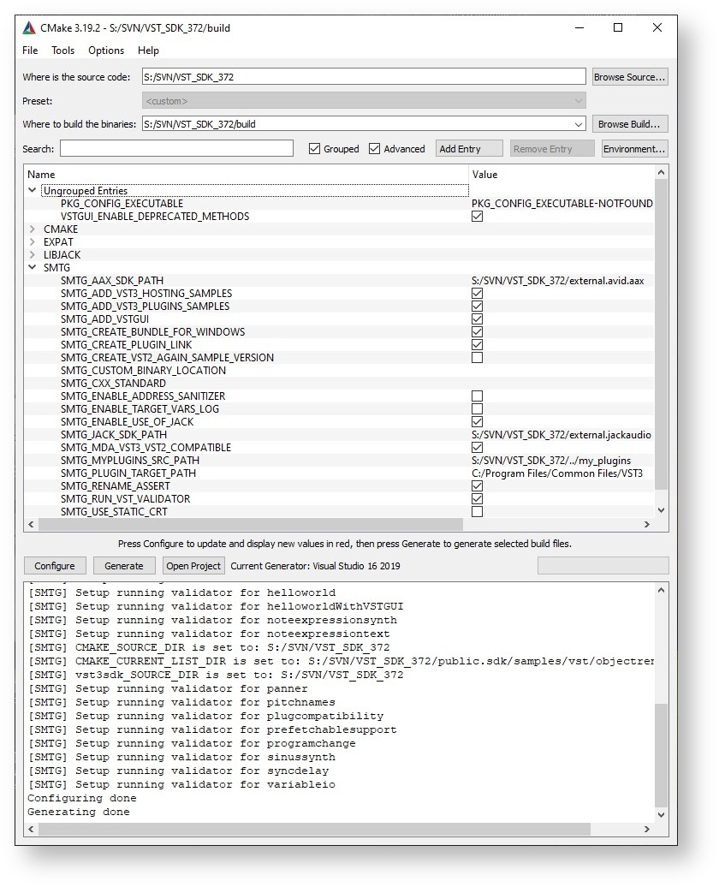

[TOC]


# 开始


## 获取VST3 SDK

| Component | [as zip package](https://developer.steinberg.help/display/VST/VST+3+Links#VST3Links-aszip) | [as GitHub repository](https://developer.steinberg.help/display/VST/VST+3+Links#VST3Links-repository) |
| :----------------------------------------------------------- | :----------------------------------------------------------- | :----------------------------------------------------------- |
| [VSTGUI](https://developer.steinberg.help/display/VST/VSTGUI) |  |  |
| [VST 3 Project Generator](https://developer.steinberg.help/display/VST/VST+3+Project+Generator) (exe only) |  |  |
| [VST 3 Plug-ins Examples](https://developer.steinberg.help/display/VST/VST+3+Plug-ins+Examples) |  |  |
| [VST 3 Plug-in Test Host](https://developer.steinberg.help/display/VST/VST+3+Plug-in+Test+Host) (exe only) |  |  |
| [VST 3 Licensing](https://developer.steinberg.help/display/VST/VST+3+Licensing) | Proprietary+ [GPLv3](https://www.gnu.org/licenses/gpl-3.0.en.html) | only [GPLv3](https://www.gnu.org/licenses/gpl-3.0.en.html) |
| [VST 3 API](https://developer.steinberg.help/display/VST/VST+3+API+Documentation) |  |  |
| [VST3 Inspector](https://developer.steinberg.help/pages/viewpage.action?pageId=9797960#WhatistheVST3SDK?-VST3Inspector) |  |  |
| [Validator command line](https://developer.steinberg.help/pages/viewpage.action?pageId=9797960#WhatistheVST3SDK?-validator) |  |  |
| [iOS Inter-App Audio support](https://developer.steinberg.help/display/VST/iOS+Inter-App+Audio+support) |  |  |
| [Helpers classes](https://developer.steinberg.help/pages/viewpage.action?pageId=9797960#WhatistheVST3SDK?-Helpersclasses) |  |  |
| [EditorHost](https://developer.steinberg.help/pages/viewpage.action?pageId=9797960#WhatistheVST3SDK?-EditorHost) |  |  |
| [AudioAudioHost](https://developer.steinberg.help/pages/viewpage.action?pageId=9797960#WhatistheVST3SDK?-AudioHost) |  |  |
| [AAX, AUv3, AU and VST 2 wrappers](https://developer.steinberg.help/display/VST/AAX%2C+AUv3%2C+AU+and+VST+2+wrappers) |  |  |


**下载完整的VST3压缩包**

下载完整的 **VST 3 SDK** 包，其中包含构建 **VST 3** 插件或宿主所需的一切。使用 [VST 3 Plug-in Test Host](https://developer.steinberg.help/display/VST/VST+3+Plug-in+Test+Host) 实时并自动化测试你的VST3插件:

<https://www.steinberg.net/vst3sdk> (zip文件链接, 101 MB)

**从 GitHub 克隆 VST 3 存储库**

从 **GitHub** 克隆 **VST 3 SDK** 存储库，以便轻松集成到您的工作区：

> 独立于 **VST 3 SDK** 的下载源，请确保遵守许可协议（查看 [VST 3 的许可选项是什么？](https://developer.steinberg.help/pages/viewpage.action?pageId=9797944)）


## 在线文档

浏览包含 **API** 参考和示例代码的VST3 SDK在线文档：

https://steinbergmedia.github.io/vst3_doc

浏览整个文档和教程的 VST 网站：

https://developer.steinberg.help/display/VST


## VST 3 Forum

访问 Steinberg 的 **VST 开发者论坛**，以获得开发方面的帮助、提交错误报告、提交新功能请求和联系其他 **VST 3** 开发者：https://sdk.steinberg.net


## VSTGUI

当你下载 **VST 3 SDK**时，它包含 [**VSTGUI**](https://developer.steinberg.help/display/VST/VSTGUI)的最后一个正式发布版本，你也可以获得它（发布和开发分支）来自 github：<https://github.com/steinbergmedia/vstgui>


## 获取源代码

**From the downloaded *vstsdk.zip* file**

下载 **VST 3 SDK**:  [VST 3 SDK Download](https://developer.steinberg.help/display/VST/VST+3+Links#VST3Links-VST3SDKDownload).

解压zip文件到你电脑的开发文件夹中

**From GitHub:**

```
git clone --recursive https://github.com/steinbergmedia/vst3sdk.git
```


## 获取用于开发的 IDE

**For Windows**

在 **Windows**上，我们建议您使用 **Visual Studio C++** 或 **Visual Studio Code，** 您可以在此处免费获得： [https://**visualstudio**.microsoft.com/free](https://visualstudio.microsoft.com/free-developer-offers/).

**For MacOS**

在 MacOS 上，首选是 **Xcode**（在此处 <https://developer.apple.com/xcode/>可用）。

**For Linux**

为了成功构建 SDK，您需要一个基于 Ubuntu 的 **Linux** 发行版。其他的发行版也可能生效，但未经过测试。

1. Download Linux: [http://www.ubuntu.com](http://www.ubuntu.com/) or [https://www.linuxmint.com](https://www.linuxmint.com/)
2. 直接安装或在 Parallels 等虚拟机中安装
   我们在 Ubuntu 20.04 LTS 上使用和测试。


## Package要求

构建 SDK 示例需要安装几个包：

必要的:

```shell
sudo apt-get install cmake gcc "libstdc++6" libx11-xcb-dev libxcb-util-dev libxcb-cursor-dev libxcb-xkb-dev libxkbcommon-dev libxkbcommon-x11-dev libfontconfig1-dev libcairo2-dev libgtkmm-3.0-dev libsqlite3-dev libxcb-keysyms1-dev
```

> On Raspbian/Debian, replace "libxcb-util-dev" with "libxcb-util0-dev"

可选的:

```
sudo apt-get install subversion git ninja-build
```

推荐的IDE (optional): **QTCreator**

```
sudo apt-get install qtcreator
```

> 你还可以使用 VST3_SDK/tools 文件夹中包含的 bash 文件 "***setup_linux_packages_for_vst3sdk.sh***"

- [代替](https://www.gtkmm.org/)[**gcc**](https://gcc.gnu.org/install/)编译器，[**clang**](https://clang.llvm.org/)[编译器的最新版本也可以使用！](https://www.gtkmm.org/)
- [VSTGUI](https://developer.steinberg.help/display/VST/How+to+set+up+my+system+for+VST+3#HowtosetupmysystemforVST3-VSTGUI)和 [editorhost](https://developer.steinberg.help/display/VST/How+to+set+up+my+system+for+VST+3#HowtosetupmysystemforVST3-editorhost)示例需要[libgtkmm3](https://www.gtkmm.org/)！
- [audiohost](https://developer.steinberg.help/display/VST/How+to+set+up+my+system+for+VST+3#HowtosetupmysystemforVST3-audiohost)示例需要[Jack Audio](http://www.jackaudio.org/) ([http://www.jackaudio.org](http://www.jackaudio.org/))！


## 获取cmake

为了控制编译过程和创建IDE项目，**VST 3 SDK**使用了开源跨平台工具[cmake。](https://cmake.org/)

可以在此处下载 cmake：<https://cmake.org/download/> 或使用你操作系统 (Linux) 的包管理器。

您可以将其用作命令行工具或带有 GUI 的 cmake 可执行文件。cmake-gui包含在cmake包里面:




## 在 Windows 上准备

使用 SDK 中包含的 [cmake](https://cmake.org/) 生成的 VST3 Microsoft Visual Studio 项目将默认为 [官方 VST3 文件夹](https://developer.steinberg.help/display/VST/Plug-in+Locations)中的每个内置插件创建symbolic链接，为了在 Windows 上运行，您必须调整 Windows 的组策略。看 [这里](https://developer.steinberg.help/display/VST/Preparation+on+Windows)!

如果您不想创建此链接，请使用此参数调用 [cmake](https://cmake.org/)：

```
-SMTG_CREATE_PLUGIN_LINK=0
```

**Windows 的注意事项**：为了能够创建符号链接，您必须设置正确的组策略。进行如下操作：

- 计算机配置 => Windows 设置 => 安全设置 => 本地策略 => 用户权限分配 => 创建符号链接


- 导航：

   计算机配置 => Windows 设置 => 安全设置 => 本地策略 => 用户权限分配 => 创建符号链接

   

您可以在此处设置哪些用户可以创建符号链接。


## 获取VST3宿主程序

您可以使用您最喜欢的 **VST 3** 宿主应用程序，请参阅[此处](https://developer.steinberg.help/display/VST/Use+cases#Usecases-VST3Hosts)以获得一些示例，或者您可以使用 [VST 3 插件测试主机](https://developer.steinberg.help/display/VST/VST+3+Plug-in+Test+Host) 应用程序已包含在 **VST 3 SDK**中。