# 技术文档

> 版本更新历史不在翻译范围内：[版本更新历史链接]([Change History - VST - Steinberg Developer Help](https://developer.steinberg.help/display/VST/Change+History))


## API文档

**VST 3 API** 是为实时音频处理组件设计的接口集。例如音频效果或音频乐器。
**VST 3** 基于一种称为 [VST 模块架构](https://developer.steinberg.help/display/VST/VST+Module+Architecture) (**VST-MA**) 的技术。请参考[VST-MA 文档](https://developer.steinberg.help/display/VST/VST+Module+Architecture)了解更多关于插件系统常规工作的细节信息。
API 文档文件**VST 3**位于文件夹“*pluginterfaces/vst*”。


### 基础概念

一个**VST 3**音效或乐器基本上由两部分组成：处理部分和编辑控制器部分。
对应的接口有：

- 处理器 : [Steinberg::Vst::IAudioProcessor](https://steinbergmedia.github.io/vst3_doc/vstinterfaces/classSteinberg_1_1Vst_1_1IAudioProcessor.html) + [Steinberg::Vst::IComponent](https://steinbergmedia.github.io/vst3_doc/vstinterfaces/classSteinberg_1_1Vst_1_1IComponent.html)
- 控制器 : [Steinberg::Vst::IEditController](https://steinbergmedia.github.io/vst3_doc/vstinterfaces/classSteinberg_1_1Vst_1_1IEditController.html)

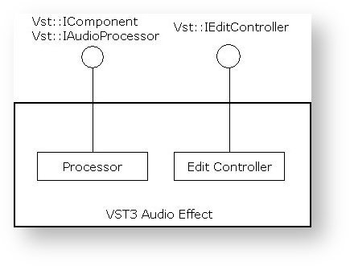

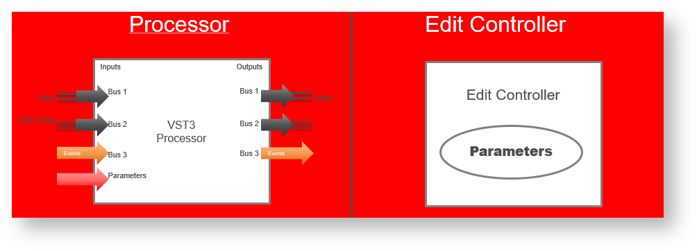

**VST 3**插件开发可以通过实现两个组件来完全解耦处理器和编辑控制器。分开成这两部分需要一些额外的开发工作。
但是，这种分离使主机能够在不同的上下文与计算机中更好地运行每个组件。另一个好处是，在自动化方面，参数更改可以分离。虽然进行这些更改需要以精确样本传输为代价，但 GUI 可以以很低的频率进行更新，并且可以根据任何延迟补偿或其他的量进行移动。


支持这种分离的插件必须在处理器组件的类中设置 [Steinberg::Vst::kDistributable](https://steinbergmedia.github.io/vst3_doc/vstinterfaces/namespaceSteinberg_1_1Vst.html#a626a070dcd2e025250f41b9c3f9817cda3185111648c1599241528f1a7f523396) 标志（[Steinberg::PClassInfo2::classFlags](https://steinbergmedia.github.io/vst3_doc/base/structSteinberg_1_1PClassInfo2.html#ab5ab9135185421caad5ad8ae1d758409)）。当然不是每个插件都能做到这一点，例如，如果它非常依赖某一台特定计算机的资源。因此，当未设置此标志时，宿主不得以任何方式分离组件。
虽然不推荐，但可以在一个组件类中同时实现处理部分和控制器部分。宿主在创建 [Steinberg::Vst::IAudioProcessor](https://steinbergmedia.github.io/vst3_doc/vstinterfaces/classSteinberg_1_1Vst_1_1IAudioProcessor.html) 后尝试查询 [Steinberg::Vst::IEditController](https://steinbergmedia.github.io/vst3_doc/vstinterfaces/classSteinberg_1_1Vst_1_1IEditController.html) 接口，并在成功时将其用作控制器。


> 宿主不需要实例化插件的控制器部分来处理它。
>
> 插件应准备好被处理，而无需实例化控制器部分。


#### 初始化

[Steinberg::Vst::IComponent](https://steinbergmedia.github.io/vst3_doc/vstinterfaces/classSteinberg_1_1Vst_1_1IComponent.html) 和 [Steinberg::Vst::IEditController](https://steinbergmedia.github.io/vst3_doc/vstinterfaces/classSteinberg_1_1Vst_1_1IEditController.html) 都派生自 [Steinberg::IPluginBase](https://steinbergmedia.github.io/vst3_doc/base/classSteinberg_1_1IPluginBase.html)。这个基本接口的目的是初始化组件并在它被销毁之前终止它。


传递给 [Steinberg::IPluginBase::initialize](https://steinbergmedia.github.io/vst3_doc/base/classSteinberg_1_1IPluginBase.html#a3c81be4ff2e7bbb541d3527264f26eed) 的上下文参数应该实现接口 [Steinberg::Vst::IHostApplication](https://steinbergmedia.github.io/vst3_doc/vstinterfaces/classSteinberg_1_1Vst_1_1IHostApplication.html)。主机不应在调用初始化之前调用其他函数，[Steinberg::Vst::IComponent::setIoMode](https://steinbergmedia.github.io/vst3_doc/vstinterfaces/classSteinberg_1_1Vst_1_1IComponent.html#a4618e7358890d549f990010bea4a4137) 必须在初始化之前调用。[Steinberg::Vst::IComponent::getControllerClassId](https://steinbergmedia.github.io/vst3_doc/vstinterfaces/classSteinberg_1_1Vst_1_1IComponent.html#a8aa65685068ad033af57b1497926b689)也可以在初始化之前调用（参见[VST3工作流程图](https://developer.steinberg.help/display/VST/VST+3+Workflow+Diagrams)）。

**插件如何访问IHostApplication？**

```c++
tresult PLUGIN_API MyPluginProcessor::initialize (FUnknown* context)
{
    FUnknownPtr<IHostApplication> hostApp (hostContext);
    if (hostApp)
    {
        String128 name;
        if (hostApp->getName (name) == kResultTrue)
        {
            //...
        }
    }
    //..
}
```


#### 从宿主的角度创建和初始化

下面是一个宿主实现示例，它使用给定的 classID 创建组件及其关联的控制器：

```c++
Vst::IComponent* processorComponent;
Vst::IEditController* editController;
IPluginFactory* factory;
// ...
// factory already initialized (after the library is loaded, see validator for example)
// ...
// create its component part
tresult result = factory->createInstance (classID, Vst::IComponent::iid, (void**)&processorComponent);
if (processorComponent && (result == kResultOk))
{
    // initialize the component with our host context (note: initialize called just after creatInstance)
    res = (processorComponent->initialize (gStandardPluginContext) == kResultOk);
 
    // try to create the controller part from the component
    // for Plug-ins which did not succeed to separate component from controller :-(
    if (processorComponent->queryInterface (Vst::IEditController::iid, (void**)&editController) != kResultTrue)
    {
        // editController is now created, we have the ownership, which means that we have
        // to release it when not used anymore FUID controllerCID;
 
        // ask for the associated controller class ID (could be called before processorComponent->initialize ())
        if (processorComponent->getControllerClassId (controllerCID) == kResultTrue && controllerCID.isValid ())
        {
            // create its controller part created from the factory
            result = factory->createInstance (controllerCID, Vst::IEditController::iid, (void**)&editController);
             if (editController && (result == kResultOk))
            {
                // initialize the component with our context
                res = (editController->initialize (gStandardPluginContext) == kResultOk);
 
                // now processorComponent and editController are initialized... :-)
            }
        }
    }
}
```


#### 扩展

这些基本接口组件的功能可以被一些可选接口进行扩展，只有在需要此扩展时才需要实现这些可选接口。

- 处理器拓展:
   - [Steinberg::Vst::IConnectionPoint](https://steinbergmedia.github.io/vst3_doc/vstinterfaces/classSteinberg_1_1Vst_1_1IConnectionPoint.html)
   - [Steinberg::Vst::IUnitData](https://steinbergmedia.github.io/vst3_doc/vstinterfaces/classSteinberg_1_1Vst_1_1IUnitData.html)
   - [Steinberg::Vst::IProgramListData](https://steinbergmedia.github.io/vst3_doc/vstinterfaces/classSteinberg_1_1Vst_1_1IProgramListData.html)

- 编辑控制器拓展:
   - [Steinberg::Vst::IConnectionPoint](https://steinbergmedia.github.io/vst3_doc/vstinterfaces/classSteinberg_1_1Vst_1_1IConnectionPoint.html)
   - [Steinberg::Vst::IMidiMapping](https://steinbergmedia.github.io/vst3_doc/vstinterfaces/classSteinberg_1_1Vst_1_1IMidiMapping.html)
   - [Steinberg::Vst::IUnitInfo](https://steinbergmedia.github.io/vst3_doc/vstinterfaces/classSteinberg_1_1Vst_1_1IUnitInfo.html)


#### 持久化

宿主在项目文件和预设文件中存储和恢复处理器和控制器的完整状态：

- [Steinberg::Vst::IComponent::getState](https://steinbergmedia.github.io/vst3_doc/vstinterfaces/classSteinberg_1_1Vst_1_1IComponent.html#a10db03106be8ba89d23859fa6be5d9f6) + [Steinberg::Vst::IComponent::setState](https://steinbergmedia.github.io/vst3_doc/vstinterfaces/classSteinberg_1_1Vst_1_1IComponent.html#a77ac39bcc5c4b15818b1a87de2573805)
   保存或恢复DSP模型.
- [Steinberg::Vst::IEditController::getState](https://steinbergmedia.github.io/vst3_doc/vstinterfaces/classSteinberg_1_1Vst_1_1IEditController.html#a10db03106be8ba89d23859fa6be5d9f6) + [Steinberg::Vst::IEditController::setState](https://steinbergmedia.github.io/vst3_doc/vstinterfaces/classSteinberg_1_1Vst_1_1IEditController.html#a77ac39bcc5c4b15818b1a87de2573805)
   保存或恢复和处理器无关的GUI设置
- **Restore:** 当状态恢复时，宿主将状态传递给处理器和控制器([Steinberg::Vst::IEditController::setComponentState](https://steinbergmedia.github.io/vst3_doc/vstinterfaces/classSteinberg_1_1Vst_1_1IEditController.html#a4c2e1cafd88143fda2767a9c7ba5d48f)). 宿主必须始终先将该状态传递给处理器。然后控制器必须将其参数同步到此状态（但不得执行任何 [IComponentHandler](https://steinbergmedia.github.io/vst3_doc/vstinterfaces/classSteinberg_1_1Vst_1_1IComponentHandler.html)的回调）。
   恢复状态后，宿主重新扫描参数（通过询问控制器）以更新其内部表示。


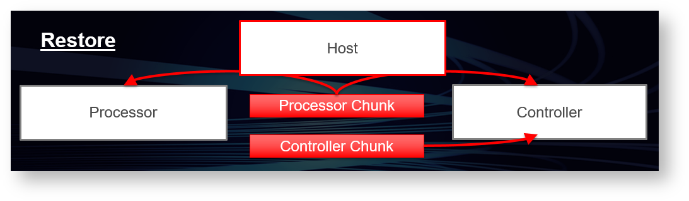

请参考

- [Steinberg::IBStream](https://steinbergmedia.github.io/vst3_doc/base/classSteinberg_1_1IBStream.html)
- [VST 3 Interfaces to be implemented by the Plug-in](https://steinbergmedia.github.io/vst3_doc/vstinterfaces/group__vstIPlug.html)
- [VST 3 Interfaces to be implemented by the Host](https://steinbergmedia.github.io/vst3_doc/vstinterfaces/group__vstIHost.html)


### 处理部分

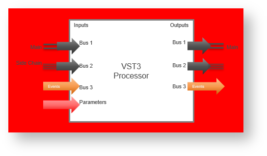

处理部分由两个相关接口组成：[Steinberg::Vst::IComponent](https://steinbergmedia.github.io/vst3_doc/vstinterfaces/classSteinberg_1_1Vst_1_1IComponent.html)和[Steinberg::Vst::IAudioProcessor](https://steinbergmedia.github.io/vst3_doc/vstinterfaces/classSteinberg_1_1Vst_1_1IAudioProcessor.html)。将两者分开的原因是为了使用基础接口 [Steinberg::Vst::IComponent](https://steinbergmedia.github.io/vst3_doc/vstinterfaces/classSteinberg_1_1Vst_1_1IComponent.html) ，它不仅用于音频插件，还用于其他类型的媒体（例如未来的视频处理）。因此，[Steinberg::Vst::IAudioProcessor](https://steinbergmedia.github.io/vst3_doc/vstinterfaces/classSteinberg_1_1Vst_1_1IAudioProcessor.html) 接口表示处理组件的音频部分。让我们仔细看看这些概念。


### IComponent

[Steinberg::Vst::IComponent](https://steinbergmedia.github.io/vst3_doc/vstinterfaces/classSteinberg_1_1Vst_1_1IComponent.html) 接口让宿主获取有关插件的信息：

1. **编辑控制器关联**：为了使宿主能够创建与之关联的编辑控制器，处理组件必须提供相应的类ID。宿主使用模块的类工厂来创建控制器组件。参见 [Steinberg::Vst::IComponent::getControllerClassId](https://steinbergmedia.github.io/vst3_doc/vstinterfaces/classSteinberg_1_1Vst_1_1IComponent.html#a8aa65685068ad033af57b1497926b689)

2. 宿主可以获取总线配置（[Steinberg::Vst::BusInfo](https://steinbergmedia.github.io/vst3_doc/vstinterfaces/structSteinberg_1_1Vst_1_1BusInfo.html)）。参见 [Steinberg::Vst::IComponent::getBusInfo](https://steinbergmedia.github.io/vst3_doc/vstinterfaces/classSteinberg_1_1Vst_1_1IComponent.html#a41b0e971a0ff153a4eb34274750b0c91)

3. 宿主可以请求路由信息（[Steinberg::Vst::RoutingInfo](https://steinbergmedia.github.io/vst3_doc/vstinterfaces/structSteinberg_1_1Vst_1_1RoutingInfo.html)）。

4. 宿主可以激活或停用特定总线，例如 [side-chain](https://developer.steinberg.help/display/VST/Frequently+Asked+Questions#FrequentlyAskedQuestions-WhatisaSide-chain)。插件不可处理被停用的总线。参见 [Steinberg::Vst::IComponent::activateBus](https://steinbergmedia.github.io/vst3_doc/vstinterfaces/classSteinberg_1_1Vst_1_1IComponent.html#a3ab7d06aaefe03da1fcd1819f1261050)

5. 宿主可以激活或停用插件（开/关按钮）。参见 [Steinberg::Vst::IComponent::setActive](https://steinbergmedia.github.io/vst3_doc/vstinterfaces/classSteinberg_1_1Vst_1_1IComponent.html#a0a840e8077eb74ec429b8007c7b83517)

6. 宿主可以存储和恢复插件的状态（预设和项目持久性）。参见 [Steinberg::Vst::IComponent::getState](https://steinbergmedia.github.io/vst3_doc/vstinterfaces/classSteinberg_1_1Vst_1_1IComponent.html#a10db03106be8ba89d23859fa6be5d9f6)


### IAudioProcessor

[Steinberg::Vst::IAudioProcessor](https://steinbergmedia.github.io/vst3_doc/vstinterfaces/classSteinberg_1_1Vst_1_1IAudioProcessor.html) 接口扩展了[Steinberg::Vst::IComponent](https://steinbergmedia.github.io /vst3_doc/vstinterfaces/classSteinberg_1_1Vst_1_1IComponent.html) ，它提供状态机进行处理：

1. 设置：必须先配置处理器，然后才能进行处理。且仅当处理器处于非活动状态时才允许配置。

      - **进程设置**：处理器被告知在活动期间不能更改的参数。 ([Steinberg::Vst::ProcessSetup](https://steinbergmedia.github.io/vst3_doc/vstinterfaces/structSteinberg_1_1Vst_1_1ProcessSetup.html))。

      - **动态扬声器排列**：宿主可以尝试更改音频总线的通道数。默认情况下，扬声器排列由插件定义。为了调整扬声器上下文，可以使用 [Steinberg::Vst::IAudioProcessor::setBusArrangements](https://steinbergmedia.github.io/ vst3_doc/vstinterfaces/classSteinberg_1_1Vst_1_1IAudioProcessor.html#ad3bc7bac3fd3b194122669be2a1ecc42)


2. 配置处理器时，它必须被激活([Steinberg::Vst::IComponent::setActive](https://steinbergmedia.github.io/vst3_doc/vstinterfaces/classSteinberg_1_1Vst_1_1IComponent.html#a0a840e8077eb74ec429b8007c7b83517)). 被调用即表示所有配置都已完成。

3. 除此之外，处理器还有一个“处理状态”。在宿主开始执行处理调用之前，它必须通过调用 [IAudioProcessor::setProcessing](https://steinbergmedia.github.io/vst3_doc/vstinterfaces/classSteinberg_1_1Vst_1_1IAudioProcessor.html#af252fd721b195b793f3a5dfffc069401)(true)来发出信号。当宿主停止处理时，它必须在最后一次处理调用之后调用 [IAudioProcessor::setProcessing](https://steinbergmedia.github.io/vst3_doc/vstinterfaces/classSteinberg_1_1Vst_1_1IAudioProcessor.html#af252fd721b195b793f3a5dfffc069401)(false)。另请参阅：[VST 3 工作流程图](https://developer.steinberg.help/display/VST/VST+3+Workflow+Diagrams)

4. Process:Steinberg::Vst::IAudioProcessor::process 是真正的处理函数。处理所需的任何数据都以Steinberg::Vst::ProcessData传递给它。这可一定程度上避免线程同步，因为处理通常在单独的线程中执行。

   - **Block Size**: 处理是在块中完成的. [Steinberg::Vst::IAudioProcessor::setupProcessing](https://steinbergmedia.github.io/vst3_doc/vstinterfaces/classSteinberg_1_1Vst_1_1IAudioProcessor.html#aefb5731b94dbc899a4a7e9cd1c96e6a2)中设置了一个块中要处理的最大样本数。处理块中的实际样本数在调用中传输，并且可以因调用而异，但必须是介于 1 和 [maxSamplesPerBlock](https://steinbergmedia.github.io/vst3_doc/vstinterfaces/structSteinberg_1_1Vst_1_1ProcessSetup.html#a41cd06a0c942a1b3f283092b893d0de3) 之间
   
      - **Audio Buffers**: 对于插件定义的任何音频总线，宿主必须提供缓冲区数据，即使是非活动总线。总线使用索引查找，因此忽略不活动的总线会混淆这些索引。但是，实际的数据缓冲区可以为空（参见 [Steinberg::Vst::AudioBusBuffers](https://steinbergmedia.github.io/vst3_doc/vstinterfaces/structSteinberg_1_1Vst_1_1AudioBusBuffers.html)）。
   
         > **Note**: [channelBuffers32](https://steinbergmedia.github.io/vst3_doc/vstinterfaces/structSteinberg_1_1Vst_1_1AudioBusBuffers.html#abac2239417d88a091cad5b4f917dc49a)(或[channelBuffers64](https://steinbergmedia.github.io/vst3_doc/vstinterfaces/structSteinberg_1_1Vst_1_1AudioBusBuffers.html#a0bbcd9a3e75d01b547097c91f9f659cf )) 输入和输出的缓冲区指针可以相同也可以不同：在处理函数中必须考虑到这一点（例如，如果输入和输出缓冲区相同，则在处理之前不要重置输出）。对于多个输入或多个输出（在乐器插件的情况下）可以是相同的，所有输出（或输入）可以共享同一个缓冲区！
         >
         > **重要提示**: The host can call [Steinberg::Vst::IAudioProcessor::process](https://steinbergmedia.github.io/vst3_doc/vstinterfaces/classSteinberg_1_1Vst_1_1IAudioProcessor.html#a6b98eb31cf38ba96a28b303c13c64e13) without buffers ([numInputs](https://steinbergmedia.github.io/vst3_doc/vstinterfaces/structSteinberg_1_1Vst_1_1ProcessData.html#a852a74fc4e461ef086bac048313d2de9) and [numOutputs](https://steinbergmedia.github.io/vst3_doc/vstinterfaces/structSteinberg_1_1Vst_1_1ProcessData.html#a1338255f88bad5cf4fb714c71f92b61a) of [Steinberg::Vst::AudioBusBuffers](https://steinbergmedia.github.io/vst3_doc/vstinterfaces/structSteinberg_1_1Vst_1_1AudioBusBuffers.html) are zeroed, [numSamples](https://steinbergmedia.github.io/vst3_doc/vstinterfaces/structSteinberg_1_1Vst_1_1ProcessData.html#aeb42971a4bd34d7baa27cff8d7e3cf26) too), in order to flush parameters (from host to plug-in). Parameters can only be flushed when the host needs to send parameter changes and no processing is called.
   


   - **参数和自动化**: 任何参数都通过接口 [Steinberg::Vst::IParameterChanges](https://steinbergmedia.github.io/vst3_doc/vstinterfaces/classSteinberg_1_1Vst_1_1IParameterChanges.html) 和 [Steinberg::Vst::IParamValueQueue](https://steinbergmedia.github.io/vst3_doc/vstinterfaces/classSteinberg_1_1Vst_1_1IParamValueQueue.html) 在流程调用中传输。 GUI 交互导致的简单参数更改以和自动化完全相同的方式传输 （参见[参数和自动化](https://developer.steinberg.help/vst3Automation.html)）。

   - **上下文:** 对于每个处理块，宿主应提供有关其状态的信息。参见 [Steinberg::Vst::ProcessContext](https://steinbergmedia.github.io/vst3_doc/vstinterfaces/structSteinberg_1_1Vst_1_1ProcessContext.html)

   - **事件:** [Steinberg::Vst::IEventList](https://steinbergmedia.github.io/vst3_doc/vstinterfaces/classSteinberg_1_1Vst_1_1IEventList.html)


### 编辑部分

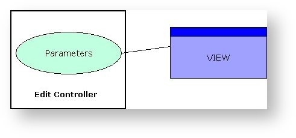

编辑控制器负责插件的 GUI 方面。它的标准接口是[Steinberg::Vst::IEditController](https://steinbergmedia.github.io/vst3_doc/vstinterfaces/classSteinberg_1_1Vst_1_1IEditController.html)。宿主必须由[Steinberg::Vst::IComponentHandler](https://steinbergmedia.github.io/vst3_doc/vstinterfaces/classSteinberg_1_1Vst_1_1IComponentHandler.html) 编辑控制器提供回调接口。处理程序主要用于宿主和处理器之间的通信。

- **GUI：** 控制器可以选择自定义编辑器视图。 [Steinberg::Vst::IEditController::createView](https://steinbergmedia.github.io/vst3_doc/vstinterfaces/classSteinberg_1_1Vst_1_1IEditController.html#a1fa4ed10cc0979e5559045104c998b1a) 函数允许宿主传递一个 id字符串。目前只可定义类型“编辑器”（[Steinberg::Vst::ViewType::kEditor](https://steinbergmedia.github.io/vst3_doc/vstinterfaces/namespaceSteinberg_1_1Vst_1_1ViewType.html#aaa62c4c32f0270a908eb20c7c7124dfc)），但未来的版本会有其他的更新（例如“设置”）。另见[Steinberg::IPlugView](https://steinbergmedia.github.io/vst3_doc/base/classSteinberg_1_1IPlugView.html)。

- **Parameters:**  控制器负责参数的管理。任何由插件 GUI 中的用户交互引起的参数更改都必须正确报告给[Steinberg::Vst::IComponentHandler](https://steinbergmedia.github.io/vst3_doc/vstinterfaces/classSteinberg_1_1Vst_1_1IComponentHandler.html)。宿主负责将更改传输到处理器。为了使自动化工作得到记录，有必要在列表中调用[beginEdit](https://steinbergmedia.github.io/vst3_doc/vstinterfaces/classSteinberg_1_1Vst_1_1IComponentHandler.html#a8456ad739430267a12dda11a53fe9223), [performEdit](https://steinbergmedia.github.io/vst3_doc/vstinterfaces/classSteinberg_1_1Vst_1_1IComponentHandler.html#a135d4e76355ef0ba0a4162a0546d5f93)和[endEdit](https://steinbergmedia.github.io/vst3_doc/vstinterfaces/classSteinberg_1_1Vst_1_1IComponentHandler.html#ae380206486b11f000cad7c0d9b6e877c)。或者来自UI-Thread。
   使用新的接口[IComponentHandler2](https://developer.steinberg.help/classSteinberg_1_1Vst_1_1IComponentHandler2.html) (从VST 3.1开始)，插件可以分组本应该在同一时间戳被自动化写入的参数，它通过[beginEdit](https://steinbergmedia.github.io/vst3_doc/vstinterfaces/classSteinberg_1_1Vst_1_1IComponentHandler.html#a8456ad739430267a12dda11a53fe9223)/[performEdit](https://steinbergmedia.github.io/vst3_doc/vstinterfaces/classSteinberg_1_1Vst_1_1IComponentHandler.html#a135d4e76355ef0ba0a4162a0546d5f93)/[endEdit](https://steinbergmedia.github.io/vst3_doc/vstinterfaces/classSteinberg_1_1Vst_1_1IComponentHandler.html#ae380206486b11f000cad7c0d9b6e877c)函数(参见 [IComponentHandler](https://steinbergmedia.github.io/vst3_doc/vstinterfaces/classSteinberg_1_1Vst_1_1IComponentHandler.html)) 和[startGroupEdit](https://steinbergmedia.github.io/vst3_doc/vstinterfaces/classSteinberg_1_1Vst_1_1IComponentHandler2.html#aba339113df404a6b3c557774d4aa9102) / [finishGroupEdit](https://steinbergmedia.github.io/vst3_doc/vstinterfaces/classSteinberg_1_1Vst_1_1IComponentHandler2.html#adbdc10ff7ecd96fa365ad4f98d57b55e) 实现
   更多的参数细节参见 [Parameters](https://developer.steinberg.help/display/VST/Parameters+and+Automation).

- **插件结构:** 如果插件由离散的功能部分组成，编辑控制器应该通过[Steinberg::Vst::IUnitInfo](https://steinbergmedia.github.io/vst3_doc)来实现这个结构和实现属于每个部分的参数接口。更多细节可以在[VST 3 Units](https://developer.steinberg.help/vst3Units.html)的页面上找到


### VST 3 线程模型

**VST 3** 使用的线程模型非常简单，它要求：

- 所有初始化/反初始化都在 UI 线程中完成
- 插件导出的所有函数都由 UI 线程中的宿主调用，除了：
  - IAudioProcessor→process：可以在音频线程（实时线程）中调用，避免任何内存分配
  - IAudioProcessor→setProcessing：可以在音频线程（实时线程）中调用，避免任何内存分配

- 宿主导出的所有函数都被UI线程中的插件调用

参见 [Audio Processor Call Sequence](https://developer.steinberg.help/display/VST/Audio+Processor+Call+Sequence) 和 [Edit Controller Call Sequence](https://developer.steinberg.help/display/VST/Edit+Controller+Call+Sequence)


### 组件间通信

**VST 3** 组件（处理器和控制器）之间需要一种通信方式。宿主的任务主要是处理这个。

#### 标准通信

所有标准数据（如参数更改）都使用下面列出的基本接口在处理器和控制器之间传输。

- 创建处理器和控制器后，宿主根据处理器状态设置控制器状态。这与之前的 SDK 有所不同，之前的 SDK 假设在创建后控制器和处理器是同步的。

- 当主机设置一个新的处理器状态（[Steinberg::Vst::IComponent::setState](https://steinbergmedia.github.io/vst3_doc/vstinterfaces/classSteinberg_1_1Vst_1_1IComponent.html#a77ac39bcc5c4b15818b1a87de2573805)）时，这个状态总是被同时传输到控制器（[Steinberg::Vst::IEditController::setComponentState](https://steinbergmedia.github.io/vst3_doc/vstinterfaces/classSteinberg_1_1Vst_1_1IEditController.html#a4c2e1cafd88143fda2767a9c7ba5d48f)）。然后控制器必须同步该状态并调整其参数。

- 当控制器向宿主传输参数时，宿主通过将新值作为 [Steinberg::Vst::IParameterChanges](https://steinbergmedia.github.io/vst3_doc/vstinterfaces/classSteinberg_1_1Vst_1_1IParameterChanges.html) 来同步进程调用。

- 处理器也可以将传出的参数传输到宿主。 ([Steinberg::Vst::ProcessData::outputParameterChanges](https://steinbergmedia.github.io/vst3_doc/vstinterfaces/structSteinberg_1_1Vst_1_1ProcessData.html#af08c4f7dfd9e456cc98ba0eb325993ae))。它通过调用 [Steinberg::Vst::IEditController::setParamNormalized](https://steinbergmedia.github.io/vst3_doc/vstinterfaces/classSteinberg_1_1Vst_1_1IEditController.html#aded549c5b0f342a23dee18cc41ece6b8) 传输到编辑控制器。


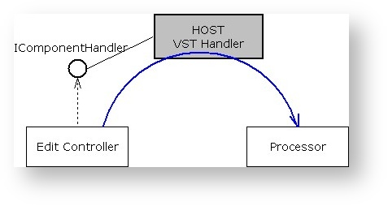

#### Private通信

宿主不知道的数据可以通过消息的方式传输。通信接口有：

- [Steinberg::Vst::IConnectionPoint](https://steinbergmedia.github.io/vst3_doc/vstinterfaces/classSteinberg_1_1Vst_1_1IConnectionPoint.html): 宿主在处理器和控制器之间建立连接。
- [Steinberg::Vst::IMessage](https://steinbergmedia.github.io/vst3_doc/vstinterfaces/classSteinberg_1_1Vst_1_1IMessage.html): 表示要发送给对方的消息。
- [Steinberg::Vst::IAttributeList](https://steinbergmedia.github.io/vst3_doc/vstinterfaces/classSteinberg_1_1Vst_1_1IAttributeList.html): 属于消息的属性列表。


请注意，从处理器到控制器的消息不能在进程调用期间发送，因为这样不够快且会破坏实时性。此类任务应在单独的计时器线程中进行处理。


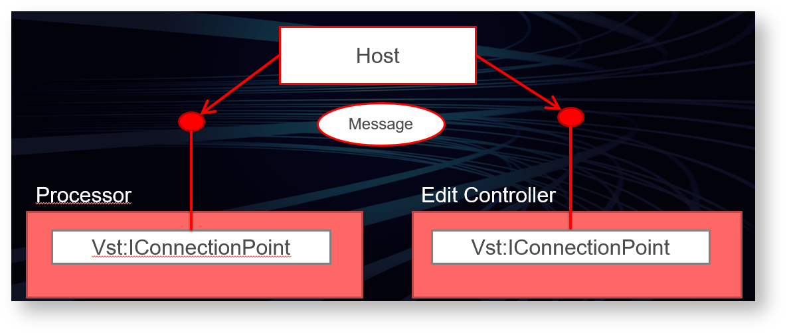

#### 从宿主的角度初始化通信

这是一个宿主实现的一个示例，其中组件和控制器连接并同步：

```c++
//------------------------------------------------------------------------
// the component and the controller parts are previously be created and initialized (see above)
// ...
if (editController)
{
    // set the host handler
    // the host set its handler to the controller
    editController->setComponentHandler (myHostComponentHandler);
 
    // connect the 2 components
    Vst::IConnectionPoint* iConnectionPointComponent = nullPtr;
    Vst::IConnectionPoint* iConnectionPointController = nullPtr;
 
    processorComponent->queryInterface (Vst::IConnectionPoint::iid, (void**)&iConnectionPointComponent);
    editController->queryInterface (Vst::IConnectionPoint::iid, (void**)&iConnectionPointController);
 
    if (iConnectionPointComponent && iConnectionPointController)
    {
        iConnectionPointComponent->connect (iConnectionPointController);
        iConnectionPointController->connect (iConnectionPointComponent);
    }
 
    // synchronize controller to component by using setComponentState
    MemoryStream stream; // defined in "public.sdk/source/common/memorystream.h"
    stream.setByteOrder (kLittleEndian);
    if (processorComponent->getState (&stream) == kResultTrue)
    {
        stream.rewind ();
        editController->setComponentState (&stream);
    }
 
    // now processorComponent and editController parts are connected and synchronized...:-)
}
```

> 处理组件和编辑控制器之间是直接连接的，你不能依赖于连接中的实施细节


## VST模块体系

### 宿主将如何加载基于 VST-MA 的插件

检查包含的 cpp 文件，如何加载此类组件/插件：

- *public.sdk/source/vst/hosting/module.h* and
- *for each platform public.sdk/source/vst/hosting/module_win32.cpp,.....*

在下面，你可以看到 Windows 上一个基本的实现，展示如何加载库并获取指向所需导出函数的指针：

```c++
HMODULE hModule = LoadLibrary ("SomePlugin.dll");
if (hModule)
{
    InitModuleProc initProc = (InitModuleProc)GetProcAddress (hModule, "InitDll");
    if (initProc) // this entry function is optional on Windows, not on MacOS and Linux!
    {
        if (initProc () == false)
        {
            FreeLibrary (module);
            return false;
        }
    }
 
    GetFactoryProc proc = (GetFactoryProc)GetProcAddress (hModule, "GetPluginFactory");
 
    IPluginFactory* factory = proc ?proc () : 0;
    if (factory)
    {
        for (int32 i = 0; i < factory->countClasses (); i++)
        {
            PClassInfo ci;
            factory->getClassInfo (i, &ci);
 
            FUnknown* obj;
            factory->createInstance (ci.cid, FUnknown::iid, (void**)&obj);
            ...
            obj->release ();
        }
 
        factory->release ();
    }
 
    ExitModuleProc exitProc = (ExitModuleProc)GetProcAddress (hModule, "ExitDll");
    if (exitProc)  // This exit function is optional on Windows, not on MacOS and Linux!
         exitProc ();
 
    FreeLibrary (hModule);
}
```


### 如何从接口派生类

```c++
class CMyClass: public FUnknown
{
public:
    CMyClass ();
    virtual ~CMyClass ();
 
    DECLARE_FUNKNOWN_METHODS  // declares queryInterface, addRef and release
};
 
CMyClass::CMyClass ()
{
    FUNKNOWN_CTOR // init reference counter, increment global object counter
}
 
CMyClass::~CMyClass ()
{
    FUNKNOWN_DTOR // decrement global object counter
}
 
IMPLEMENT_REFCOUNT (CMyClass) // implements reference counting
 
tresult CMyClass::queryInterface (const char* iid, void** obj)
{
    QUERY_INTERFACE (iid, obj, ::FUnknown::iid, CMyClass)
    return kNoInterface;
}
```

实现具有多个接口的类是通过多重继承完成的。此外，你必须为 queryInterface 函数中的每个接口提供适当的类型转换。

```c++
class CMyMultiClass : public Steinberg::IPluginBase,
                      public Steinberg::IPlugController,
                      public Steinberg::IEditorFactory
{
public:
    DECLARE_FUNKNOWN_METHODS
 
    // declare the methods of all inherited interfaces here...
};
 
IMPLEMENT_REFCOUNT (CMyMultiClass) // implements reference counting
 
tresult CMyMultiClass::queryInterface (const char* iid, void** obj)
{
    QUERY_INTERFACE (iid, obj, Steinberg::FUnknown::iid, IPluginBase)
    QUERY_INTERFACE (iid, obj, Steinberg::IPluginBase::iid, IPluginBase)
    QUERY_INTERFACE (iid, obj, Steinberg::IPlugController::iid, IPlugController)
    QUERY_INTERFACE (iid, obj, Steinberg::IEditorFactory::iid, IEditorFactory)
     *obj = 0;
    return kNoInterface;
}
```


### 接口版本和继承

与 C++ 类不同，**VST-MA** 接口不使用继承来表达对象的特化。通常所有的接口都是从 FUnknown 派生的。这是因为接口在发布后必须**从未**更改。 VST 模块架构接口仅将继承用于版本控制！所有特化都将建模为单独的接口！


C++类的例子:

```c++
class Shape
{
public:
    void setPosition (long x, long y);
protected:
    long x;
    long y;
};
class Rect : public Shape
{
public:
    void setDimension (long width, long height);
protected:
    long width;
    long height;
};
```

**VST-MA**的例子，和上面不一样:

```c++
class IShape : public FUnknown
{
public:
    virtual void setPosition (long x, long y) = 0;
};
class IRect : public FUnknown
{
public:
    virtual void setDimension (long width, long height) = 0;
};
```

在下一个程序版本中，需要对“Shape”类进行更改，如下所示

```c++
class Shape
{
public:
    void setPosition (long x, long y);
    void setColor (Color color);
protected:
    long x;
    long y;
    Color color;
};
```

**VST-MA** 表示现在通过添加一个继承自 *IShape* 的新接口来反映对 Shape 的更改，该接口类似于以下代码，而之前的接口定义保持不变：

```c++
class IShape2 : public IShape
{
public:
    virtual void setColor (Color color) = 0;
};
```


## 参数和自动化

**VST 3** 中如何定义和使用参数？


#### 参数

插件需要参数来控制 DSP 算法，例如滤波器的频率参数。插件可以导出这些参数，以使它们对宿主可见，并允许宿主控制/更改/自动化/远程/可视化它们。某些参数可以定义为私有（用户不可见）或只读，例如与 VU 表关联的参数。

[Steinberg::Vst::IEditController::getParameterCount](https://steinbergmedia.github.io/vst3_doc/vstinterfaces/classSteinberg_1_1Vst_1_1IEditController.html#ab6ffbb8e3bf6f4829ab1c9c23fe935a1) 允许宿主识别插件导出的参数数量。插件必须为每个导出的参数分配一个 32 位的唯一标识符 (ID)。

> 最多可以导出 2^31 个 ID 范围为 **[0, 2.147.483.648]** 的参数（范围 [2.147.483.649, 4.294.967.296] 为主机应用程序保留）

请注意，任何时候都不允许更改这种分配方式。插件不得重新配置可自动化参数集，以免造成数据不一致。唯一允许的改动是在未来的插件版本中添加或删除参数。但是，请记住，删除参数后，自动化数据可能会丢失。

宿主不知道参数的语义。控制器必须使用 [Steinberg::Vst::ParameterInfo::flags](https://steinbergmedia-github-io.translate.goog/vst3_doc/vstinterfaces/structSteinberg_1_1Vst_1_1ParameterInfo.html?_x_tr_sl=en&_x_tr_tl=zh-CN&_x_tr_hl=zh-CN&_x_tr_pto=wapp#a8ffba1d4311e48ae488bc118f20d7edb) 声明一些重要的异常：

- **kCanAutomate:** 这意味着该参数可以由宿主自动化其自动化轨道。**[SDK 3.0.0]** 
- **kIsBypass:** 如果插件需要进行 bypass processing，则必须导出相应的参数并用 kIsBypass 标记。强烈建议此参数由效果插件提供。如果插件没有导出旁路参数，宿主机可以进行旁路处理，插件进程调用将中断。插件应像其他参数一样保存此旁路参数的状态（使用 getState 和 setState ）。如果插件不需要旁路（如 Instrument），则不应使用此标志。查看此[常见问题解答](https://steinbergmedia-github-io.translate.goog/vst3_dev_portal/pages/FAQ/Index.html?_x_tr_sl=en&_x_tr_tl=zh-CN&_x_tr_hl=zh-CN&_x_tr_pto=wapp)以了解 bypass processing 的工作原理。**[SDK 3.0.0]**
- **kIsReadOnly:** 这意味着不能从插件外部更改此参数，同时不能设置 kCanAutomate。**[SDK 3.0.0]**
- **kIsWrapAround:** 当宿主为此参数创建 UI 控件，并尝试将其值设置为超出限制时，此 UI 控件将被旋转（对于 360 度旋转等参数很有用）**[SDK 3.0.2]**
- **kIsList:** 这意味着宿主将在通用编辑器或自动编辑中会将此参数显示为列表。**[SDK 3.1.0]**
- **kIsHidden:** 这意味着该参数将不会显示，并且不能从插件外部更改。同时不能设置 kCanAutomate 和 kIsReadOnly。**[SDK 3.7.0]**
- **kIsProgramChange:** 如果插件支持程序列表（请参阅 [VST 3 单元](https://steinbergmedia-github-io.translate.goog/vst3_dev_portal/pages/Technical+Documentation/VST+3+Units/Index.html?_x_tr_sl=en&_x_tr_tl=zh-CN&_x_tr_hl=zh-CN&_x_tr_pto=wapp)，[程序列表](https://steinbergmedia-github-io.translate.goog/vst3_dev_portal/pages/Technical+Documentation/Presets+Program+Lists/Index.html?_x_tr_sl=en&_x_tr_tl=zh-CN&_x_tr_hl=zh-CN&_x_tr_pto=wapp)），插件的每个“单元”都需要导出一个程序选择器参数。当受影响的参数也被标记为可自动执行时，就不允许自动执行此类参数。宿主可以在其 GUI 的特定位置显示程序参数。**[SDK 3.0.0]**

控制器必须支持将任何导出参数转换为字符串。转换方法 [Steinberg::Vst::IEditController::getParamStringByValue](https://steinbergmedia-github-io.translate.goog/vst3_doc/vstinterfaces/classSteinberg_1_1Vst_1_1IEditController.html?_x_tr_sl=en&_x_tr_tl=zh-CN&_x_tr_hl=zh-CN&_x_tr_pto=wapp#aab2f0b853e75361d331b667e7893962e) 必须为任何可能的规范化参数值提供结果值

> 参数值始终以规范化浮点（64 位双精度）表示 **[0.0, 1.0]** 传输。

**参数值表示**

一个插件参数通常有不止表示一个参数。插件的 GUI 可以显示单个参数的内容，但可同时控制多个处理参数。

在从 GUI 到 DSP 算法的某个地方，必须执行此转换。宿主不需要有关 DSP 参数的信息，但它负责向处理器报告参数变化。据此，处理器是唯一可以发生转换的地方，所有参数必须始终与 GUI 表示相匹配。 

这符合分离式 GUI 和处理的想法吗？目前没问题

- 这是职责分离，仅此而已。处理器组件和控制器组件必须在相同的内部插件模型上工作。控制器知道该模型如何在 GUI 中呈现。处理器知道模型必须如何转换为 DSP 参数。**VST 3** 接口建议对此模型的一部分（作为参数导出的部分）使用规范化值表示，这意味着每个值都必须在 0.0 到 1.0 的范围内。

### 参数样式 / '步数'

虽然值以规范化格式传输，但主机需要知道参数显示的 GUI 表示的一些细节。例如，在编辑自动化数据时，主机必须知道以其 “步数” 表示的参数的性质（参见 [Steinberg::Vst::ParameterInfo::stepCount](https://steinbergmedia-github-io.translate.goog/vst3_doc/vstinterfaces/structSteinberg_1_1Vst_1_1ParameterInfo.html?_x_tr_sl=en&_x_tr_tl=zh-CN&_x_tr_hl=zh-CN&_x_tr_pto=wapp#ac1efeff62e4ba9aea101c3327e0b5c4d)）

**步数语义** :

- **0** : 连续参数。任何规范化的值都有一个精确的映射（0 = 值之间没有阶梯）
- **1** : 具有 2 个状态的离散参数，例如（开/关）（是/否）等（1 = 这些状态之间有一个步骤）
- **2** : 具有 3 个状态 (0,1,2) 或 (3,5,7) 的离散参数（2 = 这些状态之间有两个步骤）
- **3** : 等等...

**标准化转换**

控制器和处理器必须使用标准化参数值

- 步骤计数 0：连续参数只需要一一对应映射

- 步数 n：离散参数需要多加注意

   - **离散值 => 归一化**

​		`double normalized = discreteValue / (double)stepCount;`

   - **Normalize => Discrete Value (Denormalize)**

​		`int discreteValue = min (stepCount, normalized *(stepCount + 1));`

**例如:** 步数 3

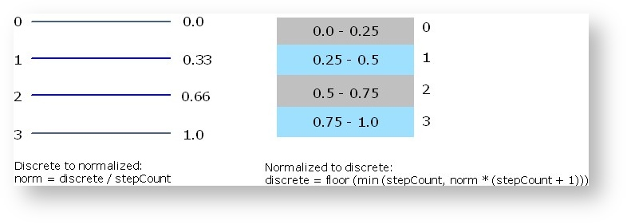

### 自动化

支持参数自动化的宿主依赖于拥有这些参数的组件。**VST 3** 界面设计的一个意图是减少实施中可能出现的错误。处理器和控制器的分离强制所有参数更改必须由宿主以定义的方式处理。此外，这允许宿主将更改存储为自动化数据。尽管如此，还有一些事情需要考虑：

任何自动化参数都不得影响另一个自动化参数！

这方面的主要例子是预设更改的自动化。预设更改可能会导致所有 “正常” 参数的更改。因此，如果已经为这些参数记录了自动化数据，并且也记录了预设更改：应该偏向哪个？这个问题无法回答，只能通过回避来解决问题。这就是默认情况下不允许自动更改预设的原因。


**自动化录制**

自动录制由宿主执行。这样做时，宿主必须知道操作的开始和结束。因此，插件必须在 **UI Thread** 中以如下方式操作 [Steinberg::Vst::IComponentHandler](https://steinbergmedia-github-io.translate.goog/vst3_doc/vstinterfaces/classSteinberg_1_1Vst_1_1IComponentHandler.html?_x_tr_sl=en&_x_tr_tl=zh-CN&_x_tr_hl=zh-CN&_x_tr_pto=wapp)

- 开始操作时使用该方法发出信号： [Steinberg::Vst::IComponentHandler::beginEdit](https://steinbergmedia.github.io/vst3_doc/vstinterfaces/classSteinberg_1_1Vst_1_1IComponentHandler.html#a8456ad739430267a12dda11a53fe9223)
- 通过该方法反馈参数变化： [Steinberg::Vst::IComponentHandler::performEdit](https://steinbergmedia.github.io/vst3_doc/vstinterfaces/classSteinberg_1_1Vst_1_1IComponentHandler.html#a135d4e76355ef0ba0a4162a0546d5f93)
- 操作结束时通过该方法发出信号： [Steinberg::Vst::IComponentHandler::endEdit](https://steinbergmedia.github.io/vst3_doc/vstinterfaces/classSteinberg_1_1Vst_1_1IComponentHandler.html#ae380206486b11f000cad7c0d9b6e877c)

插件必须遵守这些回调的顺序。否则，自动录制无法正常工作。然而，实践起来可能会遇到一些困难。每种类型的 GUI 控件、其操作方式、受控参数的性质都需要具体考虑。要解决最下面这些常见的情况：

##### 滑块和按钮

这种控件通常控制连续的参数，通常用鼠标操作。这种常见情况最容易处理：鼠标单击向下调用 beginEdit（当控件允许跳转时，随后调用 performEdit），鼠标拖动调用 performEdit，鼠标单击向上调用 endEdit。

麻烦始于**鼠标滚轮**：操作滚轮时根本没有定义的开始或结束 - 每个滚轮事件 “突然” 到达。在这种情况下启用正确的自动记录的唯一方法是使用计时器。

- 插件应在处理第一个滚轮事件时调用 beginEdit ，并启动计时器（随后是对 performEdit 的第一次调用）。使用 performEdit 报告在超时间隔内到达的更多车轮事件，并重新启动计时器。当超时期限已过且没有其他事件发生时，应调用 endEdit 并删除计时器

- 但由于记录自动化数据是宿主的任务，有人可能会争辩说，在这种情况下，宿主的任务应该是处理计时器。这就是规则出现以下例外情况的原因

   - 鼠标滚轮事件可以不用 beginEdit 和 endEdit 上报给宿主。宿主必须准备好接收 performEdit，而无需先前为参数调用 beginEdit ，并自行处理超时

##### 按钮 / 单选组 / 弹出菜单

These kind of controls usually control discrete parameters and simply switch the state of something. A proper handling is to call beginEdit, performEdit and endEdit in a row. The affected parameter has to be exported to the host with the correct step count because discrete parameters are handled differently than continuous parameters in regard to automation.

Mouse wheel handling usually is not supported for buttons, but sometimes for pop-up menus. Discrete parameters do not require the usage of a timer in order to be recorded correctly.

So the plug-in should call the 3 functions in a row for each wheel event - again, the other option is to omit beginEdit and endEdit, but in this case, be sure to report the discrete nature of the parameter to the host correctly.


### Text Input

For reporting the results of a text input value change for a continuous or a discrete parameter, always call beginEdit, performEdit and endEdit in a row.


**Automation Playback**

In **VST 3**, automation playback is the task of the plug-in and it is the host's task to provide the automation data. The only way for a parameter change to arrive in the processor is the processing call. Receiving parameter changes from the edit controller and playing back automation data is one and the same thing.

The need to perform all transformations, from the normalized GUI representation to the DSP representation, produces some overhead. Performing sample accurate automation requires even more overhead, because the DSP value must be calculated for each single sample. While this cannot be avoided entirely, it is the choice of the plug-in implementation how much processing time to spend on automation accuracy. The host always transmits value changes in a way that allows a sample accurate reconstruction of the underlying automation curve. The plug-in is responsible for the realization.


The processor gets the automation data in the processing call by using queue of parameter changes for each parameter having automation data:

a [IParameterChanges](https://steinbergmedia.github.io/vst3_doc/vstinterfaces/classSteinberg_1_1Vst_1_1IParameterChanges.html) has some [IParamValueQueue](https://steinbergmedia.github.io/vst3_doc/vstinterfaces/classSteinberg_1_1Vst_1_1IParamValueQueue.html)s (for a specific parameter ID) which has some Automation Points.

> - A parameter (ID) is present only one time in the [IParameterChanges](https://steinbergmedia.github.io/vst3_doc/vstinterfaces/classSteinberg_1_1Vst_1_1IParameterChanges.html) list!
> - Automation Points inside a [IParamValueQueue](https://steinbergmedia.github.io/vst3_doc/vstinterfaces/classSteinberg_1_1Vst_1_1IParamValueQueue.html)s are sorted per offset (position inside the audio block)!


**GUI playback**

The host is responsible for updating the plug-in GUI when automation data is transmitted to the processor. This is realized by frequent calls of [Steinberg::Vst::IEditController::setParamNormalized](https://steinbergmedia.github.io/vst3_doc/vstinterfaces/classSteinberg_1_1Vst_1_1IEditController.html#aded549c5b0f342a23dee18cc41ece6b8) in the **UI Thread**.

See also [Steinberg::Vst::IParameterChanges](https://steinbergmedia.github.io/vst3_doc/vstinterfaces/classSteinberg_1_1Vst_1_1IParameterChanges.html), [Steinberg::Vst::IParamValueQueue](https://steinbergmedia.github.io/vst3_doc/vstinterfaces/classSteinberg_1_1Vst_1_1IParamValueQueue.html)


### Informing the host about changes

**Parameter titles, default values or flags have changed**

If something happens, user interaction for example, which change the parameter styles ([ParameterFlags](https://steinbergmedia.github.io/vst3_doc/vstinterfaces/structSteinberg_1_1Vst_1_1ParameterInfo.html#ae3a5143ca8d0e271dbc259645a4ae645)) or title or default value of one or multiple parameters, the plug-in must call

```
`IComponentHandler::restartComponent (kParamTitlesChanged);`
```

to inform the host about this change (in the **UI Thread)**. The host rescans the [ParameterInfo](https://steinbergmedia.github.io/vst3_doc/vstinterfaces/structSteinberg_1_1Vst_1_1ParameterInfo.html)s with [getParameterInfo](https://steinbergmedia.github.io/vst3_doc/vstinterfaces/classSteinberg_1_1Vst_1_1IEditController.html#a0ba78602ecf2f5e8d747d8b01d4cfb6c).

**Multiple parameter values have changed**

As result of a program change for example, the plug-in must call

```
`IComponentHandler::restartComponent (kParamValuesChanged);`
```

to inform the host about this change (in the **UI Thread)**. The host invalidates all caches of parameter values and asks the edit controller for the current values.

If only some values have changed (less than 10)  the plug-in should use the [Steinberg::Vst::IComponentHandler::performEdit](https://steinbergmedia.github.io/vst3_doc/vstinterfaces/classSteinberg_1_1Vst_1_1IComponentHandler.html#a135d4e76355ef0ba0a4162a0546d5f93) interface (Show the right use when automation are used: [Automation Recording](https://developer.steinberg.help/display/VST/Parameters+and+Automation#ParametersandAutomation-AutomationRecording))

> If the plug-in needs to inform the host about changes containing parameter title, default or flags and values (of multiple parameters), it could combine the restartComponent flags:

```
`IComponentHandler::restartComponent (kParamValuesChanged|kParamTitlesChanged);`
```


## VST3单元

### 介绍

For example, an EQ section can be a unit.
The purposes of units are:

- Reveal the internal logical structure of the plug-in
- Organize parameters by associating them with units
- Support program lists
- Support handling of Complex Plug-in Structures / Multi-timbral Instruments
   - Multiple program lists (associated with a unit)
   - Access to program list data
   - Associations of MIDI tracks and units
   - Synchronization of plug-in GUI and host GUI


### 单元细节

- The plug-in can define any number and any kind of units. The semantics of a unit is not important.


- Units are organized in a hierarchical way. Each unit can contain sub-units.


- The root unit of this hierarchy is always present (explicit or implicit) and has ID '**0**'. A plug-in that does not define any further units simply consist of unit '0'.


- The plug-in has to assign a unique ID to each further unit it defines and must provide a suitable name for it to be shown in the GUI ([Steinberg::Vst::UnitInfo](https://steinbergmedia.github.io/vst3_doc/vstinterfaces/classSteinberg_1_1Vst_1_1IUnitInfo.html)).


- Each unit can 'contain' parameters. All parameters of the plug-in are managed and published by the [Steinberg::Vst::IEditController](https://steinbergmedia.github.io/vst3_doc/vstinterfaces/classSteinberg_1_1Vst_1_1IEditController.html), but each parameter can be associated with a unit. ([Steinberg::Vst::ParameterInfo::unitId](https://steinbergmedia.github.io/vst3_doc/vstinterfaces/structSteinberg_1_1Vst_1_1ParameterInfo.html#a4d2e0574df0f6d36f26fae1ad759a14f)). A host can organize the list of parameters in a tree view reflecting the unit hierarchy as nodes.


- Each unit can be associated with a program list. (See [Complex Plug-in Structures / Multi-timbral Instruments](https://developer.steinberg.help/pages/viewpage.action?pageId=9798271))


- A unit can be associated with specific busses. There can be any kind of combination, but the VST 3 interfaces only define queries for special situations. (See [Units and Tracks](file:///C:/Users/YGrabit/Desktop/SDKs/VST3_SDKs/3.7/VST_SDK/VST3_SDK/vst3_doc/vstinterfaces/vst3Multitimbral.html#vst3UnitsTracks))

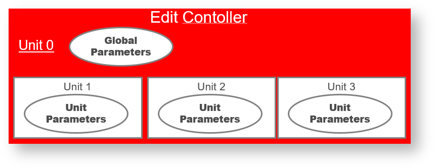

Most things of interest in regard to units are GUI related, so the access interface [Steinberg::Vst::IUnitInfo](https://steinbergmedia.github.io/vst3_doc/vstinterfaces/classSteinberg_1_1Vst_1_1IUnitInfo.html) needs to be implemented as extension of the edit controller.

See also [Steinberg::Vst::IUnitInfo](https://steinbergmedia.github.io/vst3_doc/vstinterfaces/classSteinberg_1_1Vst_1_1IUnitInfo.html), [Presets & Program Lists](https://developer.steinberg.help/pages/viewpage.action?pageId=9798267)


### 示例

- 宿主可以使用带有结构化参数列表的插件示例（来自 **Cubase** 插件集的 MultibandCompressor），在 **Cubase** 中用于选择要自动化的参数：

   

- 在 [PluginTestHost](https://developer.steinberg.help/display/VST) 的“参数”选项卡中显示结构化参数列表的插件示例（来自 **Cubase** 插件集的 VST Amp Rack）/VST+3+插件+测试+主机）应用：

   

- 在 **Cakewalk** 中使用 **HALion Sonic SE** 单元结构进行自动化选择的示例：
   


## 预设和程序列表

### 简单插件

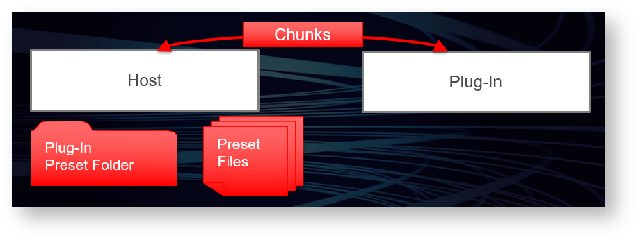

For a simple plug-in, the data of a preset is nothing more than its state. In this case:

- It is the job of the host to manage the preset handling for the plug-in.

- The plug-in itself does not need to provide any means in its GUI for loading presets at all and it does not need to define any program lists.

- Factory presets must be installed as files at the required location (See [Preset Locations](https://developer.steinberg.help/pages/viewpage.action?pageId=9798275#VST3Locations/Format-PresetLocations)).


The host has to provide the GUI for loading and saving preset files. These files contain data that the plug-in has filled into the stream in [Steinberg::Vst::IComponent::getState](https://steinbergmedia.github.io/vst3_doc/vstinterfaces/classSteinberg_1_1Vst_1_1IComponent.html#a10db03106be8ba89d23859fa6be5d9f6). **VST 3** defines dedicated locations in the OS file system (see [Preset Locations](https://developer.steinberg.help/pages/viewpage.action?pageId=9798275#VST3Locations/Format-PresetLocations)), so the host does not need to display a file selector dialog. It knows where to search for preset files of a specific plug-in and where to create them. So it can create a pop-up list for selecting a preset or any other GUI of its choice. After loading a preset, the host is responsible to rescan the parameters values (from the controller part). Therefore, the controller must be sure that it gets the correct parameter states when loading a preset (which is done with [Steinberg::Vst::IEditController::setComponentState](https://steinbergmedia.github.io/vst3_doc/vstinterfaces/classSteinberg_1_1Vst_1_1IEditController.html#a4c2e1cafd88143fda2767a9c7ba5d48f)).

See also [Communication between the components](https://developer.steinberg.help/display/VST/VST+3+API+Documentation#VST3APIDocumentation-Communicationbetweenthecomponents) and [Persistence](https://developer.steinberg.help/display/VST/VST+3+API+Documentation#VST3APIDocumentation-Persistence).


### Program Lists

If a plug-in uses a large pool of programs that require some kind of caching or that need to be preloaded, using preset files may not be a sufficient choice. In this case, the plug-in can define a program list. For this purpose, the edit controller has to be extended by the interface [Steinberg::Vst::IUnitInfo](https://steinbergmedia.github.io/vst3_doc/vstinterfaces/classSteinberg_1_1Vst_1_1IUnitInfo.html).

- If the plug-in defines a program list to be used as pool of factory presets, it must not allow the user to change these presets by the means of parameter editing. Instead, it should load the corresponding data into a kind of working memory and store possible modifications as component state. In addition, the user can be allowed to store the modifications as preset file.

- If the plug-in defines a program list to be used as a pool of user presets that are initially in an 'empty' state, modifications can be applied to the list items directly. This way of using program lists should only be chosen if programs do require a lot of resources that need to be cached in order to achieve fast program changes (good examples for this are sample-based plug-ins).


- The plug-in can provide GUI for the selection of programs, but it must enable the host to display the list and the selected program as well. The index of the selected program in the list must be exported as program selection parameter. ([Steinberg::Vst::ParameterInfo::kIsProgramChange](https://steinbergmedia.github.io/vst3_doc/vstinterfaces/structSteinberg_1_1Vst_1_1ParameterInfo.html#ae3a5143ca8d0e271dbc259645a4ae645a517665185bca1f4f3d77ce0a6468b8e3))

- The plug-in can allow the host to read and write the program data of a list item. To support this, the plug-in must implement the [Steinberg::Vst::IProgramListData](https://steinbergmedia.github.io/vst3_doc/vstinterfaces/classSteinberg_1_1Vst_1_1IProgramListData.html) interface as an extension of the component part.


**Structure of Program Lists**

All programs are always transmitted as a flat list to the host. But the plug-in can assign a number of attributes to each program of the list. This enables the host to organize and filter them in a very flexible way. Attribute values are queried via [Steinberg::Vst::IUnitInfo::getProgramInfo](https://steinbergmedia.github.io/vst3_doc/vstinterfaces/classSteinberg_1_1Vst_1_1IUnitInfo.html#ac40c799f1f52837c311ac153d7a8ead7). The possible attribute identifiers are defined in namespace Steinberg::Vst::PresetAttributes. The attribute identifier specifying a program category, for example, is [Steinberg::Vst::PresetAttributes::kInstrument](https://steinbergmedia.github.io/vst3_doc/vstinterfaces/group__presetAttributes.html#ga93cb7a7100ac96cfafceb6216770c42d). Although the name suggests that it should be used for instruments only, it can be used for any kind of audio plug-in. The value for an instrument category of a program is "Piano" for example. But it is possible to specify a subcategory like "Acoustic Piano" as well. In this case, the strings need to be chained like this:
"Piano|Acoustic Piano". This allows the host to organize presets in a category tree view, for example.


**Pitch Names**

Pitch names are intended to be used with drum kit programs where the different drum sounds are addressed by note pitches. In order to display the name of the drum instrument assigned to a pitch in a drum editor, for example, the host calls [Steinberg::Vst::IUnitInfo::hasProgramPitchNames](https://steinbergmedia.github.io/vst3_doc/vstinterfaces/classSteinberg_1_1Vst_1_1IUnitInfo.html#a63c02601259d4e8690f26eefaad53195) to determine if pitch names are supported and[Steinberg::Vst::IUnitInfo::getProgramPitchName](https://steinbergmedia.github.io/vst3_doc/vstinterfaces/classSteinberg_1_1Vst_1_1IUnitInfo.html#a6126c4506f7981b5e800c6b4daa1e66b) to query the pitch name of a single note.

See also [VST 3 Units Multi-timbral Program Lists](https://developer.steinberg.help/pages/viewpage.action?pageId=9798271) and check out the [pitchnames VST 3 Plug-in example](https://developer.steinberg.help/display/VST/VST+3+Plug-ins+Examples)


## 复杂插件/多音带乐器

### 问题

A simple VST effect plug-in usually does not cause the host too many problems. It has only one audio input and output bus and a defined set of parameters that control aspects of its sound. But a VST plug-in can be a lot more complex than this. When the plug-in implements a multi-timbral musical instrument, the host is confronted with a range of problems regarding the integration of this plug-in in its GUI. To mention a few of them:

- The plug-in can define multiple event input and multiple audio outputs. How can the host know on which output a sound will emerge when a note-event is transmitted to the plug-in?
   -> This may be of interest for the host in order to link a MIDI track to the corresponding audio channel.


- The plug-in can define a list of programs that the user can load from the plug-in GUI. In a multi-timbral instrument, a program only affects a certain part of the plug-in (we call this part a 'unit'). How can the host know about these parts and about the plug-in defined programs that can be loaded?
   -> This may be of interest for a host in order to provide shortcuts for this functionality in its own GUI.

Since a VST plug-in unlike a hardware MIDI instrument is more than only a black box, a complex plug-in should help its host to provide a more convenient GUI integration than it is possible with hardware instruments. **VST 3** uses the concept of units to describe the internal structure of the plug-in (see [VST 3 Units](https://developer.steinberg.help/display/VST/VST+3+Units)) and a multi-timbral instrument is supposed to support the respective interfaces. But the preferred solution in **VST 3** is a reduction of this complexity with the 'simple mode'.


### The Simple Mode

The 'VST 3 simple mode' has the (selfish) background to support the so-called 'simple instrument tracks' of Cubase. These tracks combine a MIDI track and VST audio channel (without the need to make any further assignments such as the choice of a MIDI output port or a MIDI channel). This mode is defined as 'only one input and only one output'. In 'simple mode', only MIDI channel 0 is used. Therefore, an instrument has to be mono-timbral.

The host will now work with multiple instances of the plug-in rather than using the same instance in a way that it contains multiple internal sections of the same kind. The **VST-MA** component model supports shared resources between multiple instances of a plug-in because usually the same module instance (dll/bundle) is used for each plug-in instance.

Yet, a plug-in has the option to support both the simple and the advanced mode with the same implementation. The host tests the general ability to support the 'simple mode' by checking the processor's class flags ([Steinberg::PClassInfo2::classFlags](https://steinbergmedia.github.io/vst3_doc/base/structSteinberg_1_1PClassInfo2.html#ab5ab9135185421caad5ad8ae1d758409)) for the [Steinberg::Vst::kSimpleModeSupported](https://steinbergmedia.github.io/vst3_doc/vstinterfaces/namespaceSteinberg_1_1Vst.html#a626a070dcd2e025250f41b9c3f9817cdabc2edc9bb281cebe9cc6dc00a7cac0ea) flag. If the plug-in is to be used in an instrument track (or whenever a host regards it more suitable) the [Steinberg::Vst::IComponent::setIoMode](https://steinbergmedia.github.io/vst3_doc/vstinterfaces/classSteinberg_1_1Vst_1_1IComponent.html#a4618e7358890d549f990010bea4a4137) method is called (before any other call!) to configure the plug-in. A mono-timbral plug-in should set this flag as well and does not need to take into account the [setIoMode](https://steinbergmedia.github.io/vst3_doc/vstinterfaces/classSteinberg_1_1Vst_1_1IComponent.html#a4618e7358890d549f990010bea4a4137)call.


### Multi-timbral Program Lists

For a multi-timbral instrument plug-in, preset handling can be a lot more complex. In this case:

- The plug-in can define any number of program lists.
- Each unit can reference one program list - this reference must not change.
- Each unit that uses a program list references one list item.
- For each unit referencing a program list, a program selection parameter has to be exported ([Steinberg::Vst::ParameterInfo::kIsProgramChange](https://steinbergmedia.github.io/vst3_doc/vstinterfaces/structSteinberg_1_1Vst_1_1ParameterInfo.html#ae3a5143ca8d0e271dbc259645a4ae645a517665185bca1f4f3d77ce0a6468b8e3)).
- The plug-in can provide GUI for the selection of programs, but it must synchronize the corresponding program selection parameter.
- A host may want to show the program list of the active unit in the same way as it shows the presets of a simple plug-in (usually in a separate control area at the top or the bottom of the window). The host must be able to display the correct list and the correct program name for the unit that has got the focus in the plug-in GUI.


To make this all work correctly, the plug-in must supply a valid implementation of [Steinberg::Vst::IUnitInfo](https://steinbergmedia.github.io/vst3_doc/vstinterfaces/classSteinberg_1_1Vst_1_1IUnitInfo.html) and it must operate the callback interface [Steinberg::Vst::IUnitHandler](https://steinbergmedia.github.io/vst3_doc/vstinterfaces/classSteinberg_1_1Vst_1_1IUnitHandler.html) accordingly.

Similar to the simple case, the host may want to save and load preset files. The component state of the plug-in is not useful here. A preset of a complex plug-in can be:

- The state of a plug-in unit
   -> To support this, the plug-in must implement the [Steinberg::Vst::IUnitData](https://steinbergmedia.github.io/vst3_doc/vstinterfaces/classSteinberg_1_1Vst_1_1IUnitData.html) interface in its component part.
- The contents of an item in the program list
   -> To support this, the plug-in must implement the[Steinberg::Vst::IProgramListData](https://steinbergmedia.github.io/vst3_doc/vstinterfaces/classSteinberg_1_1Vst_1_1IUnitData.html) interface in its component part.


A plug-in can support unit presets and program list presets.
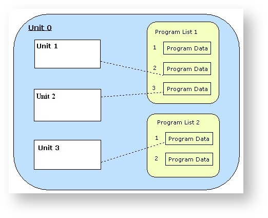

See also [Presets & Program Lists](https://developer.steinberg.help/pages/viewpage.action?pageId=9798267), [Steinberg::Vst::IProgramListData](https://steinbergmedia.github.io/vst3_doc/vstinterfaces/classSteinberg_1_1Vst_1_1IUnitData.html), [Steinberg::Vst::IUnitData](https://steinbergmedia.github.io/vst3_doc/vstinterfaces/classSteinberg_1_1Vst_1_1IUnitData.html)


### Units and Tracks

A unit can be associated with busses (or channels of busses). In particular, a unit can have a fixed and unique connection to an input MIDI channel. For a host, it might be useful to know about this connection and which unit can be associated with a specific MIDI track as a result of this. Often, the GUI of a multi-timbral plug-in does not show the settings of all similar units at the same time. Instead, there is some kind of unit selection. The idea is to be able to synchronize the selection of units in a plug-in to the selection of tracks in the host (in both ways).

When a plug-in GUI is organized in the described way, it should support the described behavior by implementing

- [Steinberg::Vst::IUnitInfo::getUnitByBus](https://steinbergmedia.github.io/vst3_doc/vstinterfaces/classSteinberg_1_1Vst_1_1IUnitInfo.html#a718fa905d04d7d559bc89c7ca761413b) : find out the track - unit relations
- [Steinberg::Vst::IUnitInfo::getSelectedUnit](https://steinbergmedia.github.io/vst3_doc/vstinterfaces/classSteinberg_1_1Vst_1_1IUnitInfo.html#a6f1b43425ba894764f35b7d492e81c53) : let the host know which track to select
- [Steinberg::Vst::IUnitInfo::selectUnit](https://steinbergmedia.github.io/vst3_doc/vstinterfaces/classSteinberg_1_1Vst_1_1IUnitInfo.html#a2504c2bb3c57742102577f34cb58e257) : cause the plug-in to select its unit and by calling

- [Steinberg::Vst::IUnitHandler::notifyUnitSelection](https://steinbergmedia.github.io/vst3_doc/vstinterfaces/classSteinberg_1_1Vst_1_1IUnitHandler.html#ab05a9a8dcca888caeabdb8ed74766bc6) : trigger the host to synchronize its GUI


### Routing

For a host, it may be interesting to know which VSTi channel in the mixer is the output of a specific MIDI track if the plug-in defines multiple audio output busses (represented as VSTi mixer channels in the host).
In general, the host needs to know about any input to output routing of the plug-in. So if an unambiguous relation exists between a plug-in input and an output, the following method should be implemented:

- [Steinberg::Vst::IComponent::getRoutingInfo](https://steinbergmedia.github.io/vst3_doc/vstinterfaces/classSteinberg_1_1Vst_1_1IComponent.html#aa0ffeccad3c44364a199ce56365a4c12) : find out the output of a given input

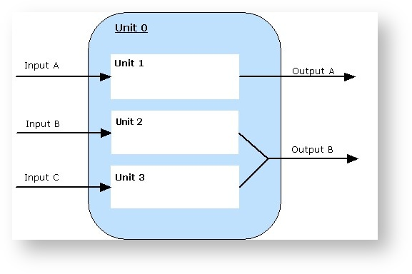


## VST3工作流程图

> 本章较多非图片文件，请到相应链接上看

### Audio Processor Call Sequence

https://developer.steinberg.help/display/VST/Audio+Processor+Call+Sequence

### Edit Controller Call Sequence

https://developer.steinberg.help/display/VST/Edit+Controller+Call+Sequence

### Get Latency Call Sequences

https://developer.steinberg.help/display/VST/Get+Latency+Call+Sequences

### Resize View Call Sequences

https://developer.steinberg.help/display/VST/Resize+View+Call+Sequences

### Bus Arrangement Setting Sequences

https://developer.steinberg.help/display/VST/Bus+Arrangement+Setting+Sequences


## VST 3 位置/格式

### 插件的格式结构

#### MacOS系统

在 macOS 平台上，**VST 3 Plug-in** 是一个标准的 macOS 捆绑包，其文件扩展名为“**.vst3**”，文件夹结构如下：

| 文件夹 | 说明 |
| :-------------------------------- | :----------------------------------------------------------- |
| MyPlugin.vst3/Contents/Resources/ | folder contains all additional resource files useful for the plug-in |
| MyPlugin.vst3/Contents/MacOS/ | folder contains the plug-in’s macOS universal binary (Mach-O) |
| MyPlugin.vst3/Contents/Info.plist | the plug-in’s property list |
| MyPlugin.vst3/Contents/PkgInfo | specifies the type and creator codes of the bundle (optional) |

#### Windows系统

在 Windows 平台上，一个 **VST 3 Plug-in** 被组织成一个捆绑包格式（简单文件夹），它的文件扩展名为“**.vst3**”，并具有以下文件夹结构：

| 文件夹 | 说明 |
| :---------------------------------------------- | :----------------------------------------------------------- |
| MyPlugin.vst3/Contents/Resources/ | folder contains all additional resource files useful for the plug-in |
| MyPlugin.vst3/Contents/x86-win/MyPlugin.vst3 | folder contains the plug-in binary (32 bit dll for the i386 architecture) |
| MyPlugin.vst3/Contents/x86_64-win/MyPlugin.vst3 | folder contains the plug-in binary (64 bit dll for the x86_64 architecture) |
| MyPlugin.vst3/Contents/arm-win/MyPlugin.vst3 | Proposal: folder contains the plug-in binary (32 bit dll for the arm architecture) |
| MyPlugin.vst3/Contents/arm_64-win/MyPlugin.vst3 | Proposal: folder contains the plug-in binary (64 bit dll for the arm64 architecture) |
| MyPlugin.vst3/desktop.ini | used to set custom icon in Windows Explorer |
| MyPlugin.vst3/Plugin.ico | customized plug-in icon |

在以前的 SDK 中，**VST 3 Plug-in** 被定义为带有 **.vst3** 扩展名的单个 dll 文件。自 VST 3.6.10 起已弃用此功能。

文件 **desktop.ini** 应包含：

**desktop.ini**

```
`[.ShellClassInfo]``IconResource=Plugin.ico,``0`
```

然后你应该使用此命令行更改它们的属性（**s** 用于系统以确保 Windows 将其用于文件夹/捆绑包，**r** 用于只读，**h** 用于隐藏（可选的））：

```
`attrib +s +``r` `+``h` `desktop.ini``attrib +``r` `+``h` `Plugin.ico`
```

#### Linux系统

在 Linux 上，**VST 3 Plug-in** 被组织为类似包的包格式，其文件扩展名为“**.vst3**”，它遵循以下文件夹结构：

| 文件夹 | 说明 |
| :---------------------------------- | :----------------------------------------------------------- |
| MyPlugin.vst3/Contents/Resources/ | folder contains all additional resource files useful for the plug-in |
| MyPlugin.vst3/Contents/i386-linux | folder contains the plug-in binary (32 bit shared library .so for Kernel Architecture i386) |
| MyPlugin.vst3/Contents/x86_64-linux | folder contains the plug-in binary (64 bit shared library .so for Kernel Architecture x86_64) |
| yPlugin.vst3/Contents/XXX-linux | with XXX the architecture name based on the output of command-line "uname -m" (machine hardware) + "-linux"for example:armv3l-linuxarmv4b-linuxarmv4l-linuxarmv5tel-linuxarmv5tejl-linuxarmv6l-linuxarmv7l-linuxarmv8l-linux |

#### 合并捆绑

请注意，所有捆绑包都可以合并为一个，这样就可以拥有一个跨平台的捆绑包/文件夹。

例如：

```
MyPlugin.vst3/
    |_ Contents/
    |   |__ Resources/
    |   |   |__ Snapshots/
    |   |   |   |__ snapshot_2.png
    |   |   |   |__ snapshot_2_2.0x.png
    |   |   |__ Documentation/
    |   |   |   |__ Manual.pdf
    |   |   |   |__ WhatsNew.pdf
    |   |   |__ Help/
    |   |       |__ helpdoc.xml
    |   |   |__ MyPlugin.srf
    |   |
    |   |__ armv7l-linux/
    |   |   |__ MyPlugin.so
    |   |
    |   |__ i686-linux/
    |   |   |__ MyPlugin.so
    |   |
    |   |__ i386-linux/
    |   |   |__ MyPlugin.so
    |   |
    |   |__ x86_64-linux/
    |   |   |__ MyPlugin.so
    |   |
    |   |__ MacOS/
    |   |   |__ MyPlugin
    |   |
    |   |__ x86-win/
    |   |   |__ MyPlugin.vst3
    |   |
    |   |__ x86_64-win/
    |   |   |__ MyPlugin.vst3
    |   |
    |   |__ Info.plist  (macOS Only)
    |   |__ PkgInfo     (macOS Only)
    |
    |____desktop.ini    (Windows only)
    |___ Plugin.ico     (Windows only)
```


## 插件位置

### 介绍

**VST 3** 插件应安装在特定的文件夹，下表为不同操作系统指定了这些预定义的位置。

> **VST 3** doesn't require a Plug-in registration like it is used with **DirectX**.

> Links, Symbolic links or Shortcuts could be used from these predefined folders.

3 levels of folder location are defined:

- **User**: available only for the current logged user
- **Global**: available for all users of the system
- **Application**: available only inside an specific Audio Application (local Plug-ins)

> The host should scan at first higher level of priority, first found Plug-in (for a given Processor UID) has to be used.

#### On macOS platform

On the macOS platform, the host application expects **VST 3 Plug-ins** to be located in:

| Priority | Location | Path | Comment |
| :------- | :---------- | :-------------------------------------------- | :------ |
| 1 | User | /Users/$USERNAME/Library/Audio/Plug-ins/VST3/ |         |
| 2 | Global | /Library/Audio/Plug-ins/VST3/ |         |
| 3 | Global | /Network/Library/Audio/Plug-ins/VST3/ |         |
| 4 | Application | $APPFOLDER/Contents/VST3/ |         |

> **Note:** The host recursively scans these folders at startup in this order (User/Global/Application).

#### On Windows platform

On the Windows platform, the host application expects **VST 3 Plug-ins** to be located in:

| Priority | Location | Path | Comment |
| :------- | :---------- | :-------------------------------------- | :----------------------------------------------------------- |
| 1 | Global | /Program Files/Common Files/VST3/ | FOLDERID_ProgramFilesCommonnative bitdepth:32bit Plug-in on 32bit OS,64bit on 64bit OS |
| 1 | Global | /Program Files (x86)/Common Files/VST3/ | 32bit Plug-ins on 64bit Windows |
| 2 | Application | $APPFOLDER/VST3/ |                                                              |

> **Note:** The host recursively scans these folders at startup in this order (Global/Application).

#### On Linux platform

On the Linux platform, the host application expects **VST 3 Plug-ins** to be located in:

| Priority | Location | Path | Comment |
| :------- | :---------- | :------------------- | :------ |
| 1 | User | $HOME/.vst3/ |         |
| 2 | Global | /usr/lib/vst3/ |         |
| 3 | Global | /usr/local/lib/vst3/ |         |
| 4 | Application | $APPFOLDER/vst3/ |         |

> **Note:** The host recursively scans these folders at startup in this order (User/Global/Application).


## 预设格式

文件扩展名必须是**".vstpreset"**，例如：*myBestDefault.vstpreset*，指定**VST 3** Preset 文件：
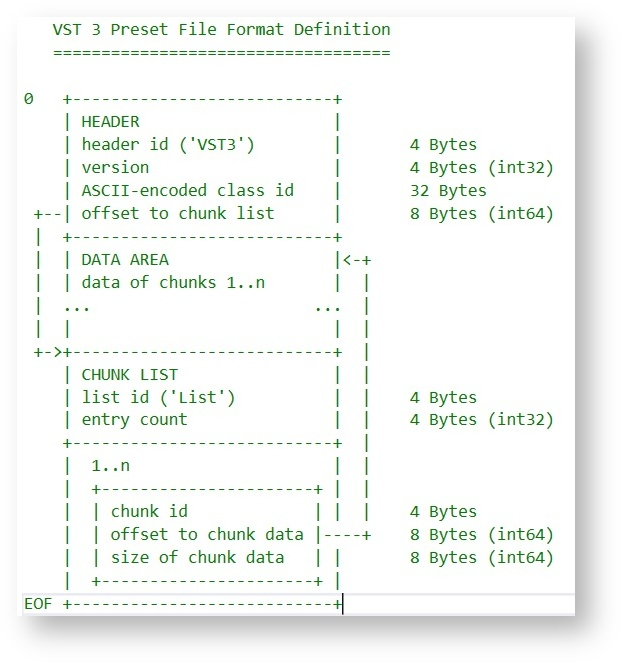

检查 [Steinberg::Vst::PresetFile](https://steinbergmedia.github.io/vst3_doc/vstsdk/classSteinberg_1_1Vst_1_1PresetFile.html#a9db1b48345e92320b0dffc446d5e3483) 源代码，它允许读取和写入此类预设。


## 预设位置

### 介绍

**VST 3** 位于计算机上的预定义位置，具体取决于操作系统。

- 定义了 3 级预设范围：
   - **User**: 仅适用于当前登录的用户
   - **Public**: 可供系统的所有用户使用
   - **Apps**: 仅在特定音频应用程序中可用
- 定义了 4 种类型的预设：
   - **User**: 用户创建的预设
   - **User_Factory**: 像 **User** 类型，但不直接显示
   - **Shared_Factory**: 插件安装程序安装的出厂预设
   - **App_Factory**: 由音频应用程序安装的预设，仅对该特定音频应用程序可见

> **$COMPANY** 和 **$PLUGIN-NAME** 文件夹名称仅包含文件命名允许的字符（将字符 "**\\*?/:<>|\**" 替换为 "**_** ”）。

> **Note:** 下面定义的每个路径都应按给定的优先级进行扫描，提取预设并将其添加到预设列表中。

#### Mac系统

| Prio | Type | Scope | Writable | Path | Comment |
| :--- | :------------- | :----- | :------- | :----------------------------------------------------------- | :----------------------------- |
| 1 | User | User | X | Users/$USERNAME/Library/Audio/Presets/$COMPANY/$PLUGIN-NAME/ |                                |
| 2 | Shared_Factory | Public | - | Library/Audio/Presets/$COMPANY/$PLUGIN-NAME/ | Computer shared FactoryROM |
| 3 | Shared_Factory | Public | - | Network/Library/Audio/Presets/$COMPANY/$PLUGIN-NAME/ | Network shared FactoryROM |
| 4 | App_Factory | Apps | - | [$APPFOLDER]/VST3 Presets/$COMPANY/$PLUGIN-NAME/ | Host Application (Cubase, ...) |

#### Windows XP/2000系统

| Prio | Type | Scope | Writable | Path | Comment |
| :--- | :------------- | :----- | :------- | :----------------------------------------------------------- | :----------------------------- |
| 1 | User | User | X | [my documents]/vst3 presets/$company/$plugin-name/ | csidl_personal |
| 2 | User_Factory | User | X | [documents and settings/$username/application data]/vst3 presets/$company/$plugin-name/ | csidl_appdata |
| 3 | Shared_Factory | Public | - | [documents and settings/$allusers/application data]/vst3 presets/$company/$plugin-name/ | csidl_common_appdata |
| 4 | App_Factory | Apps | - | [$APPFOLDER]/VST3 Presets/$COMPANY/$PLUGIN-NAME/ | Host Application (Cubase, ...) |

#### Windows Vista/7/8/10系统

| Prio | Type | Scope | Writable | Path | Comment |
| :--- | :------------- | :----- | :------- | :----------------------------------------------------------- | :----------------------------- |
| 1 | User | User | X | [Users/$USERNAME/Documents]/VST3 Presets/$COMPANY/$PLUGIN-NAME/ | FOLDERID_Documents |
| 2 | User_Factory | User | X | [Users/$USERNAME/AppData/Roaming]/VST3 Presets/$COMPANY/$PLUGIN-NAME/ | FOLDERID_RoamingAppData |
| 3 | Shared_Factory | Public | - | [ProgramData]/VST3 Presets/$COMPANY/$PLUGIN-NAME/ | FOLDERID_ProgramData |
| 4 | App_Factory | Apps | - | [$APPFOLDER]/VST3 Presets/$COMPANY/$PLUGIN-NAME/ | Host Application (Cubase, ...) |

#### Linux系统

| Prio | Type | Scope | Writable | Path | Comment |
| :--- | :------------- | :----- | :------- | :--------------------------------------------------- | :--------------- |
| 1 | User | User | X | $HOME/.vst3/presets/$COMPANY/$PLUGIN-NAME/ |                  |
| 2 | Shared_Factory | Public | - | /usr/share/vst3/presets/$COMPANY/$PLUGIN-NAME/ |                  |
| 3 | Shared_Factory | Public | - | /usr/local/share/vst3/presets/$COMPANY/$PLUGIN-NAME/ |                  |
| 4 | App_Factory | Apps | - | [$APPFOLDER]/vst3/presets/$COMPANY/$PLUGIN-NAME/ | Host Application |


## 快照

### 介绍

从 VST 3.6.10 开始，**VST 3** 包含 **VST 3** 宿主的预渲染快照图像，作为插件 UI 的可视化预览。此快照必须具有预定义的格式和文件名，以便主机能够识别它。

- 图片格式必须是PNG
- 图像需要位于文件夹 **Resources/Snapshots/** 中的捆绑目录内
- 文件名必须以 84E8DE5F92554F5396FAE4133C935A18 形式打印的音频处理器的唯一 ID 开头，后跟字符串 _snapshot，可选地后跟 HiDPI 比例因子 _2.0x，并以文件扩展名 .png 结尾。
   - 例如，again 的快照必须命名为：
      - **snapshot_2.png**
      - **snapshot_2_2.0x.png** for the 2x scaled HiDPI variant.
   - 如果省略 HiDPI 比例，则使用比例1。


### 示例

#### 音符音调合成器


#### Cubase 如何使用快照


在媒体选项卡下的右侧区域中，用户可以使用快照选择 FX 和乐器。


## VST3里的MIDI

与 **VST 2** 不同，**MIDI** 不包含在 **VST 3** 中。但是 **VST 3** 提供了可以使用 [Event](https://steinbergmedia.github.io/vst3_doc/vstinterfaces/structSteinberg_1_1Vst_1_1Event.html) 与 MIDI 相互转换的方法：


### MIDI 和 VST3 中的相关概念

**MIDI 1.0** 到 **VST 3** 中的概念关系

| MIDI 1.0 | VST 3 | Defined in |
| :------------------------------- | :----------------------------------------------------------- | :--------------------------------------- |
| Port | Bus of[Steinberg::Vst::MediaType](https://steinbergmedia.github.io/vst3_doc/vstinterfaces/group__vstBus.html#ga576e5da9bdc49812cf65f803bb303ad5), [Steinberg::Vst::MediaTypes::kEvent](https://steinbergmedia.github.io/vst3_doc/vstinterfaces/group__vstBus.html#gga576e5da9bdc49812cf65f803bb303ad5ae6a97de99980aeac9312e818af337d6f) | *ivstcomponent.h* |
| Channel | Channel of a Bus, [Unit by Bus](https://developer.steinberg.help/display/VST/VST+3+Units) and Channel | *ivstcomponent.h, ivstunits.h* |
| Note-On | [Steinberg::Vst::NoteOnEvent](https://steinbergmedia.github.io/vst3_doc/vstinterfaces/structSteinberg_1_1Vst_1_1NoteOnEvent.html) | *ivstevents.h* |
| Note-Off | [Steinberg::Vst::NoteOffEvent](https://steinbergmedia.github.io/vst3_doc/vstinterfaces/structSteinberg_1_1Vst_1_1NoteOffEvent.html) | *ivstevents.h* |
| Poly Key Pressure | [Steinberg::Vst::PolyPressureEvent](https://steinbergmedia.github.io/vst3_doc/vstinterfaces/structSteinberg_1_1Vst_1_1PolyPressureEvent.html) | *ivstevents.h* |
| Control Change | [Parameter](https://developer.steinberg.help/display/VST/Parameters+and+Automation), [IMidiMapping](https://developer.steinberg.help/display/VST/[3.0.1]+Parameter+MIDI+Mapping+Support) | *ivstcomponent.h, ivstmidicontrollers.h* |
| Channel Pressure | [Parameter](https://developer.steinberg.help/display/VST/Parameters+and+Automation), [IMidiMapping](https://developer.steinberg.help/display/VST/[3.0.1]+Parameter+MIDI+Mapping+Support) | *ivstcomponent.h, ivstmidicontrollers.h* |
| Pitch Bend | [Parameter](https://developer.steinberg.help/display/VST/Parameters+and+Automation), [IMidiMapping](https://developer.steinberg.help/display/VST/[3.0.1]+Parameter+MIDI+Mapping+Support) | *ivstcomponent.h, ivstmidicontrollers.h* |
| Program Change | [Parameter](https://developer.steinberg.help/display/VST/Parameters+and+Automation), [kIsProgramChange](https://steinbergmedia.github.io/vst3_doc/vstinterfaces/structSteinberg_1_1Vst_1_1ParameterInfo.html#ae3a5143ca8d0e271dbc259645a4ae645a517665185bca1f4f3d77ce0a6468b8e3), [Steinberg::Vst::ProgramListInfo](https://steinbergmedia.github.io/vst3_doc/vstinterfaces/structSteinberg_1_1Vst_1_1ProgramListInfo.html) | *ivstcomponent.h, ivstunits.h* |
| MPE (MIDI Polyphonic Expression) | [NoteExpression](https://developer.steinberg.help/display/VST/[3.5.0]+Note+Expression+Support), [PhysicalUI](https://developer.steinberg.help/display/VST/[3.6.11]+NoteExpression+Physical+UI+Mapping+Support) | *ivstnoteexpression.h, ivstphysicalui.h* |
| System Exclusive | [Steinberg::Vst::DataEvent](https://steinbergmedia.github.io/vst3_doc/vstinterfaces/structSteinberg_1_1Vst_1_1DataEvent.html)of Type [Steinberg::Vst::DataEvent::kMidiSysEx](https://steinbergmedia.github.io/vst3_doc/vstinterfaces/structSteinberg_1_1Vst_1_1DataEvent.html#afb6eb4f28419b652027fad41104a6d22ab06d86440be6a85eccce4df100ce8e79) | *ivstevents.h* |


MIDI 2.0 (<https://www.midi.org/>) 中引入的概念与 **VST 3** 的其他关系

| MIDI 2.0 | VST 3 | Defined in / Comments |
| :----------------------------- | :----------------------------------------------------------- | :----------------------------------------------------------- |
| Group (of Channels) | Bus of [Steinberg::Vst::MediaType](https://steinbergmedia.github.io/vst3_doc/vstinterfaces/group__vstBus.html#ga576e5da9bdc49812cf65f803bb303ad5), [Steinberg::Vst::MediaTypes::kEvent](https://steinbergmedia.github.io/vst3_doc/vstinterfaces/group__vstBus.html#gga576e5da9bdc49812cf65f803bb303ad5ae6a97de99980aeac9312e818af337d6f) | *ivstcomponent.h* |
| Registered Per-Note Controller | [NoteExpression](https://developer.steinberg.help/display/VST/[3.5.0]+Note+Expression+Support), [PhysicalUI](https://developer.steinberg.help/display/VST/[3.6.11]+NoteExpression+Physical+UI+Mapping+Support) | *ivstnoteexpression.h, ivstphysicalui.h* |
| Assignable Per-Note Controller | [NoteExpression](https://developer.steinberg.help/display/VST/[3.5.0]+Note+Expression+Support) | *ivstnoteexpression.h* |
| System Exclusive 8-Bit | indirect support | The host can translate to 7-Bit, [Steinberg::Vst::DataEvent](https://steinbergmedia.github.io/vst3_doc/vstinterfaces/structSteinberg_1_1Vst_1_1DataEvent.html)of Type [Steinberg::Vst::DataEvent::kMidiSysEx](https://steinbergmedia.github.io/vst3_doc/vstinterfaces/structSteinberg_1_1Vst_1_1DataEvent.html#afb6eb4f28419b652027fad41104a6d22ab06d86440be6a85eccce4df100ce8e79) |
| Registered Controller | not supported | The host can do detailed tuning via [NoteExpression](https://developer.steinberg.help/display/VST/[3.5.0]+Note+Expression+Support) |
| Assignable Controller | not supported | The host should offer mapping to parameters |
| Relative Registered Controller | not supported | The host is free to translate this to parameters |
| Relative Assignable Controller | not supported | The host is free to translate this to parameters |
| Per-Note Pitch Bend | not supported | The host can do detailed tuning via [NoteExpression](https://developer.steinberg.help/display/VST/[3.5.0]+Note+Expression+Support) |
| Mixed Data Set | not supported | not supported |

### MIDI 2.0 Per-Note Controllers

**MIDI 2.0** Per-Note Controllers 和 [**VST 3** NoteExpression](https://developer.steinberg.help/display/VST/[3.5.0]+Note+Expression) 之间有许多细微差别+支持。好消息是插件开发人员不必为此做任何事情。宿主则有责任将 MIDI 2.0 转换成 **VST 3**。

### 与 MIDI 1.0 相比，MIDI 2.0 增加了分辨率

**MIDI 2.0** 与**MIDI 1.0** 相比，在许多重要值（例如力度、压力和控制器）的分辨率上实现了显着提高。尽管如此，**VST 3** 仍然具有比 **MIDI 2.0** 更高的分辨率。支持 **VST 3** 的插件和主机应该积极利用这些功能。

下面是这三者的比较

| Value | MIDI 1.0 | MIDI 2.0 | VST 3 |
| :----------------------------------------------------------- | :--------------- | :----------------------- | :----------- |
| Velocity (On & Off) | 7 Bit integer | 16 Bit integer | 32 Bit float |
| Poly Pressure | 7 Bit integer | 32 Bit integer | 32 Bit float |
| Channel Pressure / Parameters | 7 Bit integer | 32 Bit integer | 64 Bit float |
| Controllers / Parameters | 7-14 Bit integer | 32 Bit integer | 64 Bit float |
| Pitch Bend / Parameters | 14 Bit integer | 32 Bit integer | 64 Bit float |
| Note Attribute Tuning | not available | 16 Bit fixed point (7.9) | 32 Bit float |
| Per-Note Controllers / [NoteExpression](https://developer.steinberg.help/display/VST/[3.5.0]+Note+Expression+Support) | not available | 32 Bit integer | 64 Bit float |