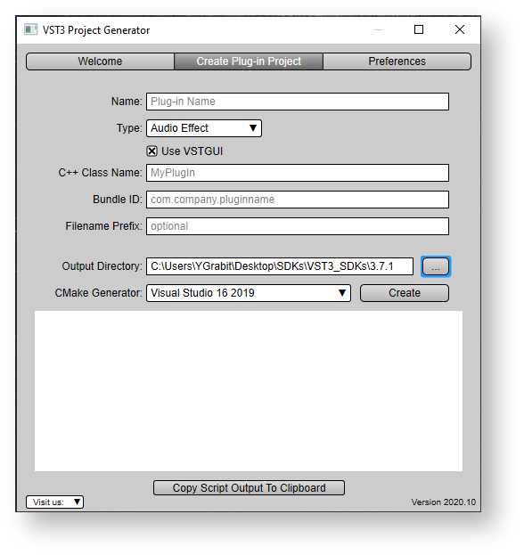

# 教程

## 构建 SDK 里面的示例项目

本教程介绍了如何设置计算机，为 **VST 3** 内置的音频插件示例项目创建编译环境 ，内置的插件包括简单的 DSP 效果（增益、压缩器、延迟等）插件、合成器乐器插件等。通过这些操作你可以了解插件是如何实现某些特定的 **VST 3** 功能的（音符表达、程序更改、频道信息上下文等）

它们可以加载到支持 **VST 3** 的宿主中，例如 Cubase、WaveLab、...


### **Part 1: 获取和安装 VST3 SDK**

关于下载 SDK，你可以参阅这部分："[如何为VST3设置我的系统](https://developer.steinberg.help/display/VST/How+to+set+up+my+system+for+VST+3)"

从以下位置下载 cmake：<https://cmake.org/download/> 或为你的操作系统使用包管理器。


### Part 2: 构建示例

**在 Windows 上构建示例**

- 为了构建示例，你需要新建一个文件夹，并移动到这个文件夹（使用 cd 命令）：

```
mkdir build
cd build
```

- 生成解决方案/项目：指定 CMakeLists.txt 所在项目的路径：

```
cmake.exe -G "Visual Studio 16 2019" -A x64 ../vst3sdk
or without symbolic links
cmake.exe -G "Visual Studio 16 2019" -A x64 ../vst3sdk -SMTG_CREATE_PLUGIN_LINK=0
```

注意：你可以在 cmake 在线文档 (<https://cmake.org/documentation/>) 中找到不同于 Visual Studio 生成器的命令。

- 构建插件 (你也可以使用 Visual Studio):

```
msbuild.exe vstsdk.sln
 (or alternatively for example for release)
 
cmake --build . --config Release
```


**在macOS上构建示例**

- 为了构建示例，你需要新建一个文件夹，并移动到这个文件夹（使用cd命令）：

```
mkdir build
cd build
```

- 生成解决方案/项目：指定CMakeLists.txt所在项目的路径：使用XCode:

```
cmake -GXcode ../vst3sdk
```

不使用 XCode (使用 Debug 变量):

```
cmake -DCMAKE_BUILD_TYPE=Debug ../
```

- 构建插件 (你也可以使用 Xcode):

```shell
xcodebuild
 (or alternatively for example for release)
 
cmake --build . --config Release
```


**在 Linux 上构建示例**

- 安装所需的软件包：[所需的包](https://developer.steinberg.help/display/VST/How+to+set+up+my+system+for+VST+3#HowtosetupmysystemforVST3-setup_linux)
- 为了构建示例，你需要新建一个文件夹，并移动到这个文件夹（使用cd命令）：

```
mkdir build
cd build
```

- 生成解决方案/项目：指定CMakeLists.txt所在项目的路径：

```
cmake ../vst3sdk
```

- 构建插件:

```shell
make
(or alternatively for example for release)
 
cmake --build . --config Release
```


### 使用cmake-gui构建

- 启动 cmake-gui 应用程序，它是 cmake 的一部分 (<https://cmake.org/download/>)


- "**Browse Source...**": 选择 VST3_SDK 文件夹
- "***Browse Build...***": 选择一个输出文件夹。一般这个文件夹名字叫 "build"
- 你可以勾上 SMTG 选项
- 点击 "***Configure***" 然后在新窗口中选择**生成器( generator )**，例如 "**Visual Studio 16 2019**"


- 点击 "***Generate***" 以创建项目
- 打开你喜欢的 IDE，编译生成的项目


## 使用 Cmake (命令行)来构建 VST3 插件

### 用于构建 VST 3 插件的 CMake

SDK 提供了一组 cmake 文件，它帮你编译SKD里面的示例和开发新插件。

- 从以下位置下载 cmake：[ https://cmake.org](https://cmake.org/)，或为你的操作系统使用包管理器（请参阅[如何为 VST 3 设置我的系统](https://developer.steinberg.help/display/VST/How+to+set+up+my+system+for+VST+3)）。
- 您可以使用命令行或 cmake 界面工具([cmake-gui](https://cmake.org/download/))。


### Windows命令行

使用 "**Microsoft Studio 16 2019**" 解决方案:

```shell
// go in to the folder where you extracted the VST 3 SDK
mkdir build
cd build
cmake.exe -G "Visual Studio 16 2019" -A x64 "..\vst3sdk"
//  or without symbolic links
cmake.exe -G "Visual Studio 16 2019" -A x64 "..\vst3sdk" -SMTG_CREATE_PLUGIN_LINK=0
 
// note: you can find the string definition for different Visual Studio Generators in the cmake online documentation
```


### MacOS命令行

使用 Xcode 构建项目:

```
// go in to the folder where you extracted the VST 3 SDK
mkdir build
cd build
/Applications/CMake.app/Content/bin/cmake -G"Xcode" "../vst3sdk"
```


### 在 Linux 上使用 QtCreator

您可以使用 **QtCreator** 2.3.1（或更高版本）

```
启动 QtCreator 2.3.2
打开位于 VST 3 SDK 文件夹的 CMakeLists.txt
点击菜单 Build->Run CMake
```


### cmake-gui 的使用

```
start the CMake (cmake-gui) application
set "Where is the source code" to the location of the "VST3_SDK" folder
set "Where to build the binaries" to a build folder of your choice
click on "Configure"
click on "Generate" for creating project/solution
```


Windows 上的 cmakegui 应用程序示例

- 使用cmake命令行编译

```
cd build
cmake --build
```

- 你可以在使用cmake时指定编译器，例如g++或clang++

```
cmake -DCMAKE_C_COMPILER=/usr/bin/clang -DCMAKE_CXX_COMPILER=/usr/bin/clang++
or
cmake -DCMAKE_C_COMPILER=/usr/bin/gcc -DCMAKE_CXX_COMPILER=/usr/bin/g++
```


### 可用的 SMTG cmake 选项

- **SMTG_AAX_SDK_PATH**: 指定AAX SDK路径 
- **SMTG_ADD_VST3_HOSTING_SAMPLES**:添加Hosting Samples到项目
- **SMTG_ADD_VST3_PLUGINS_SAMPLES**: 添加VST3 plug-in samples到项目，默认ON
- **SMTG_ADD_VSTGUI**: 添加GUI支持，默认ON
- **SMTG_BUILD_UNIVERSAL_BINARY**: 构建UNIVERSAL二进制文件
- **SMTG_COREAUDIO_SDK_PATH**: 指定COREAUDIO SDK路径
- **SMTG_CREATE_BUNDLE_FOR_WINDOWS**: 为Windows插件创建Bundle
- **SMTG_CREATE_PLUGIN_LINK**: 为VST3创建符号链接，默认开启
- **SMTG_CREATE_VST2_AGAIN_SAMPLE_VERSION**: 允许你创建增益插件的VST2版本，但是要确保你已经把VST2接口复制到了VST_SDK/VST3_SDK/pluginterfaces/vst2.x文件夹，默认关闭
- **SMTG_CUSTOM_BINARY_LOCATION**: 为二进制文件自定义输出位置
- **SMTG_CXX_STANDARD**: 插件的C++版本
- **SMTG_ENABLE_ADDRESS_SANITIZER**: 打开Address Sanitizer
- **SMTG_ENABLE_TARGET_VARS_LOG**: 在Debug时打印目标变量
- **SMTG_ENABLE_USE_OF_JACK**: 允许使用Jack，默认OFF
- **SMTG_MDA_VST3_VST2_COMPATIBLE**: 构建MDA示例以代替VST2 counterpart，默认ON
- **SMTG_IOS_DEVELOPMENT_TEAM**: 需要为IOS构建InterAppAudio和AUv3
- **SMTG_MYPLUGINS_SRC_PATH**: 你可以添加VST3插件文件夹
- **SMTG_PLUGIN_TARGET_PATH**: 你可以重新指定VST3插件文件夹
- **SMTG_RENAME_ASSERT**: 重命名ASSERT成SMTG_ASSERT以避免第三方带来的冲突，默认ON
- **SMTG_RUN_VST_VALIDATOR**: 在每次构建时在VST3插件上运行VST校验器，默认ON
- **SMTG_USE_STATIC_CRT**: 在Windows上使用Static CRuntime，默认OFF


**在 Windows 上准备**

使用 SDK 中包含的 [cmake](https://cmake.org/) 生成的 VST3 Microsoft Visual Studio 项目将默认为 [官方 VST3 文件夹](https://developer.steinberg.help/display/VST/Plug-in+Locations)中的每个内置插件创建 symbolic 链接，为了在 Windows 上运行，您必须调整 Windows 的组策略。看 [这里](https://developer.steinberg.help/display/VST/Preparation+on+Windows)!

如果您不想创建此链接，请使用此参数调用 [cmake](https://cmake.org/)：

```
-SMTG_CREATE_PLUGIN_LINK=0
```


### 使用 IDE 编译示例

- solution/project (vstsdk.sln/vstsdk.xcodeproj) 会被生成在 "build" 文件夹
- 被创建的插件会被放在build文件夹下面的 **/VST3/Release **或 ***/VST3/Debug***
- 为了允许DAW找到这些插件你需要创建链接（参考[VST3 Locations](https://developer.steinberg.help/pages/viewpage.action?pageId=9798275))


## 使用项目生成器生成一个新插件

### 第 1 部分：获取和安装 VST 3 SDK

SDK的下载请参见“[如何为 VST 3 设置我的系统](https://developer.steinberg.help/display/VST/How+to+set+up+my+system+for+VST+3)”。

你可以通过以下方式开始一个新项目：

- 你可以使用 **VST SDK** 中包含的 [**helloworld** 模板](https://developer.steinberg.help/display/VST/Creating+a+plug-in+from+the+Helloworld+template) 并将该文件夹复制到一个新文件夹中。修改注释中提到的每个文件。
- 使用 **VST SDK 中包含的 VST3 Project Generator** 应用程序来开发会更简单和值得推荐。以下步骤介绍如何使用它。


------

### 第 2 部分：使用 [VST 3 插件**项目生成器**](https://developer.steinberg.help/display/VST/VST+3+Project+Generator) 应用

**VST SDK** 中包含的 [**VST3 Project Generator**](https://developer.steinberg.help/display/VST/VST+3+Project+Generator) 应用程序可用于 Windows 和 macOS。

启动位于 **VST SDK** 的 *VST3_Project_Generator* 文件夹中的应用程序。

检查 **Preferences** 选项卡是否具有所需的信息：请参阅 [Setting the Preferences](https://developer.steinberg.help/display/VST/VST+3+Project+Generator#VST3ProjectGenerator-SettingthePreferences)。

在 **Create Plug-in Project** 选项卡中，您必须输入要创建插件的相关信息：




查看 [Create Plug-in Project](https://developer.steinberg.help/display/VST/VST+3+Project+Generator) 对话框的 [VST 3 Project Generator](https://developer.steinberg.help/display/VST/VST+3+Project+Generator#VST3ProjectGenerator-CreatePlug-inProject) 选项卡以获取更详细的文档。

输入所有信息后，单击**创建**这会启动一个脚本，这个脚本会用已更改的文件创建一个项目并输出到 Output 文件夹。进行这一步之后, IDE ([Visual Studio](https://visualstudio.microsoft.com/) or [XCode](https://developer.apple.com/xcode/)) 就会启动。

编译项目并测试您的新插件。该插件在 *Output文件夹* 中创建，为了使其对 **VST 3** 宿主可见，你可能需要将其复制或链接到 [VST 3 Locations / Format](https://developer.steinberg.help/pages/viewpage.action?pageId=9798275)。

例如，如果你选择**音效**创建了一个简单的 Stereo→Stereo 插件。

了解 **VST 3** 插件如何工作的一个好方法是在处理器和控制器文件的每个函数中添加断点：

```
tresult PLUGIN_API MyPluginController::initialize (FUnknown* context);
tresult PLUGIN_API MyPluginController::terminate ();
//...
tresult PLUGIN_API MyPluginProcessor::initialize (FUnknown* context);
//...
```

并且启动一个基于调试器的 **VST 3** 主机。


### 第 3 部分：编写你的插件

现在你有一个自动生成的插件框架。以下部分解释了如何添加新参数、相关联的处理算法以及其他特定功能，例如保存/加载项目或预设、创建专属用户界面等。

**VST 3** 插件包含两个主要类： *PlugProcessor*（进行处理和持久化）和它的 *PlugController*（负责与DAW交互、处理参数和 UI）。


#### 添加参数: Gain

在这个基本插件示例中，我们将添加一个Gain参数，该参数可以修改传输进来的音频音量。

为此，**VST 3**参数需要一个唯一的标识符（一个数字）。

1. 打开文件 pluginids.h 并输入一个新的 ID *kParamGainId。* 在本例中，分配唯一编号 102。

**plugids.h**

```c++
#include "pluginterfaces/vst/vsttypes.h"
 
enum GainParams : Steinberg::Vst::ParamID
{
    kParamGainId = 102, // should be an unique id...
};
```


2. 打开 plugcontroller.cpp 文件, 添加 parameters.addParameter

**plugcontroller.cpp**

```c++
#include "myplugincids.h"
 
//-----------------------------------------------------------------------------
tresult PLUGIN_API PlugController::initialize (FUnknown* context)
{
    tresult result = EditController::initialize (context);
    if (result != kResultOk)
    {
        return result;
    }
 
    //---Create Parameters------------
    parameters.addParameter (STR16 ("Gain"), STR16 ("dB"), 0, .5, Vst::ParameterInfo::kCanAutomate, GainParams::kParamGainId, 0);
 
    return kResultTrue;
}
```

> 注意
>
> - 我们添加标志：[*kCanAutomate*](https://steinbergmedia.github.io/vst3_doc/vstinterfaces/structSteinberg_1_1Vst_1_1ParameterInfo.html#ae3a5143ca8d0e271dbc259645a4ae645af38562ef6dde00a339d67f9be4ec3a31)，它会通知 DAW 宿主这个参数是可以自动化的。
> - **VST 3** 参数总是标准化的（它的值是一个介于 0 到 1 之间的浮点值），这里它的默认值设置为 0.5。


3. 现在为这个新参数修改处理器。打开文件 *plugprocessor.h* 并添加增益值 **Vst::ParamValue mGain**。该值用于 Gain 的处理。

**plugprocessor.h**

```c++
// ... 
static FUnknown* createInstance (void*)
{
    return (Steinberg::Vst::IAudioProcessor*)new PlugProcessor ();
}
protected:
    Steinberg::Vst::ParamValue mGain = 1.;
// ...
```


#### Add the process applying the gain

1. 我们需要设置我们的内部 **mGain**，其值来自宿主。这是处理方法的第一步。解析结构体中来自宿主的参数变化 *data.inputParameterChanges* 用于当前要处理的音频块。在 plugprocessor.cpp 文件上方添加 #include "public.sdk/source/vst/vstaudioprocessoralgo.h"，这个头文件会提供一些必要的帮助工具

**plugprocessor.cpp**

```c++
#include "pluginterfaces/vst/ivstparameterchanges.h"
#include "public.sdk/source/vst/vstaudioprocessoralgo.h"
 
//-----------------------------------------------------------------------------
tresult PLUGIN_API PlugProcessor::process (Vst::ProcessData& data)
{
    //--- First : Read inputs parameter changes-----------
    if (data.inputParameterChanges)
    {
        // for each parameter defined by its ID
        int32 numParamsChanged = data.inputParameterChanges->getParameterCount ();
        for (int32 index = 0; index < numParamsChanged; index++)
        {
            // for this parameter we could iterate the list of value changes (could 1 per audio block or more!)
            // in this example we get only the last value (getPointCount - 1)
            Vst::IParamValueQueue* paramQueue = data.inputParameterChanges->getParameterData (index);
            if (paramQueue)
            {
                Vst::ParamValue value;
                int32 sampleOffset;
                int32 numPoints = paramQueue->getPointCount ();
                switch (paramQueue->getParameterId ())
                {
                    case GainParams::kParamGainId:
                        if (paramQueue->getPoint (numPoints - 1, sampleOffset, value) == kResultTrue)
                            mGain = value;
                        break;
                }
            }
        }
    }
    // ....
}
```

> **data.inputParameterChanges** 可以在处理音频块中进行超过 **1** 个参数的更改。在这里，我们只采用列表中的最后一个更改并将其应用到我们的 **mGain**。

2. 真正的处理部分代码:

**plugprocessor.cpp**

```c++
// ...
 
//-- Flush case: we only need to update parameter, no processing possible
if (data.numInputs == 0 || data.numSamples == 0)
    return kResultOk;
 
//--- Here you have to implement your processing
int32 numChannels = data.inputs[0].numChannels;
 
//---get audio buffers using helper-functions (vstaudioprocessoralgo.h)-------------
uint32 sampleFramesSize = getSampleFramesSizeInBytes (processSetup, data.numSamples);
void** in = getChannelBuffersPointer (processSetup, data.inputs[0]);
void** out = getChannelBuffersPointer (processSetup, data.outputs[0]);
 
// Here could check the silent flags
// now we will produce the output
// mark our outputs has not silent
data.outputs[0].silenceFlags = 0;
 
float gain = mGain;
// for each channel (left and right)
for (int32 i = 0; i < numChannels; i++)
{
    int32 samples = data.numSamples;
    Vst::Sample32* ptrIn = (Vst::Sample32*)in[i];
    Vst::Sample32* ptrOut = (Vst::Sample32*)out[i];
    Vst::Sample32 tmp;
    // for each sample in this channel
    while (--samples >= 0)
    {
        // apply gain
        tmp = (*ptrIn++) * gain;
        (*ptrOut++) = tmp;
    }
}
//...
```

3. **VST 3**有一种宿主让插件静音的方式（使用**VST 3**[的静音标志](https://developer.steinberg.help/display/VST/Frequently+Asked+Questions))：

**plugprocessor.cpp**

```c++
    // Here could check the silent flags
    //---check if silence---------------
    // normally we have to check each channel (simplification)
    if (data.inputs[0].silenceFlags != 0)
    {
        // mark output silence too
        data.outputs[0].silenceFlags = data.inputs[0].silenceFlags;
 
        // the Plug-in has to be sure that if it sets the flags silence that the output buffer are clear
        for (int32 i = 0; i < numChannels; i++)
        {
           // do not need to be cleared if the buffers are the same (in this case input buffer are
            // already cleared by the host)
            if (in[i] != out[i])
            {
                memset (out[i], 0, sampleFramesSize);
            }
        }
        // nothing to do at this point
        return kResultOk;
    }
```


#### 添加存储/恢复状态

*Processor*代表插件的状态，所以它的工作是实现 **getState**/**setState**，用于保存/加载项目和预设。

1. 在 *plugprocessor.cpp* 中给宿主提供的状态流添加 **mGain** 值，getState 方法会将其另存为项目或预设。

**plugprocessor.cpp**

```c++
//------------------------------------------------------------------------
tresult PLUGIN_API PlugProcessor::getState (IBStream* state)
{
    // here we need to save the model (preset or project)
    float toSaveParam1 = mGain;
    IBStreamer streamer (state, kLittleEndian);
    streamer.writeFloat (toSaveParam1);
    return kResultOk;
}
```

2. 在 **setState** 方法中, 插件会从宿主中收到一个新的状态

**plugprocessor.cpp**

```c++
//------------------------------------------------------------------------
tresult PLUGIN_API PlugProcessor::setState (IBStream* state)
{
    if (!state)
        return kResultFalse;
    // called when we load a preset or project, the model has to be reloaded
    IBStreamer streamer (state, kLittleEndian);
    float savedParam1 = 0.f;
    if (streamer.readFloat (savedParam1) == false)
        return kResultFalse;
    mGain = savedParam1;
 
    return kResultOk;
}
```

------

#### 第 4 部分：高级步骤

#### 添加事件输入

在我们的示例中，我们希望使用“MIDI”事件 (noteOn) 来修改当前的增益系数。

1. 如果你需要在你的插件中接收音频和事件 (如 MIDI)，你需要添加一个事件输入 [addEventInput](https://steinbergmedia.github.io/vst3_doc/vstsdk/classSteinberg_1_1Vst_1_1AudioEffect.html#a98a16757564b1a077d82e2b2decc2ad8):

**plugprocessor.cpp**

```c++
//------------------------------------------------------------------------
tresult PLUGIN_API PlugProcessor::initialize (FUnknown* context)
{
    //---always initialize the parent-------
    tresult result = AudioEffect::initialize (context);
    // if everything Ok, continue
    if (result != kResultOk)
    {
        return result;
    }
 
    //....

    //---create Event In/Out busses (1 bus with only 1 channel)------
    addEventInput (STR16 ("Event In"), 1);
 
    return kResultOk;
}
```

在本例中，我们添加了 1 个输入事件总线，仅在 1 个通道上接收。如果你需要接收来自不同的通道的差异化事件，只需像这样改变它：

```c++
addEventInput (STR16 ("Event In"), 4); // here 4 channels
```


2. 我们创建了一个新的内部值 mGainReduction（不导出到宿主），该值会根据传入的 noteOn 的力度而改变，因此你击打 MIDI 音符面板越用力，增益削减就越厉害（这就是我们在这里想要的）：

**plugprocessor.h**

```c++
// ... 
static FUnknown* createInstance (void*)
{
    return (Steinberg::Vst::IAudioProcessor*)new PlugProcessor ();
}
protected:
    Steinberg::Vst::ParamValue mGain= 1.;
    Steinberg::Vst::ParamValue mGainReduction = 0.;
 
// ...
```

3. 现在我们需要在 process 函数里处理事件:

**plugprocessor.cpp**

```c++
//------------------------------------------------------------------------
tresult PLUGIN_API PlugProcessor::process (ProcessData& data)
{
    //--- First : Read inputs parameter changes-----------
    //...
 
    //---Second : Read input events-------------
    // get the list of all event changes
    Vst::IEventList* eventList = data.inputEvents;
    if (eventList)
    {
        int32 numEvent = eventList->getEventCount ();
        for (int32 i = 0; i < numEvent; i++)
        {
            Vst::Event event;
            if (eventList->getEvent (i, event) == kResultOk)
            {
                // here we do not take care of the channel info of the event
                switch (event.type)
                {
                    //----------------------
                    case Vst::Event::kNoteOnEvent:
                        // use the velocity as gain modifier: a velocity max (1) will lead to silent audio
                        mGainReduction = event.noteOn.velocity; // value between 0 and 1
                        break;
                     
                    //----------------------
                    case Vst::Event::kNoteOffEvent:
                        // noteOff reset the gain modifier
                        mGainReduction = 0.f;
                        break;
                }
            }
        }
    }
```

4. 在我们的处理中使用这个 mGainReduction：

**plugprocessor.cpp**

```c++
//-----------------------------------------------------------------------------
tresult PLUGIN_API PlugProcessor::process (Vst::ProcessData& data)
{
    //....

    float gain = mGain - mGainReduction;
    if (gain < 0.f)  // gain should always positive or zero
        gain = 0.f;
 
    // for each channel (left and right)
    for (int32 i = 0; i < numChannels; i++)
    {
        int32 samples = data.numSamples;
        Vst::Sample32* ptrIn = (Vst::Sample32*)in[i];
        Vst::Sample32* ptrOut = (Vst::Sample32*)out[i];
        Vst::Sample32 tmp;
        // for each sample in this channel
        while (--samples >= 0)
        {
            // apply gain
            tmp = (*ptrIn++) * gain;
            (*ptrOut++) = tmp;
        }
    }
    //...
}
```


#### 添加单声道音频[侧链](https://developer.steinberg.help/display/VST/Frequently+Asked+Questions#FrequentlyAskedQuestions-WhatisaSide-chain)

在我们的例子中，我们想用一个[侧链](https://developer.steinberg.help/display/VST/Frequently+Asked+Questions#FrequentlyAskedQuestions-WhatisaSide-chain)音频输入调制主音频输入。

1. 首先添加一个新的侧链音频输入到我们的初始化调用中：

**plugprocessor.cpp**

```c++
//------------------------------------------------------------------------
tresult PLUGIN_API PlugProcessor::initialize (FUnknown* context)
{
    //---always initialize the parent-------
    tresult result = AudioEffect::initialize (context);
    // if everything Ok, continue
    if (result != kResultOk)
    {
        return result;
    }
 
    //....

    //---create Event In/Out busses (1 bus with only 1 channel)------
    addEventInput (STR16 ("Event In"), 1);
 
    // create a Mono SideChain input bus
    addAudioInput (STR16 ("Mono Aux In"), Steinberg::Vst::SpeakerArr::kMono, Steinberg::Vst::kAux, 0);
 
    return kResultOk;
}
```

2. 我们要确保我们的侧链作为单声道输入处理。为此，我们需要重写 AudioEffect::setBusArrangements 函数：

**plugprocessor.h**

```c++
//------------------------------------------------------------------------
class PlugProcessor: public AudioEffect
{
public:
    PlugProcessor();
     
    //...
    // overwrite this function
    Steinberg::tresult PLUGIN_API setBusArrangements (Steinberg::Vst::SpeakerArrangement* inputs,
                                                      Steinberg::int32 numIns,
                                                      Steinberg::Vst::SpeakerArrangement* outputs,
                                                      Steinberg::int32 numOuts) SMTG_OVERRIDE;
    //...
};
```

**plugprocessor.cpp**

```c++

//------------------------------------------------------------------------
tresult PLUGIN_API PlugProcessor::setBusArrangements (Vst::SpeakerArrangement* inputs, int32 numIns,
                                                      Vst::SpeakerArrangement* outputs,
                                                      int32 numOuts)
{
    // the first input is the Main Input and the second is the SideChain Input
    // be sure that we have 2 inputs and 1 output
    if (numIns == 2 && numOuts == 1)
    {
        // we support only when Main input has the same number of channel than the output
        if (Vst::SpeakerArr::getChannelCount (inputs[0]) != Vst::SpeakerArr::getChannelCount (outputs[0]))
            return kResultFalse;
 
        // we are agree with all arrangement for Main Input and output
        // then apply them
        getAudioInput (0)->setArrangement (inputs[0]);
        getAudioOutput (0)->setArrangement (outputs[0]);
 
        // Now check if sidechain is mono (we support in our example only mono Side-chain)
        if (Vst::SpeakerArr::getChannelCount (inputs[1]) != 1)
            return kResultFalse;
 
        // OK the Side-chain is mono, we accept this by returning kResultTrue
        return kResultTrue;
    }
 
    // we do not accept what the host wants : return kResultFalse !
    return kResultFalse;
}
```


3. 使用侧链输入作为调制来调整我们的流程:

```c++
//------------------------------------------------------------------------
tresult PLUGIN_API PlugProcessor::process (ProcessData& data)
{
    //--- First : Read inputs parameter changes-----------
    //...
 
    //---Second : Read input events-------------
    //...
 
    float gain = mGain - mGainReduction;
    if (gain < 0.f)  // gain should always positive or zero
        gain = 0.f;
 
    void** auxIn = nullptr;
     
    // Check if the Side-chain input is activated
    bool auxActive = false;
    if (getAudioInput (1)->isActive ())
    {
        auxIn = getChannelBuffersPointer (processSetup, data.inputs[1]);
        auxActive = true;
    }
    if (auxActive)
    {
        // for each channel (left and right)
        for (int32 i = 0; i < numChannels; i++)
        {
            int32 samples = data.numSamples;
            Vst::Sample32* ptrIn = (Vst::Sample32*)in[i];
            Vst::Sample32* ptrOut = (Vst::Sample32*)out[i];
            // Side-chain is mono, so take auxIn[0]: index 0
            Vst::Sample32* ptrAux = (Vst::Sample32*)auxIn[0];
            Vst::Sample32 tmp;
 
            // for each sample in this channel
            while (--samples >= 0)
            {
                // apply modulation and gain
                tmp = (*ptrIn++) * (*ptrAux++) * gain;
                (*ptrOut++) = tmp;
            }
        }
    }
    else
    {
        // for each channel (left and right)
        for (int32 i = 0; i < numChannels; i++)
        {
            int32 samples = data.numSamples;
            Vst::Sample32* ptrIn = (Vst::Sample32*)in[i];
            Vst::Sample32* ptrOut = (Vst::Sample32*)out[i];
            Vst::Sample32 tmp;
            // for each sample in this channel
            while (--samples >= 0)
            {
                // apply gain
                tmp = (*ptrIn++) * gain;
                (*ptrOut++) = tmp;
            }
        }
    }
```


## 使用 VSTGUI 设计一套用户界面

### 第 1 部分：准备

如果你使用 [VST 3 Project Generator](https://developer.steinberg.help/display/VST/VST+3+Project+Generator) 创建了你的项目并选择了 “**Use VSTGUI**”，你可以直接跳到本教程的第 2 部分。

在使用内置 UI 编辑器之前，你必须确保使用 [Steinberg::Vst::EditController](https://steinbergmedia.github.io/vst3_doc/vstsdk/classSteinberg_1_1Vst_1_1EditController.html) 类作为编辑控制器的基础，并且你已经使用了 [Steinberg:: Vst::Parameter](https://steinbergmedia.github.io/vst3_doc/vstsdk/classSteinberg_1_1Vst_1_1Parameter.html) 类或它的任何子类作为你的参数。
否则内置 UI 编辑器将无法正常工作。

接下来，你必须将 vstgui 添加到你的项目中。对于 *cmake* 用户，你只需将 vstgui_support 库添加到你的 target 变量：

```
target_link_libraries(${target} PRIVATE vstgui_support)
```

如果你不使用 cmake，则必须手动将以下源文件放到你的项目中：

- vstgui/vstgui_[ios/mac/linux/win32].[cpp/mm]
- vstgui/vstgui_uidescription.cpp
- vstgui/plugin-bindings/vst3editor.cpp

之后，你必须更改项目设置以将预处理器定义添加到调试构建中：

- **VSTGUI_LIVE_EDITING=1**

如果使用 cmake：

```
target_compile_definitions(${target} PUBLIC $<$<CONFIG:Debug>:VSTGUI_LIVE_EDITING=1>)
```

最后，你必须修改编辑控制器类以重写 createView() 方法：

```c++
#include "vstgui/plugin-bindings/vst3editor.h"
 
IPlugView* PLUGIN_API MyEditController::createView (FIDString name)
{
    if (strcmp (name, ViewType::kEditor) == 0)
    {
        return new VSTGUI::VST3Editor (this, "view", "myEditor.uidesc");
    }
    return 0;
}
```

当然也确保添加了头文件：vst3editor.h 

现在你可以构建你的插件并启动你喜欢的 **VST 3** 宿主来开始设计你的用户界面。


### 第 2 部分：打开 VSTGUI/WYSWYG 编辑器

如果你现在打开插件编辑器，你将看到一个空白的编辑器。要进入 UI 编辑器，请右键单击它并选择“**打开 UIDescription 编辑器**”。

在你第一次编辑后，必须添加*uidesc*到你已保存的项目中（如果你使用[ VST 3 项目生成器](https://developer.steinberg.help/display/VST/VST+3+Project+Generator)，它会帮你完成这步)。此外你要在更改 *uidesc* 文件后才能构建你的项目。


### 第 3 部分：参数绑定

如果你使用了 **VST 3 SDK**提供的 Parameter 类，你将获得自动参数绑定，它会将编辑器控件与 VST 编辑控制器中的参数绑定起来。

你唯一需要做的就是在标签编辑器中将参数的 ID 声明为标签（或使用工具栏编辑菜单中的“同步参数标签”命令）并将控件的标签设置为这些 ID。当更改控件时，你的 VST 编辑控制器会收到 beginEdit(..)/performEdit(..)/endEdit(..) 回调。如果宿主使参数自动化，则控件也会反映这些改变。

此外，你可以修改你的 VST 编辑控制器以在 getParameterObject(int32 paramID) 方法中返回特定参数，只有UI 需要这个这些参数，这些不是你 VST 音频处理器的参数。通过这种方式，你可以存储视图设置（例如当用户关闭编辑器，在用户再次打开编辑器时可以恢复它）。你可以查看包含的 “uidescription test” 项目的来源，以获取有关其工作原理的更多信息。


### 第 4 部分：创建自定义视图

如果需要创建自定义视图，你可以在编辑控制器类中实现 VSTGUI::VST3EditorDelegate 接口。如果你在其中的一个视图中设置了 “custom-view-name” 属性，createCustomView 方法会被调用

使用你自己的视图的另一种方法是在运行时使用 UIViewFactory 注册它们。这种方法需要更多工作量，但有一个优点，即视图会像内置视图一样列出，并且可以动态更改属性。参见 VSTGUI::IViewCreator。


### 第 5 部分：展示例子

这是在为 Cubase 的著名 Grungelizer 插件创建新用户界面时录制的示例视频，该插件从 **VST 2.4** 移植到 **VST 3**。


**Create the VST 3 Grungelizer UI in 15 minutes with the UIDescriptionEditor of VSTGUI**

https://youtu.be/0zFT6bo2Dig


## 高级

### 第 1 部分：样本精确参数处理

我们将首先看一下这个处理函数：

```c++
void MyEffect::process (ProcessData& data)
{
    handleParameterChanges (data.inputParameterChanges);
 
    // get the gain value for this block
    ParamValue gain = gainParameter.getValue ();
 
    // process audio
    AudioBusBuffers* inputs = data.inputs;
    AudioBusBuffers* outputs = data.outputs;
    for (auto channelIndex = 0; channelIndex < inputs[0].numChannels; ++channelIndex)
    {
        for (auto sampleIndex = 0; sampleIndex < data.numSamples; ++sampleIndex)
        {
            auto sample = inputs[0].channelBuffers32[channelIndex][sampleIndex];
            outputs[0].channelBuffers32[channelIndex][sampleIndex] = sample * gain;
        }
    }
}
```

这很简单，我们在函数 `handleParameterChanges `中处理参数变化，我们稍后会看到。然后我们得到最后一个 `gain` 参数值并迭代输入缓冲区，从那里复制样本到输出缓冲区，并应用 `gain` factor。

我们看一下 handleParameterChanges 函数：

```c++
void MyEffect::handleParameterChanges (IParameterChanges* changes)
{
    if (!changes)
        return;
    int32 changeCount = changes->getParameterCount ();
    for (auto i = 0; i < changeCount; ++i)
    {
        if (auto queue = changes->getParameterData (i))
        {
            auto paramID = queue->getParameterId ();
            if (paramID == ParameterID::Gain)
            {
                int32 pointCount = queue->getPointCount ();
                if (pointCount > 0)
                {
                    int32 sampleOffset;
                    ParamValue value;
                    if (queue->getPoint (pointCount - 1, sampleOffset, value) == kResultTrue)
                        gainParameter.setValue (value);
                }
            }
        }
    }
}
```

我们看到 `Gain `参数仅使用最后一个点作为增益值。

如果我们现在想使用所有 `Gain` 参数的点，我们可以使用 SDK 中的两个实体类。

第一个是 `ProcessDataSlicer` 它将音频块切成更小的部分。

```c++
void MyEffect::process (ProcessData& data)
{
    handleParameterChanges (data.inputParameterChanges);
 
    ProcessDataSlicer slicer (8);
     
    auto doProcessing = [this] (ProcessData& data) {
        // get the gain value for this block
        ParamValue gain = gainParameter.getValue ();
 
        // process audio
        AudioBusBuffers* inputs = data.inputs;
        AudioBusBuffers* outputs = data.outputs;
        for (auto channelIndex = 0; channelIndex < inputs[0].numChannels; ++channelIndex)
        {
            for (auto sampleIndex = 0; sampleIndex < data.numSamples; ++sampleIndex)
            {
                auto sample = inputs[0].channelBuffers32[channelIndex][sampleIndex];
                outputs[0].channelBuffers32[channelIndex][sampleIndex] = sample * gain;
            }
        }
    }
     
    slicer.process<SymbolicSampleSizes::kSample32> (data, doProcessing);
}
```

如你所见，我们已将算法部分移动到  `doProcessing`  中，它会传给  `slicer.process`。这个 lambda 现在被多次调用，每次调用最多 8 个样本，直到处理完整个缓冲区。这并没有给我们更好的参数解析，但我们现在可以使用第二个实体类来处理这个问题。

首先我们看一下 `gainParameter` 变量，这是我们的下一个实体类：

```
SampleAccurate::Parameter gainParameter;
```

我们必须改变 `handleParameterChanges` 函数：

```c++
void MyEffect::handleParameterChanges (IParameterChanges* inputParameterChanges)
{
    int32 changeCount = inputParameterChanges->getParameterCount ();
    for (auto i = 0; i < changeCount; ++i)
    {
        if (auto queue = changes->getParameterData (i))
        {
            auto paramID = queue->getParameterId ();
            if (paramID == ParameterID::Gain)
            {
                gainParameter.beginChanges (queue);
            }
        }
    }
     
}
```

将参数更改的处理委托给 `gainParameter`。

现在我们只需要对 lambda 进行另一个小的更改，以使用样本精确的 `gain` 值。我们必须调用 `gainParameter` 对象来`advance` 参数值：

```c++
auto doProcessing = [this] (ProcessData& data) {
    // get the gain value for this block
    ParamValue gain = gainParameter.advance (data.numSamples);
 
    // process audio
    AudioBusBuffers* inputs = data.inputs;
    AudioBusBuffers* outputs = data.outputs;
    for (auto channelIndex = 0; channelIndex < inputs[0].numChannels; ++channelIndex)
    {
        for (auto sampleIndex = 0; sampleIndex < data.numSamples; ++sampleIndex)
        {
            auto sample = inputs[0].channelBuffers32[channelIndex][sampleIndex];
            outputs[0].channelBuffers32[channelIndex][sampleIndex] = sample * gain;
        }
    }
}
```

最后我们必须做一些 `gainParameter `的清理，在最后 `process` 会调用函数 `gainParameter.endChanges` .

```c++
void MyEffect::process (ProcessData& data)
{
    handleParameterChanges (data.inputParameterChanges);
 
    ProcessDataSlicer slicer (8);
     
    auto doProcessing = [this] (ProcessData& data) {
        // get the gain value for this block
        ParamValue gain = gainParameter.advance (data.numSamples);
 
        // process audio
        AudioBusBuffers* inputs = data.inputs;
        AudioBusBuffers* outputs = data.outputs;
        for (auto channelIndex = 0; channelIndex < inputs[0].numChannels; ++channelIndex)
        {
            for (auto sampleIndex = 0; sampleIndex < data.numSamples; ++sampleIndex)
            {
                auto sample = inputs[0].channelBuffers32[channelIndex][sampleIndex];
                outputs[0].channelBuffers32[channelIndex][sampleIndex] = sample * gain;
            }
        }
    }
     
    slicer.process<SymbolicSampleSizes::kSample32> (data, doProcessing);
     
    gainParameter.endChanges ();
}
```

现在，我们在此示例中拥有精确参数更改的支持。每获取 8 个样本，`gain` 参数将会更新为正确的值。

使这个样本 100% 准确非常简单，请查看 SDK 中的示例。


### 第 2 部分：添加 32 位和 64 位音频处理

该示例目前仅支持 32 位处理器。现在我们将添加 64 位处理。

正如你可能已经注意到的 `ProcessDataSlicer` 为其过程函数使用模板参数。这个模板参数的 `SampleSize` 在 `ProcessData` 结构体中定义了音频缓冲区的位深度。目前硬编码为 `SymbolicSampleSizes::kSample32` 

为了支持 `SymbolicSampleSizes::kSample64` 我们只需要对代码进行一些更改。首先，我们通过算法引入一种新的模板化方法来达到我们的效果：

```c++
template <SymbolicSampleSizes SampleSize>
void MyEffect::process (ProcessData& data)
{
}
```

除了处理参数变化的代码外，我们大多只是将代码从原来过程方法移到这个方法中：

```c++
template <SymbolicSampleSizes SampleSize>
void MyEffect::process (ProcessData& data)
{
    ProcessDataSlicer slicer (8);
     
    auto doProcessing = [this] (ProcessData& data) {
        // get the gain value for this block
        ParamValue gain = gainParameter.advance (data.numSamples);
 
        // process audio
        AudioBusBuffers* inputs = data.inputs;
        AudioBusBuffers* outputs = data.outputs;
        for (auto channelIndex = 0; channelIndex < inputs[0].numChannels; ++channelIndex)
        {
            for (auto sampleIndex = 0; sampleIndex < data.numSamples; ++sampleIndex)
            {
                auto sample = inputs[0].channelBuffers32[channelIndex][sampleIndex];
                outputs[0].channelBuffers32[channelIndex][sampleIndex] = sample * gain;
            }
        }
    }
     
    slicer.process<SampleSize> (data, doProcessing);
}
```

我们只是将 `ProcessDataSlicer` 的 `process` 方法的模板参数 `SampleSize` 更改为与我们自己过程函数相同的模板参数。

这还不能正常工作，因为我们仍在 `doProcessing` lambda 中使用 32 位音频缓冲区。为了解决这个问题，我们必须引入另外两个模板函数 `getChannelBuffers`，它们将根据 `SampleSize` 模板参数选择正确的音频缓冲区，可以是 `SymbolicSampleSizes::kSample32` 或 `SymbolicSampleSizes::kSample64`：

```c++
template <SymbolicSampleSizes SampleSize,
          typename std::enable_if<SampleSize == SymbolicSampleSizes::kSample32>::type* = nullptr>
inline Sample32** getChannelBuffers (AudioBusBuffers& buffer)
{
    return buffer.channelBuffers32;
}
 
template <SymbolicSampleSizes SampleSize,
          typename std::enable_if<SampleSize == SymbolicSampleSizes::kSample64>::type* = nullptr>
inline Sample64** getChannelBuffers (AudioBusBuffers& buffer)
{
    return buffer.channelBuffers64;
}
```

现在我们可以改变 `doProcessing` 算法来使用这些函数：

```c++
template <SymbolicSampleSizes SampleSize>
void MyEffect::process (ProcessData& data)
{
    ProcessDataSlicer slicer (8);
     
    auto doProcessing = [this] (ProcessData& data) {
        // get the gain value for this block
        ParamValue gain = gainParameter.advance (data.numSamples);
 
        // process audio
        AudioBusBuffers* inputs = data.inputs;
        AudioBusBuffers* outputs = data.outputs;
        for (auto channelIndex = 0; channelIndex < inputs[0].numChannels; ++channelIndex)
        {
            auto inputBuffers = getChannelBuffers<SampleSize> (inputs[0])[channelIndex];
            auto outputBuffers = getChannelBuffers<SampleSize> (outputs[0])[channelIndex];
            for (auto sampleIndex = 0; sampleIndex < data.numSamples; ++sampleIndex)
            {
                auto sample = inputBuffers[sampleIndex];
                outputBuffers[sampleIndex] = sample * gain;
            }
        }
    };
     
    slicer.process<SampleSize> (data, doProcessing);
}
```

最后一步，我们现在需要在 `process` 函数调用模板化的 `process<...>` 函数：

```c++
void MyEffect::process (ProcessData& data)
{
    handleParameterChanges (data.inputParameterChanges);
 
    if (processSetup.symbolicSampleSize == SymbolicSampleSizes::kSample32)
        process<SymbolicSampleSizes::kSample32> (data);
    else
        process<SymbolicSampleSizes::kSample64> (data);
     
    gainParameter.endChanges ();
}
```

取决于`processSetup.symbolicSampleSize`，我们要么使用 32 位`过程`函数要么使用 64 位`过程`函数。

我们只需要通知宿主我们可以处理 64 位：

```c++
tresult PLUGIN_API MyEffect::canProcessSampleSize (int32 symbolicSampleSize)
{
    return (symbolicSampleSize == SymbolicSampleSizes::kSample32 ||
            symbolicSampleSize == SymbolicSampleSizes::kSample64) ?
               kResultTrue :
               kResultFalse;
}
```

现在我们有精确参数更改和 32 位 / 64 位音频处理。


### 第 3 部分：线程安全状态更改

预设或 DAW 项目的插件状态由宿主从非实时线程设置是一个常见的问题。

如果我们想改变我们的内部数据模型来使用这个状态，我们必须把这个状态转移到实时线程。这应该以实时线程安全的方式完成，否则模型可能无法反映正确的状态，因为在实时线程中调度的参数更改和另一个线程上的状态数据集将以未定义状态结束。

对于这种情况，我们有另一个实体类：`RTTransferT`

这个类需要有一个模板参数 `StateModel` 来描述状态数据。我们创建一个简单的结构体作为数据模型：

```c++
struct StateModel
{
    double gain;
};
 
using RTTransfer = RTTransferT<StateModel>;
```

我们现在使用 `RTTransfer` 作为 `MyEffect` 类的成员：

```c++
class MyEffect : ....
{
    RTTransfer stateTransfer;
};
```

如果我们现在从宿主获得一个新的 `state`，我们可以创建一个新的 `StateModel` 并将 `stateGain` 值写入 `model->gain` 中，并将其传递给实用程序类 `stateTransfer`：

```c++
tresult PLUGIN_API MyEffect::setState (IBStream* state)
{
    double stateGain = ... // read this out of the state stream
     
    StateModel model = std::make_unique<StateModel> ();
    model->gain = stateGain;
     
    stateTransfer.transferObject_ui (std::move (model));
     
    return kResultTrue;
}
```

为了让`stateModel`进入实时线程，我们必须像这样修改`process`函数：

```c++
void MyEffect::process (ProcessData& data)
{
    stateTransfer.accessTransferObject_rt ([this] (const auto& stateModel) {
        gainParameter.setValue (stateModel.gain);
    });
     
    handleParameterChanges (data.inputParameterChanges);
 
    if (processSetup.symbolicSampleSize == SymbolicSampleSizes::kSample32)
        process<SymbolicSampleSizes::kSample32> (data);
    else
        process<SymbolicSampleSizes::kSample64> (data);
     
    gainParameter.endChanges ();
    return kResultTrue;
}
```

`accessTransferObject_rt `函数将检查是否存在新的模型状态，如果存在，将调用 lambda，然后我们可以将`gainParameter` 设置为 `stateModel.gain`。

要释放`stateTransfer`对象中的内存，我们必须调用它 的`clear_ui` 方法。在这种情况下，我们只有一个 double 作为状态模型，可以保留它直到设置下一个状态或直到效果终止。所以我们只需要在插件添加 `terminate` 方法：

```c++
tresult PLUGIN_API MyEffect::terminate ()
{
    stateTransfer.clear_ui ();
    return AudioEffect::terminate ();
}
```

如果模型数据使用更多内存并且你想更早地释放它，则必须使用计时器或类似方法调用 `clear_ui` 方法，它要在`setState` 方法被调用后调用。但这不是本教程的范围。

现在就是这样。完整的源代码可以在这里找到：

```
public.sdk/samples/vst/again_sampleaccurate/source/tutorial.cpp
```

如果要使用实体类，可以在此处找到它们：

```
public.sdk/source/vst/utility/processdataslicer.h
public.sdk/source/vst/utility/sampleaccurate.h
public.sdk/source/vst/utility/rttransfer.h
```


## 字符串转换工具

### 将 String128 字符串转换为 UTF-8 字符串

```c++
#include "public.sdk/source/vst/utility/stringconvert.h"
 
//...
FUnknownPtr<IHostApplication> hostApp (hostContext);
if (hostApp)
{
    Vst::String128 name;
    if (hostApp->getName (name) == kResultTrue)
    {
        // Here we convert a Vst::String128 to a std::string (UTF8)
        std::string str = VST3::StringConvert::convert (name);
        //...
    }
}
```


### 将 UTF-8 字符串转换为 String128 字符串

```
#include "public.sdk/source/vst/utility/stringconvert.h"
 
//...
std::string str ("My Title");
Vst::String128 vstStr;
VST3::StringConvert::convert (str, vstStr);
```


## 使用Helloworld模板创建插件

### 第 1 部分：获取和安装 VST 3 SDK

SDK的下载请参见“[如何为 VST 3 设置我的系统](https://developer.steinberg.help/display/VST/How+to+set+up+my+system+for+VST+3)”。

你可以通过以下方式开始一个新项目：

- 你可以使用 **VST SDK** 中包含的 [**helloworld** 模板](https://developer.steinberg.help/display/VST/Creating+a+plug-in+from+the+Helloworld+template) 并将该文件夹复制到一个新文件夹中。修改注释中提到的每个文件。
- 使用 **VST SDK 中包含的 VST3 Project Generator** 应用程序来开发会更简单和值得推荐。以下步骤显示了如何使用它。


### 第 2 部分：使用**helloworld**模板

SDK 提供了一个 HelloWorld 示例，你可以使用它来创建一个新的**VST 3 插件**：

- 只需将包含 HelloWorld 示例的文件夹 VST_SDK/my_plugins 复制到你的开发文件夹中。

- 复制 **VST_SDK/my_plugins** 到 D:/Users/Me/Desktop/development/my_plugins

- 现在你要用 cmake 将此新位置添加到项目中。有3种可能：
   - 在 VST3_SDK/CMakeLists.txt 中找到这一行 "# Here you can add your VST3 Plug-ins folder" 然后制定为你的文件夹:
      - **set(SMTG_MYPLUGINS_SRC_PATH "D:/Users/Me/Desktop/development/my_plugins")**
   - 或者，在使用 **CMake GUI App**，你可以使用浏览器为变量 **SMTG_MYPLUGINS_SRC_PATH**指定新位置。

- 
   - 或者使用选项调用cmake
      - **-DSMTG_MYPLUGINS_SRC_PATH=D:/Users/Me/Desktop/development/my_plugins**

- 你可以重命名 helloworld 文件夹，例如：

- 复制 ***D:/Users/Me/Desktop/development/my_plugins/helloworld*** 到**D:/Users/Me/Desktop/development/my_plugins/MyDelayPlugin**

- 相应地

   CMakeLists.txt 文件:

   - Open the plug-in **CMakeLists.txt** file with a text editor: **D:/Users/Me/Desktop/development/my_plugins/MyDelayPlugin/CMakeLists.txt**
   - 更改目标名称
      - ***set(target helloworld)*** => **set(target MyDelay)**
   - 使用文本编辑器打开位于 my_plugins 中的文件夹 CMakeLists.txt 文件，以便将你的插件添加到项目中：
      - D:/Users/Me/Desktop/development/my_plugins/CMakeLists.txt
   - 添加此条（在你新建的文件夹中）：
      - ***add_subdirectory(MyDelayPlugin)***

- 使用命令行或 cmake 编辑器 (cmake-gui) 生成项目，如下所述：如何使用 cmake 构建 VST 3 插件。之后你的新插件应该会出现在项目中。

- 现在你必须调整一些 **uids** 和命名以使你的插件独一无二（而不是 helloworld 的副本！）

   1. 例如，将插件的所有字符串从 *HelloWorld* 重命名为 MyDelay：

      - **HelloWorldProcessor::HelloWorldProcessor** to ***MyDelayProcessor::MyDelayProcessor***

   2. 打开文件 *MyDelayPlugin/include/plugids.h* 并创造新的**uids**对于处理器和控制器：你可以使用 GUID 创建工具，例如

      - static const FUID MyProcessorUID (0x2A0CC26C, 0xBF88964C, 0xB0BFFCB0, 0x554AF523);
      - static const FUID MyControllerUID (0xB9DBBD64, 0xF7C40A4C, 0x9C8BFB33, 0x8761E244);

   3. 打开文件**version.h**并像这样调整字符串：

      ```
      #define stringPluginName "My First Delay"
      #define stringOriginalFilename "MyDelay.vst3"
      ```
   
      4. 重命名调整 **my_plugins/MyDelayPlugin/resource/info.plist**：
   
         ```
         <string>helloworld</string> => <string>mydelay</string>
         <string>com.steinberg.vst3.helloworld</string> => <string>com.steinberg.vst3.mydelay</string>
         ```
   

- 现在你可以开始编写你的效果器或插件了


   1. 在plugcontroller.cpp中添加参数
   2. 在 plugprocessor.cpp 中调整你的过程算法
   3.  plugprocessor.cpp 中进行持久化
   4. 添加UI（使用[VSTGUI](file:///C:/Users/YGrabit/Desktop/SDKs/VST3_SDKs/3.7/VST_SDK/VST3_SDK/vst3_doc/vstsdk/namespaceVSTGUI.html)）

- 祝编码愉快！

