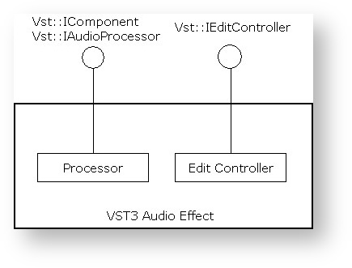
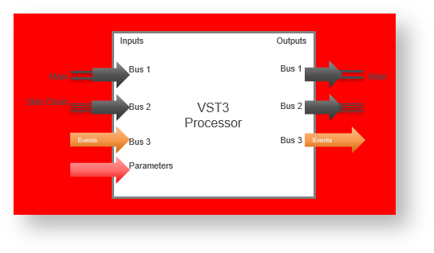
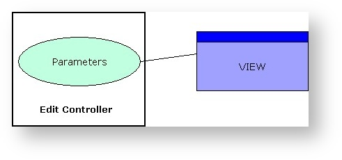
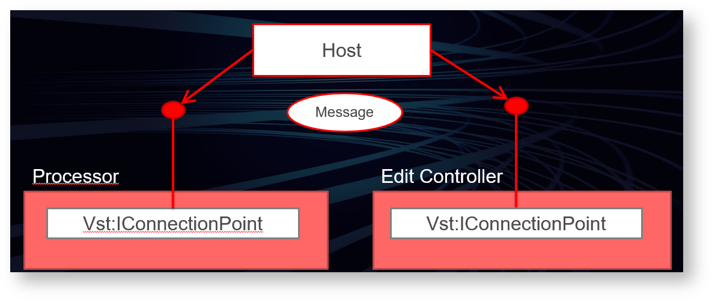
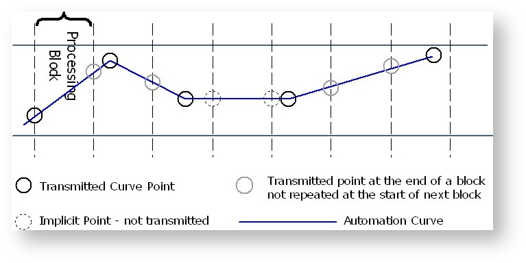
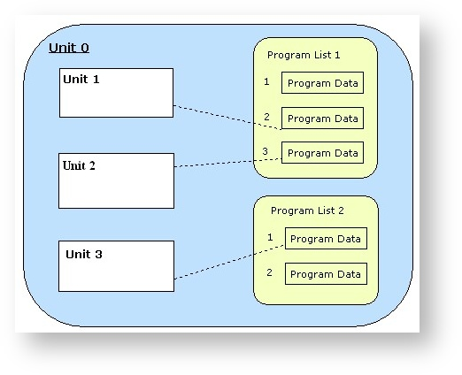
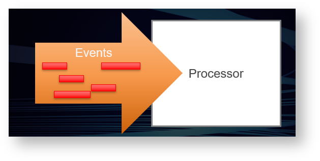

[TOC]

# 技术文档

> 版本更新历史不在翻译范围内：[版本更新历史链接]([Change History - VST - Steinberg Developer Help](https://developer.steinberg.help/display/VST/Change+History))


## API文档

**VST 3 API** 是为实时音频处理组件设计的接口集。例如音频效果或音频乐器。
**VST 3** 基于一种称为 [VST 模块架构](https://developer.steinberg.help/display/VST/VST+Module+Architecture) (**VST-MA**) 的技术。请参考[VST-MA 文档](https://developer.steinberg.help/display/VST/VST+Module+Architecture)了解更多关于插件系统常规工作的细节信息。
API 文档文件 **VST 3** 位于文件夹 `pluginterfaces/vst`。


### 基础概念

一个 **VST 3** 音效或乐器基本上由两部分组成：处理部分和编辑控制器部分。
对应的接口有：

- 处理器 : [Steinberg::Vst::IAudioProcessor](https://steinbergmedia.github.io/vst3_doc/vstinterfaces/classSteinberg_1_1Vst_1_1IAudioProcessor.html) + [Steinberg::Vst::IComponent](https://steinbergmedia.github.io/vst3_doc/vstinterfaces/classSteinberg_1_1Vst_1_1IComponent.html)
- 控制器 : [Steinberg::Vst::IEditController](https://steinbergmedia.github.io/vst3_doc/vstinterfaces/classSteinberg_1_1Vst_1_1IEditController.html)




**VST 3**插件开发可以通过实现两个组件来完全解耦处理器和编辑控制器。分开成这两部分需要一些额外的开发工作。
但是，这种分离使宿主能够在不同的上下文与计算机中更好地运行每个组件。另一个好处是，在自动化方面，参数更改可以分离。虽然进行这些更改需要以精确样本传输为代价，但 GUI 可以以很低的频率进行更新，并且可以根据任何延迟补偿或其他的量进行移动。


支持这种分离的插件必须在处理器组件的类中设置 [Steinberg::Vst::kDistributable](https://steinbergmedia.github.io/vst3_doc/vstinterfaces/namespaceSteinberg_1_1Vst.html#a626a070dcd2e025250f41b9c3f9817cda3185111648c1599241528f1a7f523396) 标志（[Steinberg::PClassInfo2::classFlags](https://steinbergmedia.github.io/vst3_doc/base/structSteinberg_1_1PClassInfo2.html#ab5ab9135185421caad5ad8ae1d758409)）。当然不是每个插件都能做到这一点，例如，如果它非常依赖某一台特定计算机的资源。因此，当未设置此标志时，宿主不得以任何方式分离组件。
虽然不推荐，但可以在一个组件类中同时实现处理部分和控制器部分。宿主在创建 [Steinberg::Vst::IAudioProcessor](https://steinbergmedia.github.io/vst3_doc/vstinterfaces/classSteinberg_1_1Vst_1_1IAudioProcessor.html) 后尝试查询 [Steinberg::Vst::IEditController](https://steinbergmedia.github.io/vst3_doc/vstinterfaces/classSteinberg_1_1Vst_1_1IEditController.html) 接口，并在成功时将其用作控制器。


> 宿主不需要实例化插件的控制器部分来处理它。
>
> 插件应准备好被处理，而无需实例化控制器部分。


#### 初始化

[Steinberg::Vst::IComponent](https://steinbergmedia.github.io/vst3_doc/vstinterfaces/classSteinberg_1_1Vst_1_1IComponent.html) 和 [Steinberg::Vst::IEditController](https://steinbergmedia.github.io/vst3_doc/vstinterfaces/classSteinberg_1_1Vst_1_1IEditController.html) 都派生自 [Steinberg::IPluginBase](https://steinbergmedia.github.io/vst3_doc/base/classSteinberg_1_1IPluginBase.html)。这个基本接口的目的是初始化组件并在它被销毁之前终止它。


传递给 [Steinberg::IPluginBase::initialize](https://steinbergmedia.github.io/vst3_doc/base/classSteinberg_1_1IPluginBase.html#a3c81be4ff2e7bbb541d3527264f26eed) 的上下文参数应该实现接口 [Steinberg::Vst::IHostApplication](https://steinbergmedia.github.io/vst3_doc/vstinterfaces/classSteinberg_1_1Vst_1_1IHostApplication.html)。宿主不应在调用初始化之前调用其他函数，[Steinberg::Vst::IComponent::setIoMode](https://steinbergmedia.github.io/vst3_doc/vstinterfaces/classSteinberg_1_1Vst_1_1IComponent.html#a4618e7358890d549f990010bea4a4137) 必须在初始化之前调用。[Steinberg::Vst::IComponent::getControllerClassId](https://steinbergmedia.github.io/vst3_doc/vstinterfaces/classSteinberg_1_1Vst_1_1IComponent.html#a8aa65685068ad033af57b1497926b689)也可以在初始化之前调用（参见 [VST 3工作流程图](https://developer.steinberg.help/display/VST/VST+3+Workflow+Diagrams)）。

**插件如何访问IHostApplication？**

```c++
tresult PLUGIN_API MyPluginProcessor::initialize (FUnknown* context)
{
    FUnknownPtr<IHostApplication> hostApp (hostContext);
    if (hostApp)
    {
        String128 name;
        if (hostApp->getName (name) == kResultTrue)
        {
            //...
        }
    }
    //..
}
```


#### 从宿主的角度创建和初始化

下面是一个宿主实现示例，它使用给定的 classID 创建组件及其关联的控制器：

```c++
Vst::IComponent* processorComponent;
Vst::IEditController* editController;
IPluginFactory* factory;
// ...
// factory already initialized (after the library is loaded, see validator for example)
// ...
// create its component part
tresult result = factory->createInstance (classID, Vst::IComponent::iid, (void**)&processorComponent);
if (processorComponent && (result == kResultOk))
{
    // initialize the component with our host context (note: initialize called just after creatInstance)
    res = (processorComponent->initialize (gStandardPluginContext) == kResultOk);
 
    // try to create the controller part from the component
    // for Plug-ins which did not succeed to separate component from controller :-(
    if (processorComponent->queryInterface (Vst::IEditController::iid, (void**)&editController) != kResultTrue)
    {
        // editController is now created, we have the ownership, which means that we have
        // to release it when not used anymore FUID controllerCID;
 
        // ask for the associated controller class ID (could be called before processorComponent->initialize ())
        if (processorComponent->getControllerClassId (controllerCID) == kResultTrue && controllerCID.isValid ())
        {
            // create its controller part created from the factory
            result = factory->createInstance (controllerCID, Vst::IEditController::iid, (void**)&editController);
             if (editController && (result == kResultOk))
            {
                // initialize the component with our context
                res = (editController->initialize (gStandardPluginContext) == kResultOk);
 
                // now processorComponent and editController are initialized... :-)
            }
        }
    }
}
```


#### 扩展

这些基本接口组件的功能可以被一些可选接口进行扩展，只有在需要此扩展时才需要实现这些可选接口。

- 处理器拓展:
   - [Steinberg::Vst::IConnectionPoint](https://steinbergmedia.github.io/vst3_doc/vstinterfaces/classSteinberg_1_1Vst_1_1IConnectionPoint.html)
   - [Steinberg::Vst::IUnitData](https://steinbergmedia.github.io/vst3_doc/vstinterfaces/classSteinberg_1_1Vst_1_1IUnitData.html)
   - [Steinberg::Vst::IProgramListData](https://steinbergmedia.github.io/vst3_doc/vstinterfaces/classSteinberg_1_1Vst_1_1IProgramListData.html)

- 编辑控制器拓展:
   - [Steinberg::Vst::IConnectionPoint](https://steinbergmedia.github.io/vst3_doc/vstinterfaces/classSteinberg_1_1Vst_1_1IConnectionPoint.html)
   - [Steinberg::Vst::IMidiMapping](https://steinbergmedia.github.io/vst3_doc/vstinterfaces/classSteinberg_1_1Vst_1_1IMidiMapping.html)
   - [Steinberg::Vst::IUnitInfo](https://steinbergmedia.github.io/vst3_doc/vstinterfaces/classSteinberg_1_1Vst_1_1IUnitInfo.html)


#### 持久化

宿主在项目文件和预设文件中存储和恢复处理器和控制器的完整状态：

- [Steinberg::Vst::IComponent::getState](https://steinbergmedia.github.io/vst3_doc/vstinterfaces/classSteinberg_1_1Vst_1_1IComponent.html#a10db03106be8ba89d23859fa6be5d9f6) + [Steinberg::Vst::IComponent::setState](https://steinbergmedia.github.io/vst3_doc/vstinterfaces/classSteinberg_1_1Vst_1_1IComponent.html#a77ac39bcc5c4b15818b1a87de2573805)
   保存或恢复DSP模型.
- [Steinberg::Vst::IEditController::getState](https://steinbergmedia.github.io/vst3_doc/vstinterfaces/classSteinberg_1_1Vst_1_1IEditController.html#a10db03106be8ba89d23859fa6be5d9f6) + [Steinberg::Vst::IEditController::setState](https://steinbergmedia.github.io/vst3_doc/vstinterfaces/classSteinberg_1_1Vst_1_1IEditController.html#a77ac39bcc5c4b15818b1a87de2573805)
   保存或恢复和处理器无关的GUI设置
- **Restore:** 当状态恢复时，宿主将状态传递给处理器和控制器([Steinberg::Vst::IEditController::setComponentState](https://steinbergmedia.github.io/vst3_doc/vstinterfaces/classSteinberg_1_1Vst_1_1IEditController.html#a4c2e1cafd88143fda2767a9c7ba5d48f)). 宿主必须始终先将该状态传递给处理器。然后控制器必须将其参数同步到此状态（但不得执行任何 [IComponentHandler](https://steinbergmedia.github.io/vst3_doc/vstinterfaces/classSteinberg_1_1Vst_1_1IComponentHandler.html)的回调）。
   恢复状态后，宿主重新扫描参数（通过询问控制器）以更新其内部表示。


请参考

- [Steinberg::IBStream](https://steinbergmedia.github.io/vst3_doc/base/classSteinberg_1_1IBStream.html)
- [VST 3 Interfaces to be implemented by the Plug-in](https://steinbergmedia.github.io/vst3_doc/vstinterfaces/group__vstIPlug.html)
- [VST 3 Interfaces to be implemented by the Host](https://steinbergmedia.github.io/vst3_doc/vstinterfaces/group__vstIHost.html)


### 处理部分



处理部分由两个相关接口组成：[Steinberg::Vst::IComponent](https://steinbergmedia.github.io/vst3_doc/vstinterfaces/classSteinberg_1_1Vst_1_1IComponent.html)和[Steinberg::Vst::IAudioProcessor](https://steinbergmedia.github.io/vst3_doc/vstinterfaces/classSteinberg_1_1Vst_1_1IAudioProcessor.html)。将两者分开的原因是为了使用基础接口 [Steinberg::Vst::IComponent](https://steinbergmedia.github.io/vst3_doc/vstinterfaces/classSteinberg_1_1Vst_1_1IComponent.html) ，它不仅用于音频插件，还用于其他类型的媒体（例如未来的视频处理）。因此，[Steinberg::Vst::IAudioProcessor](https://steinbergmedia.github.io/vst3_doc/vstinterfaces/classSteinberg_1_1Vst_1_1IAudioProcessor.html) 接口表示处理组件的音频部分。让我们仔细看看这些概念。


### IComponent

[Steinberg::Vst::IComponent](https://steinbergmedia.github.io/vst3_doc/vstinterfaces/classSteinberg_1_1Vst_1_1IComponent.html) 接口让宿主获取有关插件的信息：

1. **编辑控制器关联**：为了使宿主能够创建与之关联的编辑控制器，处理组件必须提供相应的类ID。宿主使用模块的类工厂来创建控制器组件。参见 [Steinberg::Vst::IComponent::getControllerClassId](https://steinbergmedia.github.io/vst3_doc/vstinterfaces/classSteinberg_1_1Vst_1_1IComponent.html#a8aa65685068ad033af57b1497926b689)

2. 宿主可以获取总线配置（[Steinberg::Vst::BusInfo](https://steinbergmedia.github.io/vst3_doc/vstinterfaces/structSteinberg_1_1Vst_1_1BusInfo.html)）。参见 [Steinberg::Vst::IComponent::getBusInfo](https://steinbergmedia.github.io/vst3_doc/vstinterfaces/classSteinberg_1_1Vst_1_1IComponent.html#a41b0e971a0ff153a4eb34274750b0c91)

3. 宿主可以请求路由信息（[Steinberg::Vst::RoutingInfo](https://steinbergmedia.github.io/vst3_doc/vstinterfaces/structSteinberg_1_1Vst_1_1RoutingInfo.html)）。

4. 宿主可以激活或停用特定总线，例如 [side-chain](https://developer.steinberg.help/display/VST/Frequently+Asked+Questions#FrequentlyAskedQuestions-WhatisaSide-chain)。插件不可处理被停用的总线。参见 [Steinberg::Vst::IComponent::activateBus](https://steinbergmedia.github.io/vst3_doc/vstinterfaces/classSteinberg_1_1Vst_1_1IComponent.html#a3ab7d06aaefe03da1fcd1819f1261050)

5. 宿主可以激活或停用插件（开/关按钮）。参见 [Steinberg::Vst::IComponent::setActive](https://steinbergmedia.github.io/vst3_doc/vstinterfaces/classSteinberg_1_1Vst_1_1IComponent.html#a0a840e8077eb74ec429b8007c7b83517)

6. 宿主可以存储和恢复插件的状态（预设和项目持久性）。参见 [Steinberg::Vst::IComponent::getState](https://steinbergmedia.github.io/vst3_doc/vstinterfaces/classSteinberg_1_1Vst_1_1IComponent.html#a10db03106be8ba89d23859fa6be5d9f6)


### IAudioProcessor

[Steinberg::Vst::IAudioProcessor](https://steinbergmedia.github.io/vst3_doc/vstinterfaces/classSteinberg_1_1Vst_1_1IAudioProcessor.html) 接口扩展了[Steinberg::Vst::IComponent](https://steinbergmedia.github.io /vst3_doc/vstinterfaces/classSteinberg_1_1Vst_1_1IComponent.html) ，它提供状态机进行处理：

1. 设置：必须先配置处理器，然后才能进行处理。且仅当处理器处于非活动状态时才允许配置。

      - **进程设置**：处理器被告知在活动期间不能更改的参数。 ([Steinberg::Vst::ProcessSetup](https://steinbergmedia.github.io/vst3_doc/vstinterfaces/structSteinberg_1_1Vst_1_1ProcessSetup.html))。

      - **动态扬声器排列**：宿主可以尝试更改音频总线的通道数。默认情况下，扬声器排列由插件定义。为了调整扬声器上下文，可以使用 [Steinberg::Vst::IAudioProcessor::setBusArrangements](https://steinbergmedia.github.io/ vst3_doc/vstinterfaces/classSteinberg_1_1Vst_1_1IAudioProcessor.html#ad3bc7bac3fd3b194122669be2a1ecc42)


2. 配置处理器时，它必须被激活([Steinberg::Vst::IComponent::setActive](https://steinbergmedia.github.io/vst3_doc/vstinterfaces/classSteinberg_1_1Vst_1_1IComponent.html#a0a840e8077eb74ec429b8007c7b83517)). 被调用即表示所有配置都已完成。

3. 除此之外，处理器还有一个 `处理状态`。在宿主开始执行处理调用之前，它必须通过调用 [IAudioProcessor::setProcessing](https://steinbergmedia.github.io/vst3_doc/vstinterfaces/classSteinberg_1_1Vst_1_1IAudioProcessor.html#af252fd721b195b793f3a5dfffc069401)(true)来发出信号。当宿主停止处理时，它必须在最后一次处理调用之后调用 [IAudioProcessor::setProcessing](https://steinbergmedia.github.io/vst3_doc/vstinterfaces/classSteinberg_1_1Vst_1_1IAudioProcessor.html#af252fd721b195b793f3a5dfffc069401)(false)。另请参阅：[VST 3 工作流程图](https://developer.steinberg.help/display/VST/VST+3+Workflow+Diagrams)

4. Process:Steinberg::Vst::IAudioProcessor::process 是真正的处理函数。处理所需的任何数据都以Steinberg::Vst::ProcessData传递给它。这可一定程度上避免线程同步，因为处理通常在单独的线程中执行。

   - **Block Size**: 处理是在块中完成的. [Steinberg::Vst::IAudioProcessor::setupProcessing](https://steinbergmedia.github.io/vst3_doc/vstinterfaces/classSteinberg_1_1Vst_1_1IAudioProcessor.html#aefb5731b94dbc899a4a7e9cd1c96e6a2)中设置了一个块中要处理的最大样本数。处理块中的实际样本数在调用中传输，并且可以因调用而异，但必须是介于 1 和 [maxSamplesPerBlock](https://steinbergmedia.github.io/vst3_doc/vstinterfaces/structSteinberg_1_1Vst_1_1ProcessSetup.html#a41cd06a0c942a1b3f283092b893d0de3) 之间
   
      - **Audio Buffers**: 对于插件定义的任何音频总线，宿主必须提供缓冲区数据，即使是非活动总线。总线使用索引查找，因此忽略不活动的总线会混淆这些索引。但是，实际的数据缓冲区可以为空（参见 [Steinberg::Vst::AudioBusBuffers](https://steinbergmedia.github.io/vst3_doc/vstinterfaces/structSteinberg_1_1Vst_1_1AudioBusBuffers.html)）。
   
         > **Note**: [channelBuffers32](https://steinbergmedia.github.io/vst3_doc/vstinterfaces/structSteinberg_1_1Vst_1_1AudioBusBuffers.html#abac2239417d88a091cad5b4f917dc49a)(或[channelBuffers64](https://steinbergmedia.github.io/vst3_doc/vstinterfaces/structSteinberg_1_1Vst_1_1AudioBusBuffers.html#a0bbcd9a3e75d01b547097c91f9f659cf )) 输入和输出的缓冲区指针可以相同也可以不同：在处理函数中必须考虑到这一点（例如，如果输入和输出缓冲区相同，则在处理之前不要重置输出）。对于多个输入或多个输出（在乐器插件的情况下）可以是相同的，所有输出（或输入）可以共享同一个缓冲区！
         >
         > **重要提示**: The host can call [Steinberg::Vst::IAudioProcessor::process](https://steinbergmedia.github.io/vst3_doc/vstinterfaces/classSteinberg_1_1Vst_1_1IAudioProcessor.html#a6b98eb31cf38ba96a28b303c13c64e13) without buffers ([numInputs](https://steinbergmedia.github.io/vst3_doc/vstinterfaces/structSteinberg_1_1Vst_1_1ProcessData.html#a852a74fc4e461ef086bac048313d2de9) and [numOutputs](https://steinbergmedia.github.io/vst3_doc/vstinterfaces/structSteinberg_1_1Vst_1_1ProcessData.html#a1338255f88bad5cf4fb714c71f92b61a) of [Steinberg::Vst::AudioBusBuffers](https://steinbergmedia.github.io/vst3_doc/vstinterfaces/structSteinberg_1_1Vst_1_1AudioBusBuffers.html) are zeroed, [numSamples](https://steinbergmedia.github.io/vst3_doc/vstinterfaces/structSteinberg_1_1Vst_1_1ProcessData.html#aeb42971a4bd34d7baa27cff8d7e3cf26) too), in order to flush parameters (from host to plug-in). Parameters can only be flushed when the host needs to send parameter changes and no processing is called.
   


   - **参数和自动化**: 任何参数都通过接口 [Steinberg::Vst::IParameterChanges](https://steinbergmedia.github.io/vst3_doc/vstinterfaces/classSteinberg_1_1Vst_1_1IParameterChanges.html) 和 [Steinberg::Vst::IParamValueQueue](https://steinbergmedia.github.io/vst3_doc/vstinterfaces/classSteinberg_1_1Vst_1_1IParamValueQueue.html) 在流程调用中传输。 GUI 交互导致的简单参数更改以和自动化完全相同的方式传输 （参见[参数和自动化](https://developer.steinberg.help/vst3Automation.html)）。

   - **上下文:** 对于每个处理块，宿主应提供有关其状态的信息。参见 [Steinberg::Vst::ProcessContext](https://steinbergmedia.github.io/vst3_doc/vstinterfaces/structSteinberg_1_1Vst_1_1ProcessContext.html)

   - **事件:** [Steinberg::Vst::IEventList](https://steinbergmedia.github.io/vst3_doc/vstinterfaces/classSteinberg_1_1Vst_1_1IEventList.html)


### 编辑部分



编辑控制器负责插件的 GUI 方面。它的标准接口是[Steinberg::Vst::IEditController](https://steinbergmedia.github.io/vst3_doc/vstinterfaces/classSteinberg_1_1Vst_1_1IEditController.html)。宿主必须由[Steinberg::Vst::IComponentHandler](https://steinbergmedia.github.io/vst3_doc/vstinterfaces/classSteinberg_1_1Vst_1_1IComponentHandler.html) 编辑控制器提供回调接口。处理程序主要用于宿主和处理器之间的通信。

- **GUI：** 控制器可以选择自定义编辑器视图。 [Steinberg::Vst::IEditController::createView](https://steinbergmedia.github.io/vst3_doc/vstinterfaces/classSteinberg_1_1Vst_1_1IEditController.html#a1fa4ed10cc0979e5559045104c998b1a) 函数允许宿主传递一个 id字符串。目前只可定义类型 `编辑器`（[Steinberg::Vst::ViewType::kEditor](https://steinbergmedia.github.io/vst3_doc/vstinterfaces/namespaceSteinberg_1_1Vst_1_1ViewType.html#aaa62c4c32f0270a908eb20c7c7124dfc)），但未来的版本会有其他的更新（例如 `设置`）。另见[Steinberg::IPlugView](https://steinbergmedia.github.io/vst3_doc/base/classSteinberg_1_1IPlugView.html)。

- **Parameters:**  控制器负责参数的管理。任何由插件 GUI 中的用户交互引起的参数更改都必须正确报告给[Steinberg::Vst::IComponentHandler](https://steinbergmedia.github.io/vst3_doc/vstinterfaces/classSteinberg_1_1Vst_1_1IComponentHandler.html)。宿主负责将更改传输到处理器。为了使自动化工作得到记录，有必要在列表中调用[beginEdit](https://steinbergmedia.github.io/vst3_doc/vstinterfaces/classSteinberg_1_1Vst_1_1IComponentHandler.html#a8456ad739430267a12dda11a53fe9223), [performEdit](https://steinbergmedia.github.io/vst3_doc/vstinterfaces/classSteinberg_1_1Vst_1_1IComponentHandler.html#a135d4e76355ef0ba0a4162a0546d5f93)和[endEdit](https://steinbergmedia.github.io/vst3_doc/vstinterfaces/classSteinberg_1_1Vst_1_1IComponentHandler.html#ae380206486b11f000cad7c0d9b6e877c)。或者来自UI-Thread。
   使用新的接口[IComponentHandler2](https://developer.steinberg.help/classSteinberg_1_1Vst_1_1IComponentHandler2.html) (从VST 3.1开始)，插件可以分组本应该在同一时间戳被自动化写入的参数，它通过[beginEdit](https://steinbergmedia.github.io/vst3_doc/vstinterfaces/classSteinberg_1_1Vst_1_1IComponentHandler.html#a8456ad739430267a12dda11a53fe9223)/[performEdit](https://steinbergmedia.github.io/vst3_doc/vstinterfaces/classSteinberg_1_1Vst_1_1IComponentHandler.html#a135d4e76355ef0ba0a4162a0546d5f93)/[endEdit](https://steinbergmedia.github.io/vst3_doc/vstinterfaces/classSteinberg_1_1Vst_1_1IComponentHandler.html#ae380206486b11f000cad7c0d9b6e877c)函数(参见 [IComponentHandler](https://steinbergmedia.github.io/vst3_doc/vstinterfaces/classSteinberg_1_1Vst_1_1IComponentHandler.html)) 和[startGroupEdit](https://steinbergmedia.github.io/vst3_doc/vstinterfaces/classSteinberg_1_1Vst_1_1IComponentHandler2.html#aba339113df404a6b3c557774d4aa9102) / [finishGroupEdit](https://steinbergmedia.github.io/vst3_doc/vstinterfaces/classSteinberg_1_1Vst_1_1IComponentHandler2.html#adbdc10ff7ecd96fa365ad4f98d57b55e) 实现
   更多的参数细节参见 [Parameters](https://developer.steinberg.help/display/VST/Parameters+and+Automation).

- **插件结构:** 如果插件由离散的功能部分组成，编辑控制器应该通过[Steinberg::Vst::IUnitInfo](https://steinbergmedia.github.io/vst3_doc)来实现这个结构和实现属于每个部分的参数接口。更多细节可以在[VST 3 Units](https://developer.steinberg.help/vst3Units.html)的页面上找到


### VST 3 线程模型

**VST 3** 使用的线程模型非常简单，它要求：

- 所有初始化/反初始化都在 UI 线程中完成
- 插件导出的所有函数都由 UI 线程中的宿主调用，除了：
  - IAudioProcessor→process：可以在音频线程（实时线程）中调用，避免任何内存分配
  - IAudioProcessor→setProcessing：可以在音频线程（实时线程）中调用，避免任何内存分配

- 宿主导出的所有函数都被UI线程中的插件调用

参见 [Audio Processor Call Sequence](https://developer.steinberg.help/display/VST/Audio+Processor+Call+Sequence) 和 [Edit Controller Call Sequence](https://developer.steinberg.help/display/VST/Edit+Controller+Call+Sequence)


### 组件间通信

**VST 3** 组件（处理器和控制器）之间需要一种通信方式。宿主的任务主要是处理这个。

#### 标准通信

所有标准数据（如参数更改）都使用下面列出的基本接口在处理器和控制器之间传输。

- 创建处理器和控制器后，宿主根据处理器状态设置控制器状态。这与之前的 SDK 有所不同，之前的 SDK 假设在创建后控制器和处理器是同步的。

- 当宿主设置一个新的处理器状态（[Steinberg::Vst::IComponent::setState](https://steinbergmedia.github.io/vst3_doc/vstinterfaces/classSteinberg_1_1Vst_1_1IComponent.html#a77ac39bcc5c4b15818b1a87de2573805)）时，这个状态总是被同时传输到控制器（[Steinberg::Vst::IEditController::setComponentState](https://steinbergmedia.github.io/vst3_doc/vstinterfaces/classSteinberg_1_1Vst_1_1IEditController.html#a4c2e1cafd88143fda2767a9c7ba5d48f)）。然后控制器必须同步该状态并调整其参数。

- 当控制器向宿主传输参数时，宿主通过将新值作为 [Steinberg::Vst::IParameterChanges](https://steinbergmedia.github.io/vst3_doc/vstinterfaces/classSteinberg_1_1Vst_1_1IParameterChanges.html) 来同步进程调用。

- 处理器也可以将传出的参数传输到宿主。 ([Steinberg::Vst::ProcessData::outputParameterChanges](https://steinbergmedia.github.io/vst3_doc/vstinterfaces/structSteinberg_1_1Vst_1_1ProcessData.html#af08c4f7dfd9e456cc98ba0eb325993ae))。它通过调用 [Steinberg::Vst::IEditController::setParamNormalized](https://steinbergmedia.github.io/vst3_doc/vstinterfaces/classSteinberg_1_1Vst_1_1IEditController.html#aded549c5b0f342a23dee18cc41ece6b8) 传输到编辑控制器。


#### Private通信

宿主不知道的数据可以通过消息的方式传输。通信接口有：

- [Steinberg::Vst::IConnectionPoint](https://steinbergmedia.github.io/vst3_doc/vstinterfaces/classSteinberg_1_1Vst_1_1IConnectionPoint.html): 宿主在处理器和控制器之间建立连接。
- [Steinberg::Vst::IMessage](https://steinbergmedia.github.io/vst3_doc/vstinterfaces/classSteinberg_1_1Vst_1_1IMessage.html): 表示要发送给对方的消息。
- [Steinberg::Vst::IAttributeList](https://steinbergmedia.github.io/vst3_doc/vstinterfaces/classSteinberg_1_1Vst_1_1IAttributeList.html): 属于消息的属性列表。


请注意，从处理器到控制器的消息不能在进程调用期间发送，因为这样不够快且会破坏实时性。此类任务应在单独的计时器线程中进行处理。




#### 从宿主的角度初始化通信

这是一个宿主实现的一个示例，其中组件和控制器连接并同步：

```c++
//------------------------------------------------------------------------
// the component and the controller parts are previously be created and initialized (see above)
// ...
if (editController)
{
    // set the host handler
    // the host set its handler to the controller
    editController->setComponentHandler (myHostComponentHandler);
 
    // connect the 2 components
    Vst::IConnectionPoint* iConnectionPointComponent = nullPtr;
    Vst::IConnectionPoint* iConnectionPointController = nullPtr;
 
    processorComponent->queryInterface (Vst::IConnectionPoint::iid, (void**)&iConnectionPointComponent);
    editController->queryInterface (Vst::IConnectionPoint::iid, (void**)&iConnectionPointController);
 
    if (iConnectionPointComponent && iConnectionPointController)
    {
        iConnectionPointComponent->connect (iConnectionPointController);
        iConnectionPointController->connect (iConnectionPointComponent);
    }
 
    // synchronize controller to component by using setComponentState
    MemoryStream stream; // defined in "public.sdk/source/common/memorystream.h"
    stream.setByteOrder (kLittleEndian);
    if (processorComponent->getState (&stream) == kResultTrue)
    {
        stream.rewind ();
        editController->setComponentState (&stream);
    }
 
    // now processorComponent and editController parts are connected and synchronized...:-)
}
```

> 处理组件和编辑控制器之间是直接连接的，你不能依赖于连接中的实施细节


## VST模块体系

### 宿主将如何加载基于 VST-MA 的插件

检查包含的 cpp 文件，如何加载此类组件/插件：

- *public.sdk/source/vst/hosting/module.h* and
- *for each platform public.sdk/source/vst/hosting/module_win32.cpp,.....*

在下面，你可以看到 Windows 上一个基本的实现，展示如何加载库并获取指向所需导出函数的指针：

```c++
HMODULE hModule = LoadLibrary ("SomePlugin.dll");
if (hModule)
{
    InitModuleProc initProc = (InitModuleProc)GetProcAddress (hModule, "InitDll");
    if (initProc) // this entry function is optional on Windows, not on MacOS and Linux!
    {
        if (initProc () == false)
        {
            FreeLibrary (module);
            return false;
        }
    }
 
    GetFactoryProc proc = (GetFactoryProc)GetProcAddress (hModule, "GetPluginFactory");
 
    IPluginFactory* factory = proc ?proc () : 0;
    if (factory)
    {
        for (int32 i = 0; i < factory->countClasses (); i++)
        {
            PClassInfo ci;
            factory->getClassInfo (i, &ci);
 
            FUnknown* obj;
            factory->createInstance (ci.cid, FUnknown::iid, (void**)&obj);
            ...
            obj->release ();
        }
 
        factory->release ();
    }
 
    ExitModuleProc exitProc = (ExitModuleProc)GetProcAddress (hModule, "ExitDll");
    if (exitProc)  // This exit function is optional on Windows, not on MacOS and Linux!
         exitProc ();
 
    FreeLibrary (hModule);
}
```


### 如何从接口派生类

```c++
class CMyClass: public FUnknown
{
public:
    CMyClass ();
    virtual ~CMyClass ();
 
    DECLARE_FUNKNOWN_METHODS  // declares queryInterface, addRef and release
};
 
CMyClass::CMyClass ()
{
    FUNKNOWN_CTOR // init reference counter, increment global object counter
}
 
CMyClass::~CMyClass ()
{
    FUNKNOWN_DTOR // decrement global object counter
}
 
IMPLEMENT_REFCOUNT (CMyClass) // implements reference counting
 
tresult CMyClass::queryInterface (const char* iid, void** obj)
{
    QUERY_INTERFACE (iid, obj, ::FUnknown::iid, CMyClass)
    return kNoInterface;
}
```

实现具有多个接口的类是通过多重继承完成的。此外，你必须为 queryInterface 函数中的每个接口提供适当的类型转换。

```c++
class CMyMultiClass : public Steinberg::IPluginBase,
                      public Steinberg::IPlugController,
                      public Steinberg::IEditorFactory
{
public:
    DECLARE_FUNKNOWN_METHODS
 
    // declare the methods of all inherited interfaces here...
};
 
IMPLEMENT_REFCOUNT (CMyMultiClass) // implements reference counting
 
tresult CMyMultiClass::queryInterface (const char* iid, void** obj)
{
    QUERY_INTERFACE (iid, obj, Steinberg::FUnknown::iid, IPluginBase)
    QUERY_INTERFACE (iid, obj, Steinberg::IPluginBase::iid, IPluginBase)
    QUERY_INTERFACE (iid, obj, Steinberg::IPlugController::iid, IPlugController)
    QUERY_INTERFACE (iid, obj, Steinberg::IEditorFactory::iid, IEditorFactory)
     *obj = 0;
    return kNoInterface;
}
```


### 接口版本和继承

与 C++ 类不同，**VST-MA** 接口不使用继承来表达对象的特化。通常所有的接口都是从 FUnknown 派生的。这是因为接口在发布后必须**从未**更改。 VST 模块架构接口仅将继承用于版本控制！所有特化都将建模为单独的接口！


C++类的例子:

```c++
class Shape
{
public:
    void setPosition (long x, long y);
protected:
    long x;
    long y;
};
class Rect : public Shape
{
public:
    void setDimension (long width, long height);
protected:
    long width;
    long height;
};
```

**VST-MA**的例子，和上面不一样:

```c++
class IShape : public FUnknown
{
public:
    virtual void setPosition (long x, long y) = 0;
};
class IRect : public FUnknown
{
public:
    virtual void setDimension (long width, long height) = 0;
};
```

在下一个程序版本中，需要对 `Shape` 类进行更改，如下所示

```c++
class Shape
{
public:
    void setPosition (long x, long y);
    void setColor (Color color);
protected:
    long x;
    long y;
    Color color;
};
```

**VST-MA** 表示现在通过添加一个继承自 *IShape* 的新接口来反映对 Shape 的更改，该接口类似于以下代码，而之前的接口定义保持不变：

```c++
class IShape2 : public IShape
{
public:
    virtual void setColor (Color color) = 0;
};
```


## 参数和自动化

**VST 3** 中如何定义和使用参数？


#### 参数

插件需要参数来控制 DSP 算法，例如滤波器的频率参数。插件可以导出这些参数，以使它们对宿主可见，并允许宿主控制/更改/自动化/远程/可视化它们。某些参数可以定义为私有（用户不可见）或只读，例如与 VU 表关联的参数。

[Steinberg::Vst::IEditController::getParameterCount](https://steinbergmedia.github.io/vst3_doc/vstinterfaces/classSteinberg_1_1Vst_1_1IEditController.html#ab6ffbb8e3bf6f4829ab1c9c23fe935a1) 允许宿主识别插件导出的参数数量。插件必须为每个导出的参数分配一个 32 位的唯一标识符 (ID)。

> 最多可以导出 2^31 个 ID 范围为 **[0, 2.147.483.648]** 的参数（范围 [2.147.483.649, 4.294.967.296] 为宿主应用程序保留）

请注意，任何时候都不允许更改这种分配方式。插件不得重新配置可自动化参数集，以免造成数据不一致。唯一允许的改动是在未来的插件版本中添加或删除参数。但是，请记住，删除参数后，自动化数据可能会丢失。

宿主不知道参数的语义。控制器必须使用 [Steinberg::Vst::ParameterInfo::flags](https://steinbergmedia-github-io.translate.goog/vst3_doc/vstinterfaces/structSteinberg_1_1Vst_1_1ParameterInfo.html?_x_tr_sl=en&_x_tr_tl=zh-CN&_x_tr_hl=zh-CN&_x_tr_pto=wapp#a8ffba1d4311e48ae488bc118f20d7edb) 声明一些重要的异常：

- **kCanAutomate:** 这意味着该参数可以由宿主自动化其自动化轨道。**[SDK 3.0.0]** 
- **kIsBypass:** 如果插件需要进行 bypass processing，则必须导出相应的参数并用 kIsBypass 标记。强烈建议此参数由效果插件提供。如果插件没有导出旁路参数，宿主可以进行旁路处理，插件进程调用将中断。插件应像其他参数一样保存此旁路参数的状态（使用 getState 和 setState ）。如果插件不需要旁路（如 Instrument），则不应使用此标志。查看此[常见问题解答](https://steinbergmedia-github-io.translate.goog/vst3_dev_portal/pages/FAQ/Index.html?_x_tr_sl=en&_x_tr_tl=zh-CN&_x_tr_hl=zh-CN&_x_tr_pto=wapp)以了解 bypass processing 的工作原理。**[SDK 3.0.0]**
- **kIsReadOnly:** 这意味着不能从插件外部更改此参数，同时不能设置 kCanAutomate。**[SDK 3.0.0]**
- **kIsWrapAround:** 当宿主为此参数创建 UI 控件，并尝试将其值设置为超出限制时，此 UI 控件将被旋转（对于 360 度旋转等参数很有用）**[SDK 3.0.2]**
- **kIsList:** 这意味着宿主将在通用编辑器或自动编辑中会将此参数显示为列表。**[SDK 3.1.0]**
- **kIsHidden:** 这意味着该参数将不会显示，并且不能从插件外部更改。同时不能设置 kCanAutomate 和 kIsReadOnly。**[SDK 3.7.0]**
- **kIsProgramChange:** 如果插件支持程序列表（请参阅 [VST 3 单元](https://steinbergmedia-github-io.translate.goog/vst3_dev_portal/pages/Technical+Documentation/VST+3+Units/Index.html?_x_tr_sl=en&_x_tr_tl=zh-CN&_x_tr_hl=zh-CN&_x_tr_pto=wapp)，[程序列表](https://steinbergmedia-github-io.translate.goog/vst3_dev_portal/pages/Technical+Documentation/Presets+Program+Lists/Index.html?_x_tr_sl=en&_x_tr_tl=zh-CN&_x_tr_hl=zh-CN&_x_tr_pto=wapp)），插件的每个 `单元` 都需要导出一个程序选择器参数。当受影响的参数也被标记为可自动执行时，就不允许自动执行此类参数。宿主可以在其 GUI 的特定位置显示程序参数。**[SDK 3.0.0]**

控制器必须支持将任何导出参数转换为字符串。转换方法 [Steinberg::Vst::IEditController::getParamStringByValue](https://steinbergmedia-github-io.translate.goog/vst3_doc/vstinterfaces/classSteinberg_1_1Vst_1_1IEditController.html?_x_tr_sl=en&_x_tr_tl=zh-CN&_x_tr_hl=zh-CN&_x_tr_pto=wapp#aab2f0b853e75361d331b667e7893962e) 必须为任何可能的规范化参数值提供结果值

> 参数值始终以规范化浮点（64 位双精度）表示 **[0.0, 1.0]** 传输。

**参数值表示**

一个插件参数通常有不止表示一个参数。插件的 GUI 可以显示单个参数的内容，但可同时控制多个处理参数。

在从 GUI 到 DSP 算法的某个地方，必须执行此转换。宿主不需要有关 DSP 参数的信息，但它负责向处理器报告参数变化。据此，处理器是唯一可以发生转换的地方，所有参数必须始终与 GUI 表示相匹配。 

这符合分离式 GUI 和处理的想法吗？目前没问题

- 这是职责分离，仅此而已。处理器组件和控制器组件必须在相同的内部插件模型上工作。控制器知道该模型如何在 GUI 中呈现。处理器知道模型必须如何转换为 DSP 参数。**VST 3** 接口建议对此模型的一部分（作为参数导出的部分）使用规范化值表示，这意味着每个值都必须在 0.0 到 1.0 的范围内。

### 参数样式 / 步长

虽然值以规范化格式传输，但宿主需要知道参数显示的 GUI 表示的一些细节。例如，在编辑自动化数据时，宿主必须知道以其 `步长` 表示的参数的性质（参见 [Steinberg::Vst::ParameterInfo::stepCount](https://steinbergmedia-github-io.translate.goog/vst3_doc/vstinterfaces/structSteinberg_1_1Vst_1_1ParameterInfo.html?_x_tr_sl=en&_x_tr_tl=zh-CN&_x_tr_hl=zh-CN&_x_tr_pto=wapp#ac1efeff62e4ba9aea101c3327e0b5c4d)）

**步长语义** :

- **0** : 连续参数。任何规范化的值都有一个精确的映射（0 = 值之间没有阶梯）
- **1** : 具有 2 个状态的离散参数，例如（开/关）（是/否）等（1 = 这些状态之间有一个步骤）
- **2** : 具有 3 个状态 (0,1,2) 或 (3,5,7) 的离散参数（2 = 这些状态之间有两个步骤）
- **3** : 等等...

**标准化转换**

控制器和处理器必须使用标准化参数值

- 步骤计数 0：连续参数只需要一一对应映射

- 步长 n：离散参数需要多加注意

   - **离散值 => 归一化**

​		`double normalized = discreteValue / (double)stepCount;`

   - **Normalize => Discrete Value (Denormalize)**

​		`int discreteValue = min (stepCount, normalized *(stepCount + 1));`

**例如:** 步长 3


### 自动化

支持参数自动化的宿主依赖于拥有这些参数的组件。**VST 3** 界面设计的一个意图是减少实施中可能出现的错误。处理器和控制器的分离强制所有参数更改必须由宿主以定义的方式处理。此外，这允许宿主将更改存储为自动化数据。尽管如此，还有一些事情需要考虑：

任何自动化参数都不得影响另一个自动化参数！

这方面的主要例子是预设更改的自动化。预设更改可能会导致所有 `正常` 参数的更改。因此，如果已经为这些参数记录了自动化数据，并且也记录了预设更改：应该偏向哪个？这个问题无法回答，只能通过回避来解决问题。这就是默认情况下不允许自动更改预设的原因。


#### **自动化录制**

自动录制由宿主执行。这样做时，宿主必须知道操作的开始和结束。因此，插件必须在 **UI Thread** 中以如下方式操作 [Steinberg::Vst::IComponentHandler](https://steinbergmedia-github-io.translate.goog/vst3_doc/vstinterfaces/classSteinberg_1_1Vst_1_1IComponentHandler.html?_x_tr_sl=en&_x_tr_tl=zh-CN&_x_tr_hl=zh-CN&_x_tr_pto=wapp)

- 开始操作时使用该方法发出信号： [Steinberg::Vst::IComponentHandler::beginEdit](https://steinbergmedia.github.io/vst3_doc/vstinterfaces/classSteinberg_1_1Vst_1_1IComponentHandler.html#a8456ad739430267a12dda11a53fe9223)
- 通过该方法反馈参数变化： [Steinberg::Vst::IComponentHandler::performEdit](https://steinbergmedia.github.io/vst3_doc/vstinterfaces/classSteinberg_1_1Vst_1_1IComponentHandler.html#a135d4e76355ef0ba0a4162a0546d5f93)
- 操作结束时通过该方法发出信号： [Steinberg::Vst::IComponentHandler::endEdit](https://steinbergmedia.github.io/vst3_doc/vstinterfaces/classSteinberg_1_1Vst_1_1IComponentHandler.html#ae380206486b11f000cad7c0d9b6e877c)

插件必须遵守这些回调的顺序。否则，自动录制无法正常工作。然而，实践起来可能会遇到一些困难。每种类型的 GUI 控件、其操作方式、受控参数的性质都需要具体考虑。要解决最下面这些常见的情况：

##### 滑块和按钮

这种控件通常控制连续的参数，通常用鼠标操作。这种常见情况最容易处理：鼠标单击向下调用 beginEdit（当控件允许跳转时，随后调用 performEdit），鼠标拖动调用 performEdit，鼠标单击向上调用 endEdit。

麻烦始于**鼠标滚轮**：操作滚轮时根本没有定义的开始或结束 - 每个滚轮事件 `突然` 到达。在这种情况下启用正确的自动记录的唯一方法是使用计时器。

- 插件应在处理第一个滚轮事件时调用 beginEdit ，并启动计时器（随后是对 performEdit 的第一次调用）。使用 performEdit 报告在超时间隔内到达的更多车轮事件，并重新启动计时器。当超时期限已过且没有其他事件发生时，应调用 endEdit 并删除计时器

- 但由于记录自动化数据是宿主的任务，有人可能会争辩说，在这种情况下，宿主的任务应该是处理计时器。这就是规则出现以下例外情况的原因

   - 鼠标滚轮事件可以不用 beginEdit 和 endEdit 上报给宿主。宿主必须准备好接收 performEdit，而无需先前为参数调用 beginEdit ，并自行处理超时

##### 按钮 / 单选组 / 弹出菜单

这种控件通常控制离散参数并简单地进行状态切换。正确的处理方式是连续调用 beginEdit、performEdit 和 endEdit。受影响的参数必须以正确的步长导出到宿主，因为在自动化方面，离散参数的处理方式不同于连续参数。

按钮通常不支持鼠标滚轮处理，弹出菜单也不支持。离散参数不需要使用计时器就可正确记录。

所以插件应该为每个滚轮事件连续调用 3 个函数 —— 同样，另一个选项是省略 beginEdit 和 endEdit，但在这种情况下，一定要正确地向宿主报告参数的离散性质。

##### 文本输入

要传递连续或离散参数的文本输入值的更改结果，请持续调用 beginEdit、performEdit 和 endEdit。


#### 自动化播放

在 **VST 3 **中，自动化播放是插件的任务，提供自动化数据是宿主的任务。参数更改传递给处理器的唯一方法是处理调用。从编辑控制器接收参数变化和回调自动化数据是一样的。

执行从规范化 GUI 表示到 DSP 表示的所有转换会产生一些开销。执行准确的样本自动化需要更多的开销，因为必须为每个样本计算 DSP 值。虽然这不能完全避免，但为了实现自动化的准确性就必须花费额外的处理时间。宿主始终允许以对底层自动化曲线进行样本重建的方式进行传输值更改。由插件负责实现。



处理器通过使用具有自动化数据的每个参数的参数更改队列来获取处理过程的自动化数据：


#### **GUI 回放**

当自动化数据传输到处理器时，宿主负责更新插件 GUI。这是通过在 **UI 线程中持续不断调用 **[Steinberg::Vst::IEditController::setParamNormalized](https://steinbergmedia-github-io.translate.goog/vst3_doc/vstinterfaces/classSteinberg_1_1Vst_1_1IEditController.html?_x_tr_sl=en&_x_tr_tl=zh-CN&_x_tr_hl=zh-CN&_x_tr_pto=wapp#aded549c5b0f342a23dee18cc41ece6b8) 来实现的。

另见 [Steinberg::Vst::IParameterChanges](https://steinbergmedia-github-io.translate.goog/vst3_doc/vstinterfaces/classSteinberg_1_1Vst_1_1IParameterChanges.html?_x_tr_sl=en&_x_tr_tl=zh-CN&_x_tr_hl=zh-CN&_x_tr_pto=wapp) , [Steinberg::Vst::IParamValueQueue](https://steinbergmedia-github-io.translate.goog/vst3_doc/vstinterfaces/classSteinberg_1_1Vst_1_1IParamValueQueue.html?_x_tr_sl=en&_x_tr_tl=zh-CN&_x_tr_hl=zh-CN&_x_tr_pto=wapp)


### 通知宿主更改

**参数标题、默认值或标志已更改**

如果发生某些事情，例如用户交互，它改变了参数样式（[ParameterFlags](https://steinbergmedia-github-io.translate.goog/vst3_doc/vstinterfaces/structSteinberg_1_1Vst_1_1ParameterInfo.html?_x_tr_sl=en&_x_tr_tl=zh-CN&_x_tr_hl=zh-CN&_x_tr_pto=wapp#ae3a5143ca8d0e271dbc259645a4ae645)）、标题或者一个或多个参数的默认值，插件必须调用

```c++
IComponentHandler::restartComponent (kParamTitlesChanged);
```

通知宿主此更改（在**UI 线程**中）。宿主使用 [getParameterInfo重新扫描](https://steinbergmedia-github-io.translate.goog/vst3_doc/vstinterfaces/classSteinberg_1_1Vst_1_1IEditController.html?_x_tr_sl=en&_x_tr_tl=zh-CN&_x_tr_hl=zh-CN&_x_tr_pto=wapp#a0ba78602ecf2f5e8d747d8b01d4cfb6c)[ParameterInfos](https://steinbergmedia-github-io.translate.goog/vst3_doc/vstinterfaces/structSteinberg_1_1Vst_1_1ParameterInfo.html?_x_tr_sl=en&_x_tr_tl=zh-CN&_x_tr_hl=zh-CN&_x_tr_pto=wapp)。

**多个参数值的更改**

例如，作为程序更改的结果，插件必须调用：

```c++
IComponentHandler::restartComponent (kParamValuesChanged);
```

通知宿主此更改（在**UI Thread**中）。宿主使参数值的所有缓存无效，并向编辑控制器询问当前值。

如果只有一些值发生了变化（小于 10），插件应该使用 [Steinberg::Vst::IComponentHandler::performEdit](https://steinbergmedia-github-io.translate.goog/vst3_doc/vstinterfaces/classSteinberg_1_1Vst_1_1IComponentHandler.html?_x_tr_sl=en&_x_tr_tl=zh-CN&_x_tr_hl=zh-CN&_x_tr_pto=wapp#a135d4e76355ef0ba0a4162a0546d5f93) 接口（显示使用自动化时的正确用法：[Automation Recording](https://steinbergmedia-github-io.translate.goog/vst3_dev_portal/pages/Technical+Documentation/Parameters+Automation/Index.html?_x_tr_sl=en&_x_tr_tl=zh-CN&_x_tr_hl=zh-CN&_x_tr_pto=wapp#automation-recording)）

> 如果插件需要通知宿主有关包含参数标题、默认或标志和值（多个参数）的更改，它可以组合 restartComponent 标志：

```c++
IComponentHandler::restartComponent (kParamValuesChanged|kParamTitlesChanged);
```


## VST 3 单元

### 介绍

例如，一个 EQ 部分可以是一个单元。设计单位的目的是：

- 揭示插件的内部逻辑结构
- 通过将参数与单位相关联来组织参数
- 支持程序列表
- 支持处理复杂的插件结构/多音色乐器
   - 多个节目列表（与一个单元相关联）
   - 访问节目列表数据
   - MIDI 音轨和单元的关联
   - 插件 GUI 和宿主 GUI 的同步


### 单元细节

- 该插件可以定义任何数量和任何类型的单位。单元的语义并不重要

- 单位以分层方式组织。每个单元可以包含子单元。

- 此层次结构的根单元始终存在（显式或隐式）并且具有 ID `0`。不定义任何其他单元的插件只包含单元 `0`。

- 插件必须为其定义的每个单元分配一个唯一的 ID，并且必须为其提供一个合适的名称以在 GUI 中显示 ( [Steinberg::Vst::UnitInfo](https://steinbergmedia-github-io.translate.goog/vst3_doc/vstinterfaces/classSteinberg_1_1Vst_1_1IUnitInfo.html?_x_tr_sl=en&_x_tr_tl=zh-CN&_x_tr_hl=zh-CN&_x_tr_pto=wapp) )。

- 每个单元都可以 `包含` 参数。插件的所有参数都由 [Steinberg::Vst::IEditController](https://steinbergmedia-github-io.translate.goog/vst3_doc/vstinterfaces/classSteinberg_1_1Vst_1_1IEditController.html?_x_tr_sl=en&_x_tr_tl=zh-CN&_x_tr_hl=zh-CN&_x_tr_pto=wapp) 管理和发布，但每个参数都可以与一个单元相关联。（[Steinberg::Vst::ParameterInfo::unitId](https://steinbergmedia-github-io.translate.goog/vst3_doc/vstinterfaces/structSteinberg_1_1Vst_1_1ParameterInfo.html?_x_tr_sl=en&_x_tr_tl=zh-CN&_x_tr_hl=zh-CN&_x_tr_pto=wapp#a4d2e0574df0f6d36f26fae1ad759a14f)）。宿主可以在树视图中组织参数列表，将单元层次结构反映为节点。

- 每个单元都可以与一个节目列表相关联。（参见 [复杂的插件结构/多音色乐器](https://steinbergmedia-github-io.translate.goog/vst3_dev_portal/pages/Technical+Documentation/Complex+Structures/Index.html?_x_tr_sl=en&_x_tr_tl=zh-CN&_x_tr_hl=zh-CN&_x_tr_pto=wapp)）

- 一个单元可以与特定的总线相关联。可以有任何类型的组合，但 **VST 3** 接口只定义特殊情况的查询。（见 [单位和曲目](https://steinbergmedia-github-io.translate.goog/vst3_dev_portal/pages/Technical+Documentation/Complex+Structures/Index.html?_x_tr_sl=en&_x_tr_tl=zh-CN&_x_tr_hl=zh-CN&_x_tr_pto=wapp#units-and-tracks)）


大多数与单位相关的东西都与 GUI 相关，因此访问接口 [Steinberg::Vst::IUnitInfo](https://steinbergmedia-github-io.translate.goog/vst3_doc/vstinterfaces/classSteinberg_1_1Vst_1_1IUnitInfo.html?_x_tr_sl=en&_x_tr_tl=zh-CN&_x_tr_hl=zh-CN&_x_tr_pto=wapp) 需要作为编辑控制器的扩展来实现。参见 [Steinberg::Vst::IUnitInfo](https://steinbergmedia.github.io/vst3_doc/vstinterfaces/classSteinberg_1_1Vst_1_1IUnitInfo.html), [Presets & Program Lists](https://developer.steinberg.help/pages/viewpage.action?pageId=9798267)

#### 示例

- 宿主可以使用带有结构化参数列表的插件示例（来自 **Cubase** 插件集的 MultibandCompressor），在 **Cubase** 中用于选择要自动化的参数：

   

- 在 [PluginTestHost](https://developer.steinberg.help/display/VST) 的 `参数` 选项卡中显示结构化参数列表的插件示例（来自 **Cubase** 插件集的 VST Amp Rack）/VST+3+插件+测试+宿主）应用：

   

- 在 **Cakewalk** 中使用 **HALion Sonic SE** 单元结构进行自动化选择的示例：
   


## 预设和程序列表

### 简单插件


对于一个简单的插件，预设的数据无非就是它的状态。在这种情况下：

- 管理插件的预设处理是宿主的工作。
- 插件本身根本不需要在其 GUI 中提供任何方式来加载预设，也不需要定义任何程序列表。
- 出厂预设必须作为文件安装在所需位置（请参阅 [预设位置](https://steinbergmedia-github-io.translate.goog/vst3_dev_portal/pages/Technical+Documentation/Locations+Format/Index.html?_x_tr_sl=en&_x_tr_tl=zh-CN&_x_tr_hl=zh-CN&_x_tr_pto=wapp#preset-locations)）。

宿主必须提供用于加载和保存预设文件的 GUI。这些文件包含插件已填充到 [Steinberg::Vst::IComponent::getState](https://steinbergmedia-github-io.translate.goog/vst3_doc/vstinterfaces/classSteinberg_1_1Vst_1_1IComponent.html?_x_tr_sl=en&_x_tr_tl=zh-CN&_x_tr_hl=zh-CN&_x_tr_pto=wapp#a10db03106be8ba89d23859fa6be5d9f6) 流中的数据。**VST 3 ** 在操作系统文件系统中定义了专用位置（请参阅 [预设位置](https://steinbergmedia-github-io.translate.goog/vst3_dev_portal/pages/Technical+Documentation/Locations+Format/Index.html?_x_tr_sl=en&_x_tr_tl=zh-CN&_x_tr_hl=zh-CN&_x_tr_pto=wapp#preset-locations)），因此宿主不需要显示文件选择器对话框。它知道在哪里搜索特定插件的预设文件以及在哪里创建它们。因此，它可以创建一个弹出列表，用于选择预设或它选择的任何其他 GUI。加载预设后，宿主负责重新扫描参数值（来自控制器部分）。因此，控制器必须确保它在加载预设时获得正确的参数状态（调用 [Steinberg::Vst::IEditController::setComponentState](https://steinbergmedia-github-io.translate.goog/vst3_doc/vstinterfaces/classSteinberg_1_1Vst_1_1IEditController.html?_x_tr_sl=en&_x_tr_tl=zh-CN&_x_tr_hl=zh-CN&_x_tr_pto=wapp#a4c2e1cafd88143fda2767a9c7ba5d48f)）。

另请参阅 [组件之间的通信](https://steinbergmedia-github-io.translate.goog/vst3_dev_portal/pages/Technical+Documentation/API+Documentation/Index.html?_x_tr_sl=en&_x_tr_tl=zh-CN&_x_tr_hl=zh-CN&_x_tr_pto=wapp#communication-between-the-components) 和 [持久性](https://steinbergmedia-github-io.translate.goog/vst3_dev_portal/pages/Technical+Documentation/API+Documentation/Index.html?_x_tr_sl=en&_x_tr_tl=zh-CN&_x_tr_hl=zh-CN&_x_tr_pto=wapp#persistence)。


### 节目列表（Program list）

如果插件使用大量需要某种缓存或需要预加载的程序，使用预设文件可能不是一个好选择。在这种情况下，插件可以定义节目列表。为此，编辑控制器必须通过接口 [Steinberg::Vst::IUnitInfo ](https://steinbergmedia-github-io.translate.goog/vst3_doc/vstinterfaces/classSteinberg_1_1Vst_1_1IUnitInfo.html?_x_tr_sl=en&_x_tr_tl=zh-CN&_x_tr_hl=zh-CN&_x_tr_pto=wapp)进行扩展。

- 如果插件定义了一个节目列表用作出厂预设池，则不得允许用户通过参数编辑的方式更改这些预设。相反，它应该将相应的数据加载到内存中，并将可能的更改存储为组件状态。此外，可以允许用户将更改存储为预设文件。
- 如果插件定义了一个节目列表，用作最初处于 `空` 状态的用户预设池，则可以直接对列表项应用修改。只有当程序确实需要大量需要缓存的资源以实现快速程序更改时，才应选择这种使用节目列表的方式（这方面可参阅示例的插件）。


- 插件可以提供选择节目的 GUI，但必须能够让宿主显示列表和选择的节目。列表中所选节目的索引必须作为节目选择参数导出。（[Steinberg::Vst::ParameterInfo::kIsProgramChange](https://steinbergmedia-github-io.translate.goog/vst3_doc/vstinterfaces/structSteinberg_1_1Vst_1_1ParameterInfo.html?_x_tr_sl=en&_x_tr_tl=zh-CN&_x_tr_hl=zh-CN&_x_tr_pto=wapp#ae3a5143ca8d0e271dbc259645a4ae645a517665185bca1f4f3d77ce0a6468b8e3)）
- 插件可以让宿主读写列表项的程序数据。为了支持这一点，插件必须实现[Steinberg::Vst::IProgramListData](https://steinbergmedia-github-io.translate.goog/vst3_doc/vstinterfaces/classSteinberg_1_1Vst_1_1IProgramListData.html?_x_tr_sl=en&_x_tr_tl=zh-CN&_x_tr_hl=zh-CN&_x_tr_pto=wapp)接口作为组件部分的扩展。


##### 节目列表的结构

所有节目总是作为平面数组传输到宿主。但是插件可以为列表中的每个程序分配一些属性。这使宿主能够以非常灵活的方式组织和过滤它们。通过 [Steinberg::Vst::IUnitInfo::getProgramInfo](https://steinbergmedia-github-io.translate.goog/vst3_doc/vstinterfaces/classSteinberg_1_1Vst_1_1IUnitInfo.html?_x_tr_sl=en&_x_tr_tl=zh-CN&_x_tr_hl=zh-CN&_x_tr_pto=wapp#ac40c799f1f52837c311ac153d7a8ead7) 查询属性值。可能的属性标识符在命名空间 [Steinberg::Vst::PresetAttributes](https://steinbergmedia-github-io.translate.goog/vst3_doc/vstinterfaces/group__presetAttributes.html?_x_tr_sl=en&_x_tr_tl=zh-CN&_x_tr_hl=zh-CN&_x_tr_pto=wapp) 中定义。指定程序类别的属性标识符，例如[Steinberg::Vst::PresetAttributes::kInstrument](https://steinbergmedia-github-io.translate.goog/vst3_doc/vstinterfaces/group__presetAttributes.html?_x_tr_sl=en&_x_tr_tl=zh-CN&_x_tr_hl=zh-CN&_x_tr_pto=wapp#ga93cb7a7100ac96cfafceb6216770c42d) ，虽然顾名思义它应该只用于乐器，但它可以用于任何类型的音频插件。例如，程序的乐器类别的值为 `钢琴`。但是也可以指定一个子类别，例如 `原声钢琴`。在这种情况下，琴弦需要像这样链接起来：
`钢琴|原声钢琴`。这允许用户在类别树视图中组织预设。


**音高名称**

音高名称旨在与架子鼓程序一起使用，其中不同的鼓声由音符音高表示。例如，为了在鼓编辑器中显示分配给音高的鼓乐器的名称，宿主调用 [Steinberg::Vst::IUnitInfo::hasProgramPitchNames](https://steinbergmedia-github-io.translate.goog/vst3_doc/vstinterfaces/classSteinberg_1_1Vst_1_1IUnitInfo.html?_x_tr_sl=en&_x_tr_tl=zh-CN&_x_tr_hl=zh-CN&_x_tr_pto=wapp#a63c02601259d4e8690f26eefaad53195) 来确定是否支持音高名称和 [Steinberg::Vst::IUnitInfo ::getProgramPitchName](https://steinbergmedia-github-io.translate.goog/vst3_doc/vstinterfaces/classSteinberg_1_1Vst_1_1IUnitInfo.html?_x_tr_sl=en&_x_tr_tl=zh-CN&_x_tr_hl=zh-CN&_x_tr_pto=wapp#a6126c4506f7981b5e800c6b4daa1e66b) 查询单个音符的音高名称。

另请参阅 [VST 3 单元多音色程序列表](https://steinbergmedia-github-io.translate.goog/vst3_dev_portal/pages/Technical+Documentation/Complex+Structures/Index.html?_x_tr_sl=en&_x_tr_tl=zh-CN&_x_tr_hl=zh-CN&_x_tr_pto=wapp#multi-timbral-program-lists) 并查看 [pitchnames VST 3 插件示例](https://steinbergmedia-github-io.translate.goog/vst3_dev_portal/pages/What+is+the+VST+3+SDK/Plug-in+Examples.html?_x_tr_sl=en&_x_tr_tl=zh-CN&_x_tr_hl=zh-CN&_x_tr_pto=wapp#pitchnames)。

 

## 复杂插件 / 多音色乐器

### 问题

一个简单的 VST 效果器插件通常不会给宿主带来太多问题。它只有一个音频输入和输出总线，以及一组定义的参数来控制其声音特征。但是 VST 插件可能比这复杂得多。当插件实现多音色乐器时，宿主会面临一系列将该插件集成到其 GUI 中的问题。仅举其中的几个：

- 该插件可以定义多个事件输入和多个音频输出。当音符事件传输到插件时，宿主如何知道声音将出现在哪个输出端？
  - 宿主如果知道的话就方便将 MIDI 轨道链接到相应的音频通道。
- 插件可以定义用户可以从插件 GUI 加载的节目列表。在多音色乐器中，程序只影响插件的特定部分（我们称这部分为 `单元`）。宿主如何知道这些单元以及如何知道可以加载插件定义的程序？
  - 宿主如果知道的话就方便在自己的 GUI 中为此功能提供快捷方式。

由于与硬件 MIDI 乐器不同的 VST 插件不仅仅是一个黑盒，复杂的插件应该有助于其宿主提供比硬件乐器更方便的 GUI 集成。**VST 3 **使用单元的概念来描述插件的内部结构（请参阅 [VST 3 单元](https://steinbergmedia-github-io.translate.goog/vst3_dev_portal/pages/Technical+Documentation/VST+3+Units/Index.html?_x_tr_sl=en&_x_tr_tl=zh-CN&_x_tr_hl=zh-CN&_x_tr_pto=wapp)），并且多音色乐器应该支持相应的接口。但 **VST 3** 中的首选解决方案是通过 `简单模式` 降低这种复杂性。

### 简单模式

`简单模式` 支持 Cubase 的 `简单乐器轨道`。这些轨道结合了 MIDI 轨道和 VST 音频通道（无需进行任何进一步的分配，例如选择 MIDI 输出端口或 MIDI 通道），这种模式被定义为 `只有一个输入，只有一个输出`。在 `简单模式` 下，仅使用 MIDI 通道 0。因此，乐器必须是单音色的。

宿主现在将使用插件的多个实例，而不是以包含多个同类内部部分的方式使用同一个实例。**VST-MA** 组件模型支持插件的多个实例之间共享资源，因为通常每个插件实例使用相同的模块实例 (dll/bundle)。

然而，插件可以选择以相同的实现同时支持简单模式和高级模式。宿主通过检查处理器的类标志 ( [Steinberg::PClassInfo2::classFlags](https://steinbergmedia-github-io.translate.goog/vst3_doc/base/structSteinberg_1_1PClassInfo2.html?_x_tr_sl=en&_x_tr_tl=zh-CN&_x_tr_hl=zh-CN&_x_tr_pto=wapp#ab5ab9135185421caad5ad8ae1d758409) ) 的 [Steinberg::Vst::kSimpleModeSupported](https://steinbergmedia-github-io.translate.goog/vst3_doc/vstinterfaces/namespaceSteinberg_1_1Vst.html?_x_tr_sl=en&_x_tr_tl=zh-CN&_x_tr_hl=zh-CN&_x_tr_pto=wapp#a626a070dcd2e025250f41b9c3f9817cdabc2edc9bb281cebe9cc6dc00a7cac0ea) 标志来支持 `简单模式` 。如果要在乐器轨道中使用简单模式（或者当宿主认为它更合适时），[调用 Steinberg::Vst::IComponent::setIoMode](https://steinbergmedia-github-io.translate.goog/vst3_doc/vstinterfaces/classSteinberg_1_1Vst_1_1IComponent.html?_x_tr_sl=en&_x_tr_tl=zh-CN&_x_tr_hl=zh-CN&_x_tr_pto=wapp#a4618e7358890d549f990010bea4a4137) 方法来配置插件。单音色插件也应该设置这个标志并且不需要考虑 [setIoMode](https://steinbergmedia-github-io.translate.goog/vst3_doc/vstinterfaces/classSteinberg_1_1Vst_1_1IComponent.html?_x_tr_sl=en&_x_tr_tl=zh-CN&_x_tr_hl=zh-CN&_x_tr_pto=wapp#a4618e7358890d549f990010bea4a4137) 调用。


### 多音色节目列表

对于多音色乐器插件，预设处理可能要复杂得多。在这种情况下：

- 该插件可以定义任意数量的节目列表。
- 每个单元可引用一份节目列表（此引用不得更改）。
- 使用节目列表的每个单元引用一个列表项。
- 对于引用节目列表的每个单元，必须导出程序选择参数（[Steinberg::Vst::ParameterInfo::kIsProgramChange](https://steinbergmedia-github-io.translate.goog/vst3_doc/vstinterfaces/structSteinberg_1_1Vst_1_1ParameterInfo.html?_x_tr_sl=en&_x_tr_tl=zh-CN&_x_tr_hl=zh-CN&_x_tr_pto=wapp#ae3a5143ca8d0e271dbc259645a4ae645a517665185bca1f4f3d77ce0a6468b8e3)）。
- 插件可以提供程序选择的 GUI，但必须同步相应的程序选择参数。
- 宿主可能希望以与显示简单插件的预设相同的方式显示活动单元的程序列表（通常在窗口顶部或底部的单独控制区域中）。宿主必须能够为在插件 GUI 中获得焦点的单元显示正确的列表和正确的程序名称。

为了使这一切正常工作，插件必须提供 [Steinberg::Vst::IUnitInfo](https://steinbergmedia-github-io.translate.goog/vst3_doc/vstinterfaces/classSteinberg_1_1Vst_1_1IUnitInfo.html?_x_tr_sl=en&_x_tr_tl=zh-CN&_x_tr_hl=zh-CN&_x_tr_pto=wapp) 的有效实现，并且它必须相应地操作回调接口[Steinberg::Vst::IUnitHandler](https://steinbergmedia-github-io.translate.goog/vst3_doc/vstinterfaces/classSteinberg_1_1Vst_1_1IUnitHandler.html?_x_tr_sl=en&_x_tr_tl=zh-CN&_x_tr_hl=zh-CN&_x_tr_pto=wapp)。

与简单情况类似，宿主可能想要保存和加载预设文件。插件的组件状态在这里没有用。复杂插件的预设可以是：

- 插件状态
  - 为了支持这一点，插件必须在其组件部分实现 [Steinberg::Vst::IUnitData](https://steinbergmedia-github-io.translate.goog/vst3_doc/vstinterfaces/classSteinberg_1_1Vst_1_1IUnitData.html?_x_tr_sl=en&_x_tr_tl=zh-CN&_x_tr_hl=zh-CN&_x_tr_pto=wapp) 接口。
- 程序列表中某项的内容
  - 为了支持这一点，插件必须在其组件部分实现 [Steinberg::Vst::IProgramListData](https://steinbergmedia-github-io.translate.goog/vst3_doc/vstinterfaces/classSteinberg_1_1Vst_1_1IUnitData.html?_x_tr_sl=en&_x_tr_tl=zh-CN&_x_tr_hl=zh-CN&_x_tr_pto=wapp) 接口。

插件可以支持单元预设和节目列表预设。


参见 [Presets & Program Lists](https://developer.steinberg.help/pages/viewpage.action?pageId=9798267), [Steinberg::Vst::IProgramListData](https://steinbergmedia.github.io/vst3_doc/vstinterfaces/classSteinberg_1_1Vst_1_1IUnitData.html), [Steinberg::Vst::IUnitData](https://steinbergmedia.github.io/vst3_doc/vstinterfaces/classSteinberg_1_1Vst_1_1IUnitData.html)


### 单元和轨道

一个单元可以与总线（或总线的通道）相关联。一个单元可以与输入 MIDI 通道具有固定且唯一的连接。对于宿主来说，了解此连接以及哪个单元可以因与特定 MIDI 轨道相关联可能很有用。通常，多音色插件的 GUI 不会同时显示所有相似单元的设置。相反，有个实现叫单元选择。这个想法是为了能够将插件中的单元选择与宿主中的轨道选择同步（两种方式）。

当插件 GUI 以描述的方式组织时，它应该通过实现来支持描述的行为

- [Steinberg::Vst::IUnitInfo::getUnitByBus](https://steinbergmedia-github-io.translate.goog/vst3_doc/vstinterfaces/classSteinberg_1_1Vst_1_1IUnitInfo.html?_x_tr_sl=en&_x_tr_tl=zh-CN&_x_tr_hl=zh-CN&_x_tr_pto=wapp#a718fa905d04d7d559bc89c7ca761413b)：找出轨道 - 单元关系
- [Steinberg::Vst::IUnitInfo::getSelectedUnit](https://steinbergmedia-github-io.translate.goog/vst3_doc/vstinterfaces/classSteinberg_1_1Vst_1_1IUnitInfo.html?_x_tr_sl=en&_x_tr_tl=zh-CN&_x_tr_hl=zh-CN&_x_tr_pto=wapp#a6f1b43425ba894764f35b7d492e81c53)：让宿主知道选择哪个轨道
- [Steinberg::Vst::IUnitInfo::selectUnit](https://steinbergmedia-github-io.translate.goog/vst3_doc/vstinterfaces/classSteinberg_1_1Vst_1_1IUnitInfo.html?_x_tr_sl=en&_x_tr_tl=zh-CN&_x_tr_hl=zh-CN&_x_tr_pto=wapp#a2504c2bb3c57742102577f34cb58e257)：使插件选择其单元

并通过调用

- [Steinberg::Vst::IUnitHandler::notifyUnitSelection](https://steinbergmedia-github-io.translate.goog/vst3_doc/vstinterfaces/classSteinberg_1_1Vst_1_1IUnitHandler.html?_x_tr_sl=en&_x_tr_tl=zh-CN&_x_tr_hl=zh-CN&_x_tr_pto=wapp#ab05a9a8dcca888caeabdb8ed74766bc6)：触发宿主同步其 GUI


### 路由

对于宿主，如果插件定义了多个音频输出总线（在宿主中表示为 VSTi 混音器通道），那么了解混音器中的哪个 VSTi 通道是特定 MIDI 轨道的输出可能很有必要。通常，宿主需要了解插件的任何输入到输出的路由。因此，如果插件输入和输出之间存在明确的关系，则应实现以下方法：

- [Steinberg::Vst::IComponent::getRoutingInfo](https://steinbergmedia.github.io/vst3_doc/vstinterfaces/classSteinberg_1_1Vst_1_1IComponent.html#aa0ffeccad3c44364a199ce56365a4c12) : 找出给定输入的输出


## VST 3 工作流程图

> 本章较多非图片文件，请到相应链接上看

### Audio Processor 调用顺序

https://developer.steinberg.help/display/VST/Audio+Processor+Call+Sequence

### Edit Controller 调用顺序

https://developer.steinberg.help/display/VST/Edit+Controller+Call+Sequence

### Get Latency 调用顺序

https://developer.steinberg.help/display/VST/Get+Latency+Call+Sequences

### Resize View 调用顺序

https://developer.steinberg.help/display/VST/Resize+View+Call+Sequences

### Bus Arrangement 设置顺序

https://developer.steinberg.help/display/VST/Bus+Arrangement+Setting+Sequences


## VST 3 位置/格式

### 插件的格式结构

#### MacOS 系统

在 macOS 平台上，**VST 3 插件** 是一个标准的 macOS 捆绑包，其文件扩展名为 `.vst3`，文件夹结构如下：

| 文件夹 | 说明 |
| :-------------------------------- | :----------------------------------------------------------- |
| MyPlugin.vst3/Contents/Resources/ | folder contains all additional resource files useful for the plug-in |
| MyPlugin.vst3/Contents/MacOS/ | folder contains the plug-in’s macOS universal binary (Mach-O) |
| MyPlugin.vst3/Contents/Info.plist | the plug-in’s property list |
| MyPlugin.vst3/Contents/PkgInfo | specifies the type and creator codes of the bundle (optional) |

#### Windows 系统

在 Windows 平台上，一个 **VST 3 插件** 被组织成一个捆绑包格式，它的文件扩展名为 `.vst3` ，并具有以下文件夹结构：

| 文件夹 | 说明 |
| :---------------------------------------------- | :----------------------------------------------------------- |
| MyPlugin.vst3/Contents/Resources/ | folder contains all additional resource files useful for the plug-in |
| MyPlugin.vst3/Contents/x86-win/MyPlugin.vst3 | folder contains the plug-in binary (32 bit dll for the i386 architecture) |
| MyPlugin.vst3/Contents/x86_64-win/MyPlugin.vst3 | folder contains the plug-in binary (64 bit dll for the x86_64 architecture) |
| MyPlugin.vst3/Contents/arm-win/MyPlugin.vst3 | Proposal: folder contains the plug-in binary (32 bit dll for the arm architecture) |
| MyPlugin.vst3/Contents/arm_64-win/MyPlugin.vst3 | Proposal: folder contains the plug-in binary (64 bit dll for the arm64 architecture) |
| MyPlugin.vst3/desktop.ini | used to set custom icon in Windows Explorer |
| MyPlugin.vst3/Plugin.ico | customized plug-in icon |

在以前的 SDK 中，**VST 3 插件** 被定义为带有 **.vst3** 扩展名的单个 dll 文件。自 VST 3.6.10 起已弃用此功能。

文件 **desktop.ini** 应包含：

**desktop.ini**

```shell
[.ShellClassInfo]
IconResource=Plugin.ico,0
```

然后你应该使用此命令行更改它们的属性（**s** 用于系统以确保 Windows 将其用于文件夹/捆绑包，**r** 用于只读，**h** 用于隐藏（可选的））：

```shell
attrib +s +r +h desktop.ini
attrib +r +h Plugin.ico
```

#### Linux系统

在 Linux 上，**VST 3 插件** 被组织为类似包的包格式，其文件扩展名为 `.vst3`，它遵循以下文件夹结构：

| 文件夹 | 说明 |
| :---------------------------------- | :----------------------------------------------------------- |
| MyPlugin.vst3/Contents/Resources/ | folder contains all additional resource files useful for the plug-in |
| MyPlugin.vst3/Contents/i386-linux | folder contains the plug-in binary (32 bit shared library .so for Kernel Architecture i386) |
| MyPlugin.vst3/Contents/x86_64-linux | folder contains the plug-in binary (64 bit shared library .so for Kernel Architecture x86_64) |
| yPlugin.vst3/Contents/XXX-linux | with XXX the architecture name based on the output of command-line "uname -m" (machine hardware) + "-linux"for example:armv3l-linuxarmv4b-linuxarmv4l-linuxarmv5tel-linuxarmv5tejl-linuxarmv6l-linuxarmv7l-linuxarmv8l-linux |

#### 合并捆绑

请注意，所有捆绑包都可以合并为一个，这样就可以拥有一个跨平台的捆绑包/文件夹。

例如：

```
MyPlugin.vst3/
    |_ Contents/
    |   |__ Resources/
    |   |   |__ Snapshots/
    |   |   |   |__ snapshot_2.png
    |   |   |   |__ snapshot_2_2.0x.png
    |   |   |__ Documentation/
    |   |   |   |__ Manual.pdf
    |   |   |   |__ WhatsNew.pdf
    |   |   |__ Help/
    |   |       |__ helpdoc.xml
    |   |   |__ MyPlugin.srf
    |   |
    |   |__ armv7l-linux/
    |   |   |__ MyPlugin.so
    |   |
    |   |__ i686-linux/
    |   |   |__ MyPlugin.so
    |   |
    |   |__ i386-linux/
    |   |   |__ MyPlugin.so
    |   |
    |   |__ x86_64-linux/
    |   |   |__ MyPlugin.so
    |   |
    |   |__ MacOS/
    |   |   |__ MyPlugin
    |   |
    |   |__ x86-win/
    |   |   |__ MyPlugin.vst3
    |   |
    |   |__ x86_64-win/
    |   |   |__ MyPlugin.vst3
    |   |
    |   |__ Info.plist  (macOS Only)
    |   |__ PkgInfo     (macOS Only)
    |
    |____desktop.ini    (Windows only)
    |___ Plugin.ico     (Windows only)
```


## 插件位置

### 介绍

**VST 3** 插件应安装在特定的文件夹，下表为不同操作系统指定了这些预定义的位置。

> **VST 3** 不需要插件注册，就像使用 DirectX 一样

> 可以在这些预定义文件夹中使用：**警告链接、符号链接或快捷方式**

定义了 3 级文件夹位置:

- **User**: 仅对当前登录的用户可用
- **Global**: 适用于系统的所有用户
- **Application**: 仅在特定音频应用程序（本地插件）内可用

> 宿主应首先扫描更高优先级的插件，使用第一个找到的插件。

#### 在 macOS 平台

在 macOS 平台, 宿主应用程序希望 **VST 3** 插件位于

| Priority | Location | Path | Comment |
| :------- | :---------- | :-------------------------------------------- | :------ |
| 1 | User | /Users/$USERNAME/Library/Audio/Plug-ins/VST3/ |         |
| 2 | Global | /Library/Audio/Plug-ins/VST3/ |         |
| 3 | Global | /Network/Library/Audio/Plug-ins/VST3/ |         |
| 4 | Application | $APPFOLDER/Contents/VST3/ |         |

> **注：**  宿主应在启动时按此顺序（全局/应用程序）递归扫描这些文件夹

#### 在 Windows 平台

在 Windows 平台上，宿主应用程序希望 **VST 3** 插件位于：

| Priority | Location | Path | Comment |
| :------- | :---------- | :-------------------------------------- | :----------------------------------------------------------- |
| 1 | Global | /Program Files/Common Files/VST3/ | FOLDERID_ProgramFilesCommonnative bitdepth:32bit Plug-in on 32bit OS,64bit on 64bit OS |
| 1 | Global | /Program Files (x86)/Common Files/VST3/ | 32bit Plug-ins on 64bit Windows |
| 2 | Application | $APPFOLDER/VST3/ |                                                              |

> **注：**  宿主应在启动时按此顺序（全局/应用程序）递归扫描这些文件夹

#### 在 Linux 平台

在 Linux 平台上，宿主应用程序希望 **VST 3** 插件位于：

| Priority | Location | Path | Comment |
| :------- | :---------- | :------------------- | :------ |
| 1 | User | $HOME/.vst3/ |         |
| 2 | Global | /usr/lib/vst3/ |         |
| 3 | Global | /usr/local/lib/vst3/ |         |
| 4 | Application | $APPFOLDER/vst3/ |         |

> **注：**  宿主应在启动时按此顺序（全局/应用程序）递归扫描这些文件夹


## 预设格式

文件扩展名必须是 `.vstpreset`，例如：*myBestDefault.vstpreset*，指定 **VST 3** Preset 文件：


查看 [Steinberg::Vst::PresetFile](https://steinbergmedia.github.io/vst3_doc/vstsdk/classSteinberg_1_1Vst_1_1PresetFile.html#a9db1b48345e92320b0dffc446d5e3483) 源代码，它允许读取和写入此类预设。


## 预设位置

### 介绍

**VST 3** 位于计算机上的预定义位置，具体取决于操作系统。

- 定义了 3 级预设范围：
   - **User**: 仅适用于当前登录的用户
   - **Public**: 可供系统的所有用户使用
   - **Apps**: 仅在特定音频应用程序中可用
- 定义了 4 种类型的预设：
   - **User**: 用户创建的预设
   - **User_Factory**: 像 **User** 类型，但不直接显示
   - **Shared_Factory**: 插件安装程序安装的出厂预设
   - **App_Factory**: 由音频应用程序安装的预设，仅对该特定音频应用程序可见

> **$COMPANY** 和 **$PLUGIN-NAME** 文件夹名称仅包含文件命名允许的字符（将字符 "**\\*?/:<>|\**" 替换为 "**_** ”）。

> **注：** 下面定义的每个路径都应按给定的优先级进行扫描，提取预设并将其添加到预设列表中。

#### Mac 系统

| Prio | Type | Scope | Writable | Path | Comment |
| :--- | :------------- | :----- | :------- | :----------------------------------------------------------- | :----------------------------- |
| 1 | User | User | X | Users/$USERNAME/Library/Audio/Presets/$COMPANY/$PLUGIN-NAME/ |                                |
| 2 | Shared_Factory | Public | - | Library/Audio/Presets/$COMPANY/$PLUGIN-NAME/ | Computer shared FactoryROM |
| 3 | Shared_Factory | Public | - | Network/Library/Audio/Presets/$COMPANY/$PLUGIN-NAME/ | Network shared FactoryROM |
| 4 | App_Factory | Apps | - | [$APPFOLDER]/VST3 Presets/$COMPANY/$PLUGIN-NAME/ | Host Application (Cubase, ...) |

#### Windows XP/2000 系统

| Prio | Type | Scope | Writable | Path | Comment |
| :--- | :------------- | :----- | :------- | :----------------------------------------------------------- | :----------------------------- |
| 1 | User | User | X | [my documents]/vst3 presets/$company/$plugin-name/ | csidl_personal |
| 2 | User_Factory | User | X | [documents and settings/$username/application data]/vst3 presets/$company/$plugin-name/ | csidl_appdata |
| 3 | Shared_Factory | Public | - | [documents and settings/$allusers/application data]/vst3 presets/$company/$plugin-name/ | csidl_common_appdata |
| 4 | App_Factory | Apps | - | [$APPFOLDER]/VST3 Presets/$COMPANY/$PLUGIN-NAME/ | Host Application (Cubase, ...) |

#### Windows Vista/7/8/10 系统

| Prio | Type | Scope | Writable | Path | Comment |
| :--- | :------------- | :----- | :------- | :----------------------------------------------------------- | :----------------------------- |
| 1 | User | User | X | [Users/$USERNAME/Documents]/VST3 Presets/$COMPANY/$PLUGIN-NAME/ | FOLDERID_Documents |
| 2 | User_Factory | User | X | [Users/$USERNAME/AppData/Roaming]/VST3 Presets/$COMPANY/$PLUGIN-NAME/ | FOLDERID_RoamingAppData |
| 3 | Shared_Factory | Public | - | [ProgramData]/VST3 Presets/$COMPANY/$PLUGIN-NAME/ | FOLDERID_ProgramData |
| 4 | App_Factory | Apps | - | [$APPFOLDER]/VST3 Presets/$COMPANY/$PLUGIN-NAME/ | Host Application (Cubase, ...) |

#### Linux 系统

| Prio | Type | Scope | Writable | Path | Comment |
| :--- | :------------- | :----- | :------- | :--------------------------------------------------- | :--------------- |
| 1 | User | User | X | $HOME/.vst3/presets/$COMPANY/$PLUGIN-NAME/ |                  |
| 2 | Shared_Factory | Public | - | /usr/share/vst3/presets/$COMPANY/$PLUGIN-NAME/ |                  |
| 3 | Shared_Factory | Public | - | /usr/local/share/vst3/presets/$COMPANY/$PLUGIN-NAME/ |                  |
| 4 | App_Factory | Apps | - | [$APPFOLDER]/vst3/presets/$COMPANY/$PLUGIN-NAME/ | Host Application |


## 快照

### 介绍

从 **VST 3.6.10** 开始，**VST 3** 包含 **VST 3** 宿主的预渲染快照图像，作为插件 UI 的可视化预览。此快照必须具有预定义的格式和文件名，以便宿主能够识别它。

- 图片格式必须是PNG
- 图像需要位于文件夹 **Resources/Snapshots/** 中的捆绑目录内
- 文件名必须以 84E8DE5F92554F5396FAE4133C935A18 形式打印的音频处理器的唯一 ID 开头，后跟字符串 _snapshot，可选地后跟 HiDPI 比例因子 _2.0x，并以文件扩展名 .png 结尾。
   - 例如，again 的快照必须命名为：
      - **snapshot_2.png**
      - **snapshot_2_2.0x.png** for the 2x scaled HiDPI variant.
   - 如果省略 HiDPI 比例，则使用比例1。


### 示例

#### 音符音调合成器


#### Cubase 如何使用快照


在媒体选项卡下的右侧区域中，用户可以使用快照选择 FX 和乐器。


## VST 3 里的 MIDI

与 **VST 2** 不同，**MIDI** 不包含在 **VST 3** 中。但是 **VST 3** 提供了可以使用 [Event](https://steinbergmedia.github.io/vst3_doc/vstinterfaces/structSteinberg_1_1Vst_1_1Event.html) 与 MIDI 相互转换的方法：



### MIDI 和 VST 3 中的相关概念

**MIDI 1.0** 到 **VST 3** 中的概念关系

| MIDI 1.0 | VST 3 | Defined in |
| :------------------------------- | :----------------------------------------------------------- | :--------------------------------------- |
| Port | Bus of [Steinberg::Vst::MediaType](https://steinbergmedia.github.io/vst3_doc/vstinterfaces/group__vstBus.html#ga576e5da9bdc49812cf65f803bb303ad5), [Steinberg::Vst::MediaTypes::kEvent](https://steinbergmedia.github.io/vst3_doc/vstinterfaces/group__vstBus.html#gga576e5da9bdc49812cf65f803bb303ad5ae6a97de99980aeac9312e818af337d6f) | *ivstcomponent.h* |
| Channel | Channel of a Bus, [Unit by Bus](https://developer.steinberg.help/display/VST/VST+3+Units) and Channel | *ivstcomponent.h, ivstunits.h* |
| Note-On | [Steinberg::Vst::NoteOnEvent](https://steinbergmedia.github.io/vst3_doc/vstinterfaces/structSteinberg_1_1Vst_1_1NoteOnEvent.html) | *ivstevents.h* |
| Note-Off | [Steinberg::Vst::NoteOffEvent](https://steinbergmedia.github.io/vst3_doc/vstinterfaces/structSteinberg_1_1Vst_1_1NoteOffEvent.html) | *ivstevents.h* |
| Poly Key Pressure | [Steinberg::Vst::PolyPressureEvent](https://steinbergmedia.github.io/vst3_doc/vstinterfaces/structSteinberg_1_1Vst_1_1PolyPressureEvent.html) | *ivstevents.h* |
| Control Change | [Parameter](https://developer.steinberg.help/display/VST/Parameters+and+Automation), [IMidiMapping](https://developer.steinberg.help/display/VST/[3.0.1]+Parameter+MIDI+Mapping+Support) | *ivstcomponent.h, ivstmidicontrollers.h* |
| Channel Pressure | [Parameter](https://developer.steinberg.help/display/VST/Parameters+and+Automation), [IMidiMapping](https://developer.steinberg.help/display/VST/[3.0.1]+Parameter+MIDI+Mapping+Support) | *ivstcomponent.h, ivstmidicontrollers.h* |
| Pitch Bend | [Parameter](https://developer.steinberg.help/display/VST/Parameters+and+Automation), [IMidiMapping](https://developer.steinberg.help/display/VST/[3.0.1]+Parameter+MIDI+Mapping+Support) | *ivstcomponent.h, ivstmidicontrollers.h* |
| Program Change | [Parameter](https://developer.steinberg.help/display/VST/Parameters+and+Automation), [kIsProgramChange](https://steinbergmedia.github.io/vst3_doc/vstinterfaces/structSteinberg_1_1Vst_1_1ParameterInfo.html#ae3a5143ca8d0e271dbc259645a4ae645a517665185bca1f4f3d77ce0a6468b8e3), [Steinberg::Vst::ProgramListInfo](https://steinbergmedia.github.io/vst3_doc/vstinterfaces/structSteinberg_1_1Vst_1_1ProgramListInfo.html) | *ivstcomponent.h, ivstunits.h* |
| MPE (MIDI Polyphonic Expression) | [NoteExpression](https://developer.steinberg.help/display/VST/[3.5.0]+Note+Expression+Support), [PhysicalUI](https://developer.steinberg.help/display/VST/[3.6.11]+NoteExpression+Physical+UI+Mapping+Support) | *ivstnoteexpression.h, ivstphysicalui.h* |
| System Exclusive | [Steinberg::Vst::DataEvent](https://steinbergmedia.github.io/vst3_doc/vstinterfaces/structSteinberg_1_1Vst_1_1DataEvent.html)of Type [Steinberg::Vst::DataEvent::kMidiSysEx](https://steinbergmedia.github.io/vst3_doc/vstinterfaces/structSteinberg_1_1Vst_1_1DataEvent.html#afb6eb4f28419b652027fad41104a6d22ab06d86440be6a85eccce4df100ce8e79) | *ivstevents.h* |


MIDI 2.0 (<https://www.midi.org/>) 中引入的概念与 **VST 3** 的其他关系

| MIDI 2.0 | VST 3 | Defined in / Comments |
| :----------------------------- | :----------------------------------------------------------- | :----------------------------------------------------------- |
| Group (of Channels) | Bus of [Steinberg::Vst::MediaType](https://steinbergmedia.github.io/vst3_doc/vstinterfaces/group__vstBus.html#ga576e5da9bdc49812cf65f803bb303ad5), [Steinberg::Vst::MediaTypes::kEvent](https://steinbergmedia.github.io/vst3_doc/vstinterfaces/group__vstBus.html#gga576e5da9bdc49812cf65f803bb303ad5ae6a97de99980aeac9312e818af337d6f) | *ivstcomponent.h* |
| Registered Per-Note Controller | [NoteExpression](https://developer.steinberg.help/display/VST/[3.5.0]+Note+Expression+Support), [PhysicalUI](https://developer.steinberg.help/display/VST/[3.6.11]+NoteExpression+Physical+UI+Mapping+Support) | *ivstnoteexpression.h, ivstphysicalui.h* |
| Assignable Per-Note Controller | [NoteExpression](https://developer.steinberg.help/display/VST/[3.5.0]+Note+Expression+Support) | *ivstnoteexpression.h* |
| System Exclusive 8-Bit | indirect support | The host can translate to 7-Bit, [Steinberg::Vst::DataEvent](https://steinbergmedia.github.io/vst3_doc/vstinterfaces/structSteinberg_1_1Vst_1_1DataEvent.html)of Type [Steinberg::Vst::DataEvent::kMidiSysEx](https://steinbergmedia.github.io/vst3_doc/vstinterfaces/structSteinberg_1_1Vst_1_1DataEvent.html#afb6eb4f28419b652027fad41104a6d22ab06d86440be6a85eccce4df100ce8e79) |
| Registered Controller | not supported | The host can do detailed tuning via [NoteExpression](https://developer.steinberg.help/display/VST/[3.5.0]+Note+Expression+Support) |
| Assignable Controller | not supported | The host should offer mapping to parameters |
| Relative Registered Controller | not supported | The host is free to translate this to parameters |
| Relative Assignable Controller | not supported | The host is free to translate this to parameters |
| Per-Note Pitch Bend | not supported | The host can do detailed tuning via [NoteExpression](https://developer.steinberg.help/display/VST/[3.5.0]+Note+Expression+Support) |
| Mixed Data Set | not supported | not supported |

### MIDI 2.0 Per-Note Controllers

**MIDI 2.0** Per-Note Controllers 和 [**VST 3** NoteExpression](https://developer.steinberg.help/display/VST/[3.5.0]+Note+Expression) 之间有许多细微差别+支持。好消息是插件开发人员不必为此做任何事情。宿主则有责任将 MIDI 2.0 转换成 **VST 3**。

### 与 MIDI 1.0 相比，MIDI 2.0 增加了分辨率

**MIDI 2.0** 与**MIDI 1.0** 相比，在许多重要值（例如力度、压力和控制器）的分辨率上实现了显着提高。尽管如此，**VST 3** 仍然具有比 **MIDI 2.0** 更高的分辨率。支持 **VST 3** 的插件和宿主应该积极利用这些功能。

下面是这三者的比较

| Value | MIDI 1.0 | MIDI 2.0 | VST 3 |
| :----------------------------------------------------------- | :--------------- | :----------------------- | :----------- |
| Velocity (On & Off) | 7 Bit integer | 16 Bit integer | 32 Bit float |
| Poly Pressure | 7 Bit integer | 32 Bit integer | 32 Bit float |
| Channel Pressure / Parameters | 7 Bit integer | 32 Bit integer | 64 Bit float |
| Controllers / Parameters | 7-14 Bit integer | 32 Bit integer | 64 Bit float |
| Pitch Bend / Parameters | 14 Bit integer | 32 Bit integer | 64 Bit float |
| Note Attribute Tuning | not available | 16 Bit fixed point (7.9) | 32 Bit float |
| Per-Note Controllers / [NoteExpression](https://developer.steinberg.help/display/VST/[3.5.0]+Note+Expression+Support) | not available | 32 Bit integer | 64 Bit float |